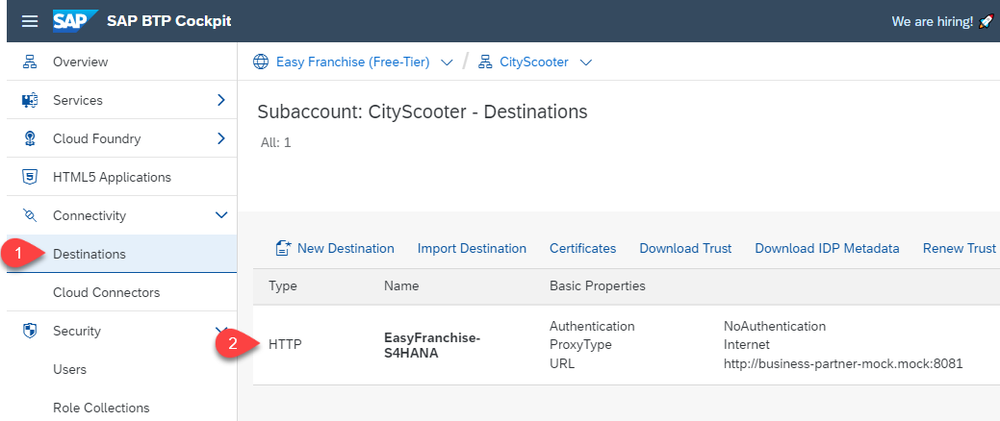
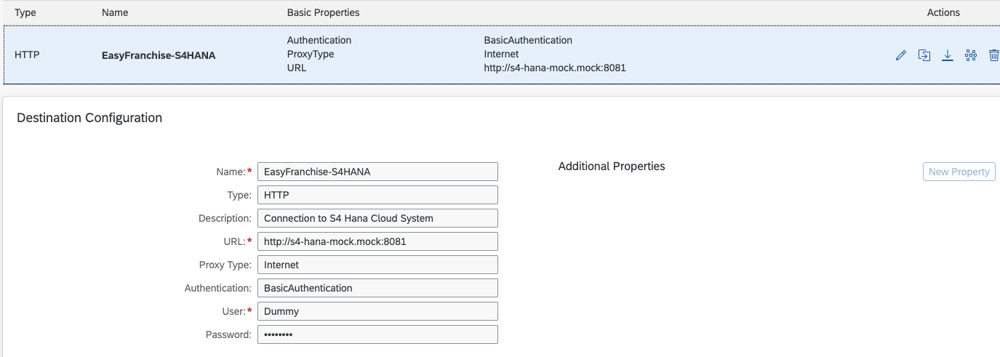

# How to Use the Business Partner Mock Server

If the SAP S/4HANA Cloud system is not available, you can deploy our Business Partner mock server either locally or using the SAP BTP, Kyma environment.

## Business Partner Data

The mock server simply reads all entities in the [BusinessPartner-sample.json](../../../code/easyfranchise/source/business-partner-mock-server/BusinessPartner-sample.json) file and returns it to the calling application.

## Start the Business Partner Mock Server Locally

1. Download the code of this repository.
1. Open a command shell and change the directory to [code/business-partner-mock-server](../../../code/easyfranchise/source/business-partner-mock-server/).
1. Install the required package in the folder **code/business-partner-mock-server**:

   ```shell
   npm install
   ```

1. Launch the Business Partner mock server:

   ```shell
   node server.js
   ```

1. Once the mock server is up and running on `http://localhost:8081`, try the following get requests:

   ``` html
   http://localhost:8081/sap/opu/odata/sap/API_BUSINESS_PARTNER/A_BusinessPartner?$expand=to_BusinessPartnerAddress/to_EmailAddress&$format=json
   ```

1. These are the needed **hiddenconfig.properties**, for example, needed in section [Start and Test the Database Service, the Business Partner Service and the Easy Franchise Service](../../../documentation/prepare/test-app-locally/README.md#1-start-and-test-the-database-service-the-easy-franchise-service-and-the-business-partner-service).


   ```properties
   s4hana.destination.URL: http://localhost:8081
   s4hana.destination.User: dummy
   s4hana.destination.Password: dummy
   s4hana.destination.Authentication: BasicAuthentication
   s4hana.destination.Type: http
   ```

## Deploy to the Kyma Cluster

For the next steps you need to have your SAP BTP, Kyma environment ready as described in section [prepare](../../../documentation/prepare/setup-btp-environment/README.md). In addition, make sure that you have the Kubeconfig downloaded and made available in your Kubectl as described in section [Get Kubeconfig](../../../documentation/deploy/prepare-deployment/README.md#get-kubeconfig).

1. Create a namespace _mock_:

   ```shell
   kubectl create ns mock
   ```

1. Create the Docker registry secret with which Docker image can be pulled by Kubernetes:

   ```shell
   # replace user credentials and email per your settings
   kubectl create secret docker-registry <your-docker-secret-name> --docker-server=<your-registry-server> --docker-username=xxx --docker-password=xxx --docker-email="xxxx" -n mock
   ```

1. Deploy to Kyma cluster:

   ```shell
   # make sure use the correct .env file for your setup
   ./build.sh  -e=../.env-dev
   ```

1. Test service in Kyma cluster locally. Forward the SAP Business Partner Mock Server service in Kyma to local port `8081`, then it can be tested as described above.

   ```shell
   kubectl -n mock port-forward svc/business-partner-mock 8081:8081
   ```

1. Create a destination pointing to the mock server in the cluster. In your subscriber subaccount, create a destination for the Business Partner mock server as following:

   

   The properties of the destination are shown in the following screenshot. Note that the Business Partner mock server does not require user and password. For compatibility purpose, you can use any text for username and password.

   

## Using Multiple Instances

In case you want to use multiple instances of the mock server to simulate more than one SAP S/4HANA Cloud system, you need to adapt all occurrences of **business-partner-mock** in the [business-partner-mock.yaml](../../../code/easyfranchise/deployment/k8s/business-partner-mock.yaml), for example to **business-partner-mock-2**. You should also adapt the business partner data in [BusinessPartner-sample.json](../../../code/easyfranchise/source/business-partner-mock-server/BusinessPartner-sample.json) so that it returns different data than the other instance. Then, you can deploy the second instance as described in the previous section.
