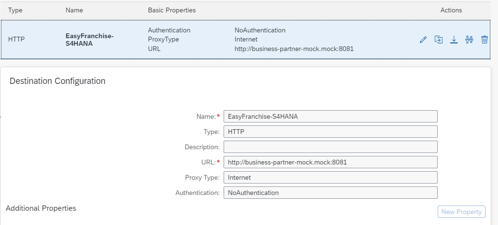

# How to Use the Business Partner Mock Server

If the SAP S/4HANA system is not readily available, you can deploy our Business Partner mock server either locally or using Kyma environment.

## Business Partner data

The mock server simply reads all entities in the [BusinessPartner-sample.json](../code/busines-partner-mock-server/BusinessPartner-sample.json) file and returns it to the calling application.

## Start the Business Partner Mock local

1. Have the code of this repo downloaded.
1. open a command shell and change directory to [code/business-partner-mock-server](/code/business-partner-mock-server/)
1. Install required package in folder code/business-partner-mock-server

   ```shell
   npm install
   ```

1. Launch the Business Partner mock server

   ```shell
   node server.js
   ```

1. Now the mock is up and running on ``http://localhost:8081``. Try the following get requests:

   ``` html
   http://localhost:8081/sap/opu/odata/sap/API_BUSINESS_PARTNER/A_BusinessPartner?$expand=to_BusinessPartnerAddress/to_EmailAddress&$format=json
   ```

1. This are the needed hiddenconfig.properties e.g. needed in chapter [Start and Test the Microservices DB-Service, BP-Service and EF-Service](/documentation/step-by-step-guide/run-app-locally/start-and-test-microservices/README.md)

   ```properties
   s4hana.destination.URL: http://localhost:8081
   s4hana.destination.User: dummy
   s4hana.destination.Password: dummy
   s4hana.destination.Authentication: BasicAuthentication
   s4hana.destination.Type: http
   ```

## Deploy to Kyma cluster
For the next steps you need to have your kyma environment ready as described [here](../../step-by-step-guide/preparation/setup-btp-environment/readme.md). In additon pleae make sure that you have the kubeconfig downloaded and made availalbe in your CLI as described [here](../../step-by-step-guide/run-app-in-kyma/common-tasks/README.md#get-kubeconfig).

1. Create a namespace _mock_:

   ```shell
   kubectl create ns mock
   ```

1. Create the docker registry secret with which docker image can be pulled by Kubernetes:

   ```shell
   # replace user credentials and email per your settings
   kubectl create secret docker-registry <your-docker-secret-name> --docker-server=<your-registry-server> --docker-username=xxx --docker-password=xxx --docker-email="xxxx" -n mock
   ```

1. Deploy to Kyma Cluster

   ```shell
   # make sure use the correct .env file for your setup
   ./build.sh  -e=../.env-dev
   ```

1. Test service in Kyma Cluster Locally
   Forward the s4 hana mock service in Kyma to local port 8081, then the service can be tested as described above

   ```shell
   kubectl -n mock port-forward svc/business-partner-mock 8081:8081
   ```

1. Create a Destination Pointing to the Mock Service in Cluster
   In your subscriber sub-account, create a destination for the Business Partner mock server as following:

   

   The properties of the destination is shown below. Note that the Business Partner mock server does not require user and password. For compatibility purpose you can use any text for username and password.

   

## Using Multiple Instances

In case you want to use multiple instances of the mock service to simulate more than one S/4HANA system you need to adapt all occurences of business-partner-mock in the [deployment.yaml](../code/busines-partner-mock-server/k8s/deployment.yaml) (e.g. to business-partner-mock-2). You should also adapt the business partner data in [Start and Test the Microservices DB-Service, BP-Service and EF-Service](/documentation/step-by-step-guide/run-app-locally/start-and-test-microservices/README.md) so that it returns different data than the other instance. Then you can deploy the second instance as described in the chapter above.
