# Enable the Business Partner OData V2 Rest API in an SAP S/4HANA Cloud System

## Prerequisites

  * You have an SAP S/4HANA Cloud system and can log on as an *Administrator Business User*.
    > Your company just has orders *SAP S/4HANA Cloud* and you don't have an *Administrator Business User* ? This should help:
    > 1. [User Onboarding Process Overview](https://help.sap.com/viewer/b249d650b15e4b3d9fc2077ee921abd0/2108.501/en-US/2742b342a9bc4d1197b108f5d2953ffd.html)
    > 2. [Creating the Administrator Business User](https://help.sap.com/viewer/b249d650b15e4b3d9fc2077ee921abd0/2108.501/en-US/8db94977c4bc4599ab4ef081a66874b1.html)
  * This key user need to have the administrator business user that contains the business catalog `SAP_CORE_BC_COM` (Communication Management). For example, the business role `SAP_BR_ADMINISTRATOR` (Administrator).

## What You Will Gain

SAP S/4HANA Cloud has by default different APIs, which are not accessible outside the SAP S/4HANA Cloud system. Those APIs are made accessible from outside secured via Communication User and Password.

If you face any problems with the steps, see section [Establish Your Communication Arrangement in SAP S/4HANA Cloud](https://help.sap.com/viewer/60055cf8f72644eb82a6f3bdc9be6e2b/1.0/en-US/4aad735c66c5495e9299d10231874bfd.html) on SAP Help Portal for more details.

## Create Communication System and Communication User

A communication system is a semantic representation of the system, which will connect to SAP S/4HANA Cloud system. It holds all necessary technical information about the system, such as hostname/IP address, identity, user information, certificates etc.

1. Log in to your SAP S/4HANA Cloud Fiori Launchpad.

2. Search for the Fiori tile **Communication Systems** and choose it to open the app.

   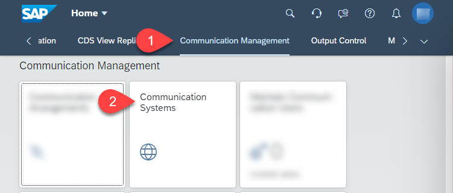

3. Choose **New** to create a new communication system.

   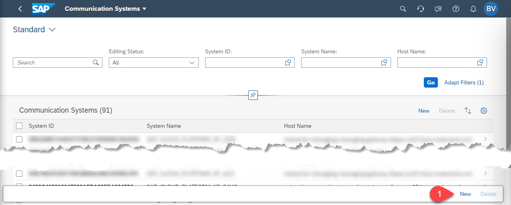

4. In the opened dialog, **New Communication System**, enter the following values:
    - Enter a value for the field **System ID**, which would define the target system, for example: `BTP_EXTENSION`.
    - You can enter the same value for the **System Name** as well.
    - Choose **Create** to create the Communication System.

      

5. In the opened SAP Fiori page, enter the following values:
    - Hostname: Enter the host name of the SAP BTP account, for example: `account.hana.ondemand.com`
    - Logical System: You can enter a value, for example: `SCP`
    - Business System: Give a unique Business System name, for example: `BP_SCP`.

      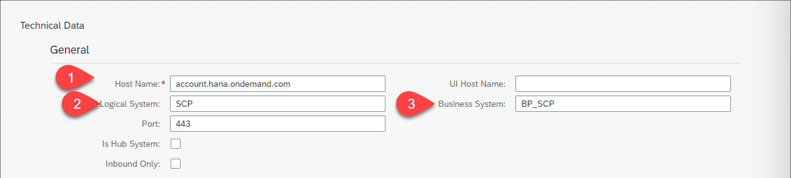

6. A communication user is needed to authenticate to the SAP S/4HANA Cloud APIs. You can create different users for different scenarios/APIs. This user will have specific access to the API depending upon which *Communication Scenario*, this communication user is configured for. Choose **+** near **User for Inbound Communication**.

    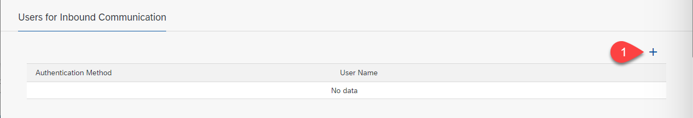

7. In the opened dialog, **New Inbound Communication User**, choose **New User** to create a new communication user. Inbound user is a user, which is used for incoming communications to the SAP S/4HANA Cloud system.

   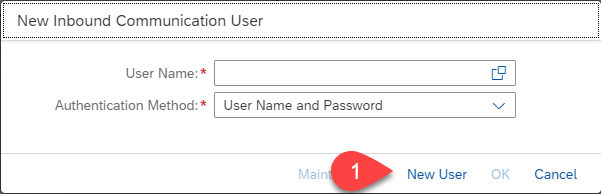

8. In the opened SAP Fiori page, **Create Communication User**, enter the following:
    - User Name: `INBOUND_COMM_USER_BTP_EXTENSION`
    - Description: Enter a meaningful description
    - Password: Choose **Propose Password** to propose a password, which is strong, secure and of minimum 20 characters in length. Copy the password and store in a safe password depot for later use.
    - Choose **Create** to create the communication user.

      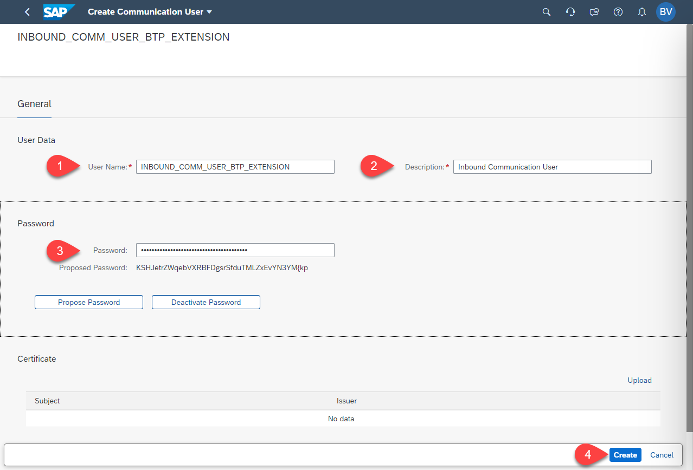

9. The UI returns back to the previous screen where you wanted to select an inbound user for the **Communication System** edit dialog.

10. In the f**User Name** field of **New Inbound Communication User**, leave the preselected newly created user and **Authentication Method** as **User Name and Password** and choose **OK** to confirm the in-bound user selection.

    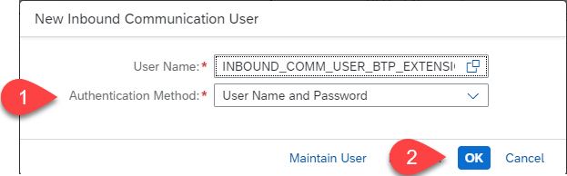

11. In the field **User for Outbound Communication**, create a new user by choosing the **&#x2B;** icon.
    Even if you do not need an outbound user, as your SAP S/4HANA Cloud system will not call an external system, the user creation is needed to be able to create a **Communication Arrangement** successfully in the next step.

    

12. Enter a user name and password for the outbound user and choose **Create** to create this user.

    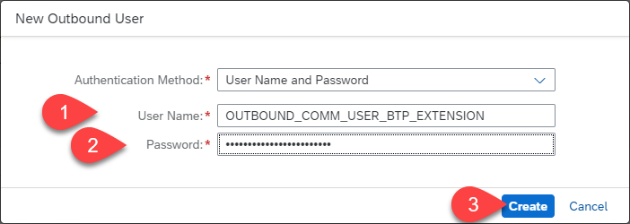

13. Choose **Save** to save the **Communication System** dialog.

      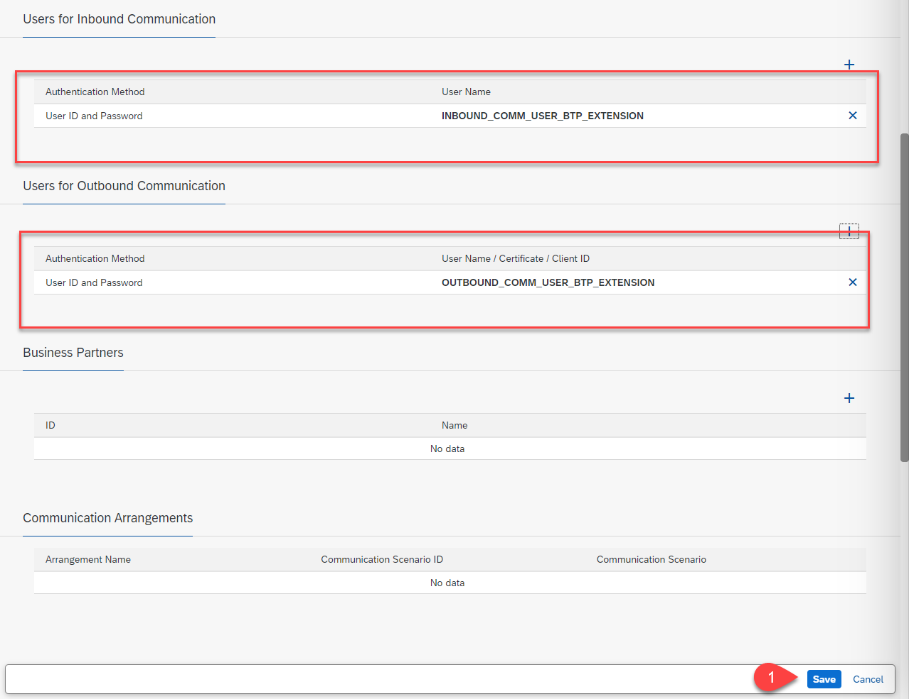

Result: You have created a communication user and communication system in order to expose the API in the SAP S/4HANA Cloud System.

## Create Communication Arrangement

A communication arrangement is always based on one communication scenario and makes use of one communication system. The business partner API is included in the communication scenario named *Business Partner, Customer and Supplier Integration*, which has the identifier *SAP_COM_0008*. If you need a different API, just use the according scenario in step 4.

1. In the SAP S/4HANA Cloud Fiori Launchpad, search for the SAP Fiori tile ***Communication Arrangement** and choose it to open the app.

      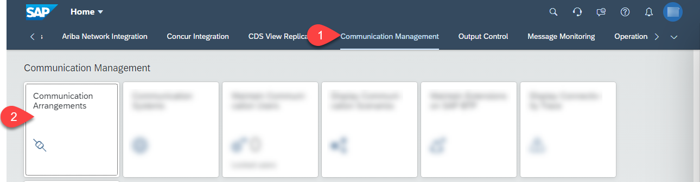

2. Choose **New** to create a new **Communication Arrangement**.

3. In the opened dialog, **New Communication Arrangement**, select the **Scenario:** as **SAP_COM_0008** from the list of communication scenarios.

   For the field **Arrangement Name**, enter a meaningful arrangement name, which will fit to your scenario, for example: **BTP_BUSINESS_PARTNER_BASIC** or **BUSINESS_PARTNER_\<your cloud account name\>**.

      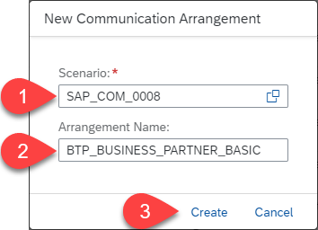

4. The edit screen of the communication arrangement opens. For the field, **Communication System**, enter the communication system you created in the previous step.

    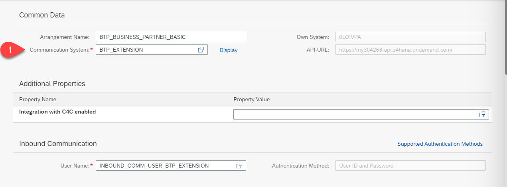

5. Verify if both inbound and outbound users are pre-filled accordingly.

6. For the fields under **Outbound Services**, you can see that there are multiple outbound services for replicating data from SAP S/4HANA Cloud to other external systems. To enable the OData API that you do not need these functionalities so you will uncheck the checkbox for these outbound services.

7. Uncheck the checkbox of **Service Status** of all the outbound services, so that all the outbound services are not active. There are many outbound services. Make sure you 'uncheck the checkbox' of all the Outbound services. The following screenshot shows not all of them.

    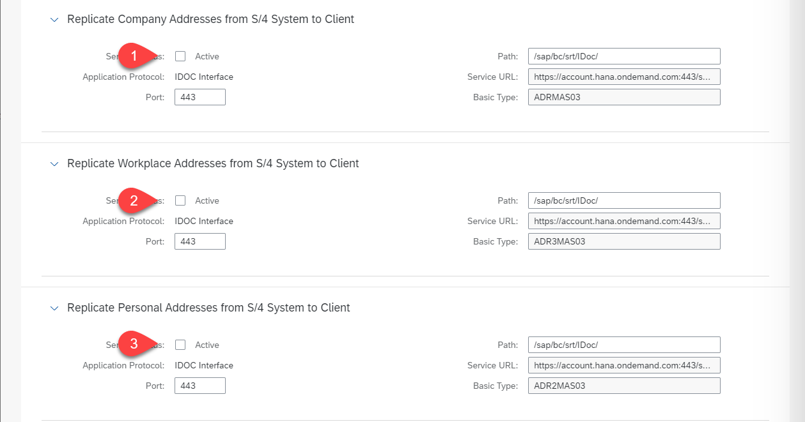

8. Choose **Save** to save the communication arrangement.
   > **Troubleshooting:** In case you get an error complaining about the missing **Business System ID** as shown in the screenshot, you missed providing the **Business System** in the **Communication System**.
   >
   > 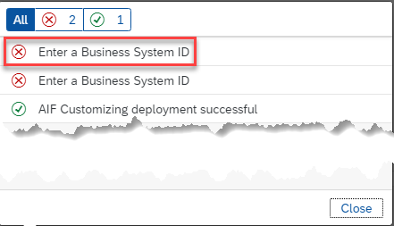
   >
   > Open the previously created **Communication System** in edit mode and provide a **Business System**.
   >
   > 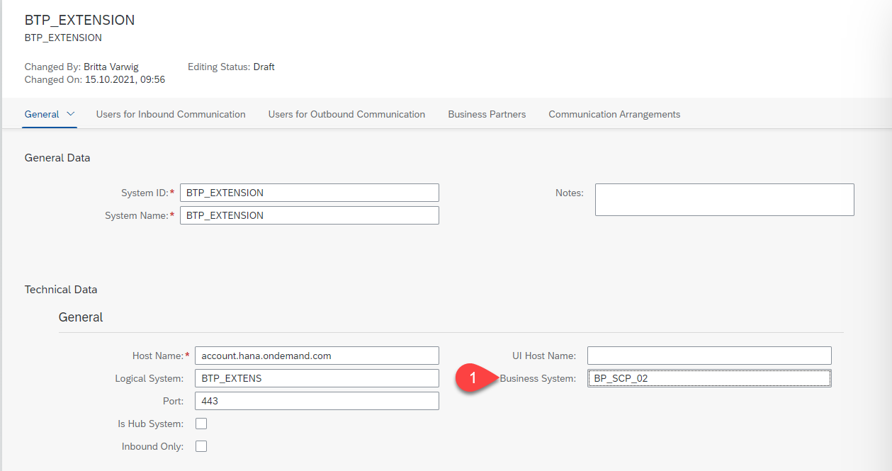

9. Check the saved communication arrangement. In the list of inbound services, note the URL under **Business Partner (A2X)** with protocol **OData V2**.

   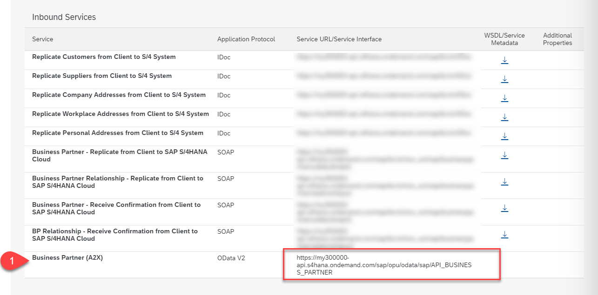

10. Copy the URL and save it for the next step to test the API. The URL is of the format: `https://<your S/4 hostname>-api.s4hana.ondemand.com/sap/opu/odata/sap/API_BUSINESS_PARTNER`

> *Hint:* Later on by defining a destination consuming this OData V2 API, you need to insert the URL. Based on your application implementation you can insert the path  `/sap/opu/odata/sap/API_BUSINESS_PARTNER` directly in the URL of the destination or in the application code.

Result: You have created a communication arrangement for the Business Partner API using scenario `SAP_COM_0008` so that the Business Partner OData Rest API can be accessed externally from SAP BTP.

## Test the Business Partner OData API in the Browser

Let us test the business partner API which you currently exposed in our SAP S/4HANA Cloud system. You can test the API in any browser.

1. Open the OData V2 URL, which you have copied in the previous step, when creating communication arrangement and open in browser.

2. When asked for user name and password enter the inbound communication user name and password, which you created in the previous step.

3. When you add `/$metadata` at the end of the URL you can get the OData metadata description.

4. To get the actual Business Partner data, change the URL by removing the `$metadata` and adding **A_BusinessPartner** like: `https://<your S/4 hostname>-api.s4hana.ondemand.com/sap/opu/odata/sap/API_BUSINESS_PARTNER/A_BusinessPartner`. You will receive all the business partner data returned from the SAP S/4HANA Cloud system.

5. If you would like to learn about the queries options see [URI Conventions (OData Version 2.0)](https://www.odata.org/documentation/odata-version-2-0/uri-conventions/) for more details.

Result: You have tested the Business Partner API of the SAP S/4HANA Cloud system.

## Explore the Business Partner (A2X) API via API Business Hub

You can use the **SAP API Business Hub** to gain more information about the Business Partner API or other APIs.

1. Open the [SAP API Hub page](https://api.sap.com/).

2. Choose **S/4HANA Cloud**.

   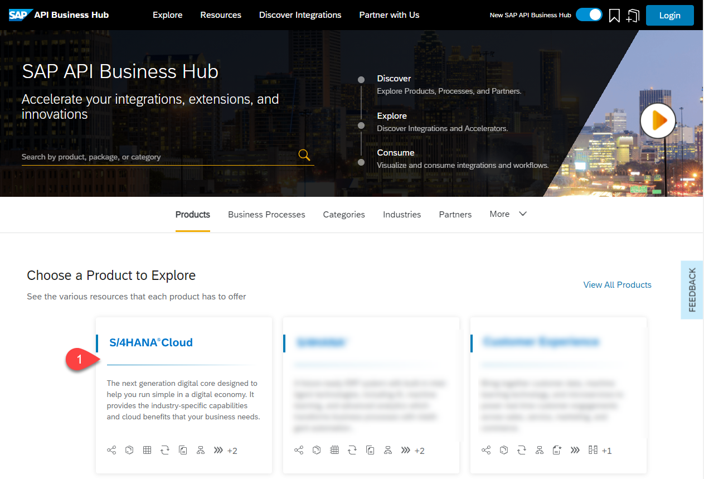

3. Select **APIs** and **ODATA V2**. Use _Business Partner_ as search term to finally find the tile **Business Partner (A2X)**. Open it.

   Alternatively you can use the direct-link for [Business Partner (A2X)](https://api.sap.com/api/API_BUSINESS_PARTNER/overview).

   In case you want details for another API than the Business Partner, just check for what you are searching for.

   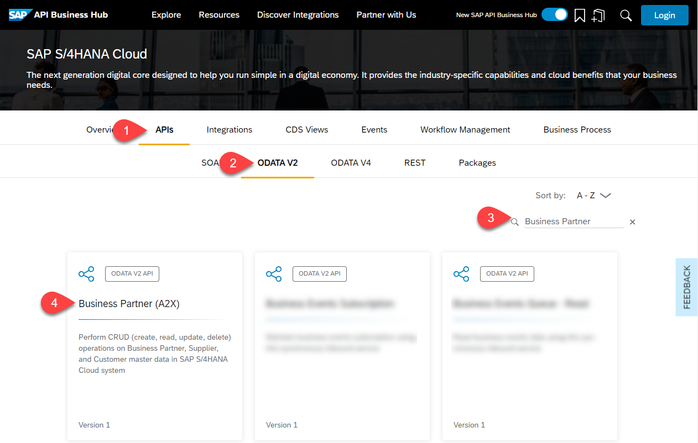

5. Check for the information that you are searching for. You can also try out according requests.

   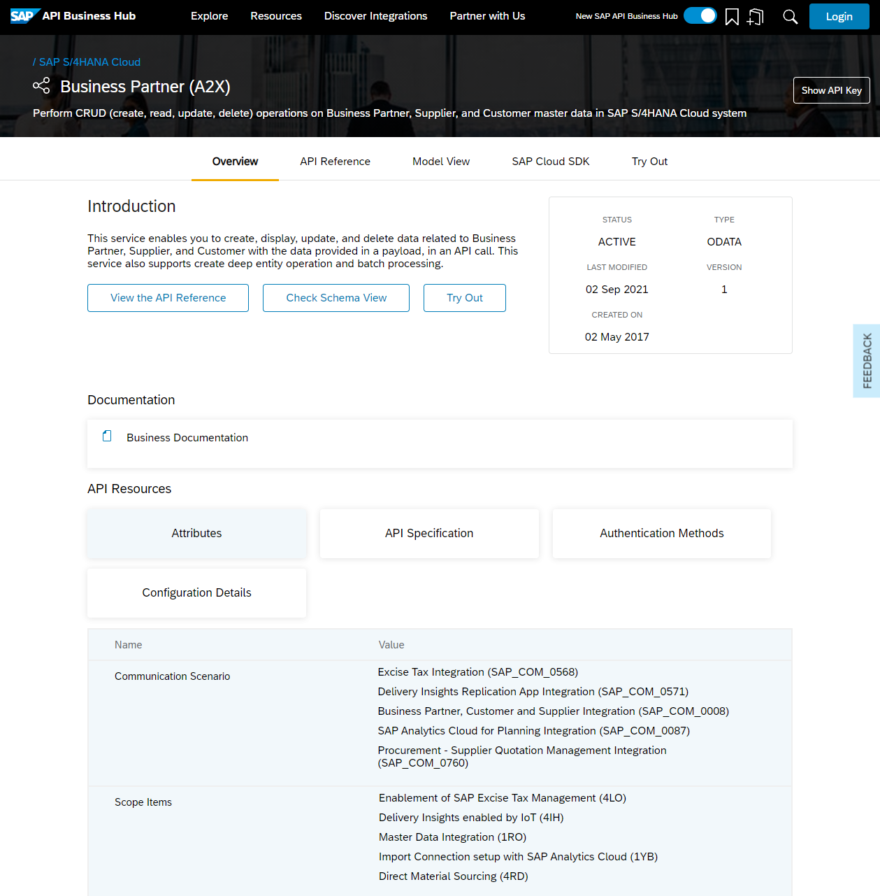

