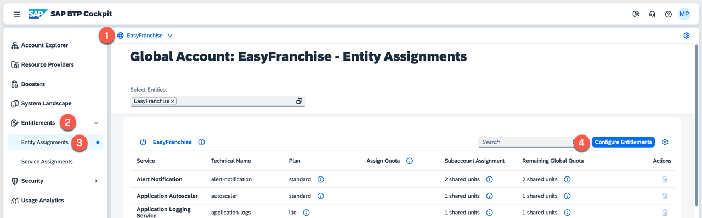
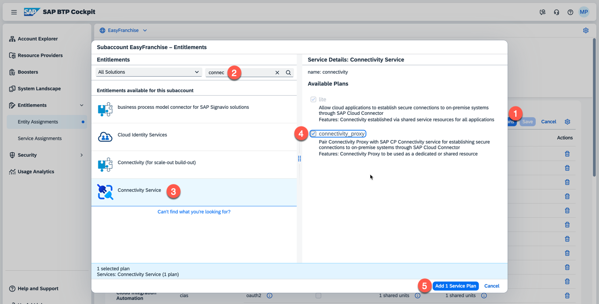
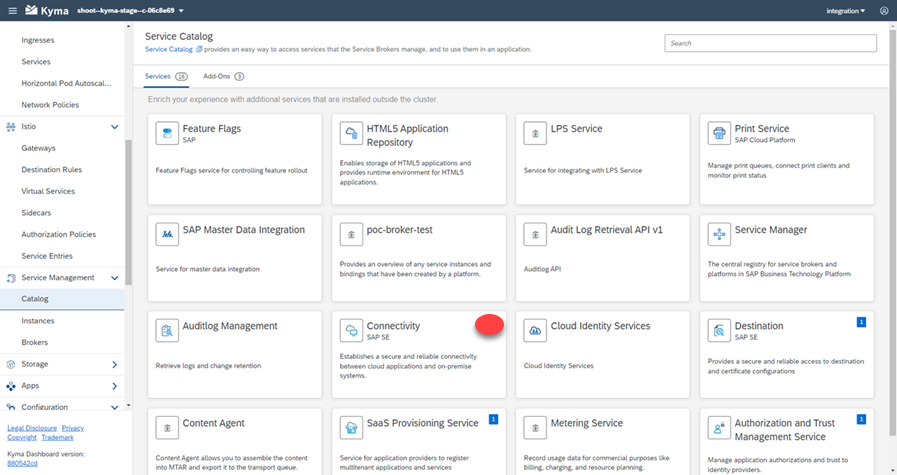
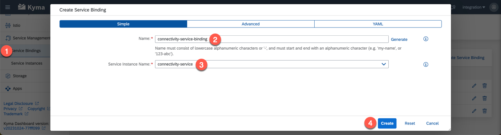

# Connect to SAP S/4HANA On-Premise

## Prerequisites

  * You have an SAP S/4HANA on-premise system and can log on as an *Administrator Business User*.
  * You have access to an SAP Cloud Connector in your on-premise landscape.

If you do not already have an SAP S/4HANA on-premise system, you might want to look at [SAP Cloud Appliance Library](https://cal.sap.com/) for fast access to a running and pre-configured system.

## What You Will Gain

SAP S/4HANA on-premise has by default different APIs, which are not accessible outside the SAP S/4HANA on-premise system. Those APIs are made accessible for the EasyFranchise application via a number of configuration steps.

## Connection Configuration

* [Configure SAP Cloud Connector](./scc/README.md)
* [Configure SAP S/4HANA SAP GUI](./gui/README.md)
* [Configure SAP BTP Cockpit](./btp/README.md)

## Enable Connectivity-Proxy

All the configuration work so far had nothing to do with the Kyma environment. The only thing special to Kyma with regards to on-premise connections is explained in this section.

See section [Configure SAP BTP Connectivity in the Kyma Environment](https://help.sap.com/docs/BTP/65de2977205c403bbc107264b8eccf4b/0c035010a9d64cc8a02d872829c7fa75.html) on SAP Help Portal for more details. See also the [in-depth sample](https://github.com/SAP-samples/kyma-runtime-extension-samples/tree/main/connectivity-proxy) that explains how to test an on-premise connection with a curl docker image.

Configuration steps:

1. Go to your global account and add entitlement for plan **connectivity_proxy** in **Entitlements** section of your EasyFranchise subaccount.

   

1. Select **Connectivity Service** and select the plan **connectivity_proxy**. Then add the entitlement.
   

1. In the Kyma dashboard under **Service Management**, click **Create Service Instance** and provide the following details:
   * Name - a unique name for your service instance.The name must not contain more than 253 characters. It must consist of lowercase alphanumeric characters. It can also contain - (single or consecutive, like in a--a).
   * Offering Name - set it to connectivity.
   * Plan Name - set it to connectivity_proxy.

   

2. Go to the tab **Service Bindings** and **click Create Service Binding** and provide the following details:
   * Name - a unique name for your service binding.
   * Service Instance Name - the name of the service instance created previously.


   
## Use Connectivity-Proxy in bp-service

Changing Easy Franchise setup from SAP S/4HANA Cloud to on-premise after the previous configuration steps requires only small changes. The same destination name was reused. You may want to compare with [Destination Configuration](../../test-customer-onboarding/configure-destination/README.md).

Only one change in code is needed: Edit the Java code of [BPService](../../../code/easyfranchise/source/backend/bp-service/src/main/java/dev/kyma/samples/easyfranchise/bpservice/BPService.java) and find this section in *getBusinessPartner()*:

```
            ConnectionParameter param = DestinationUtil.getDestinationData(subdomain, Util.getS4HanaDestinationName(), authorizationHeader).setAcceptJsonHeader();

            // set subdomain dynamically as search term
            String searchString = BUSINESS_PARTNER_ODATA_REQUEST.replace("<cf-subdomain>", subdomain);
            param.updateUrl(param.getUrl() + searchString);
            Connection.call(param);
```

Add these lines directly before *Connection.call()*:

```
param.proxy = new Proxy(Proxy.Type.HTTP,
              new InetSocketAddress("connectivity-proxy.kyma-system.svc.cluster.local", 20003));
```

This enables usage of the connectivity-proxy service to make the connection to the on-premise system. After rebuilding and redeploying, the on-premise system will be used to get the BusinessPartner data. See section [Deploy](../../deploy/README.md) for more details.
