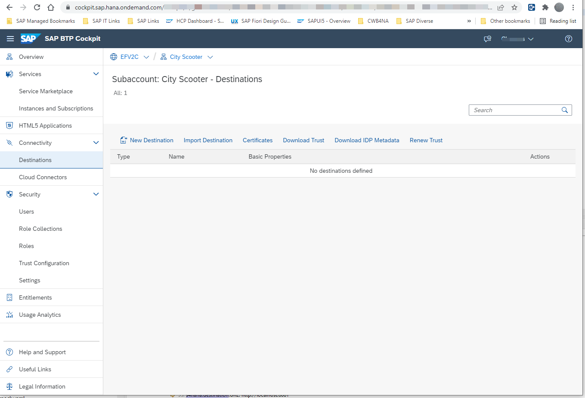
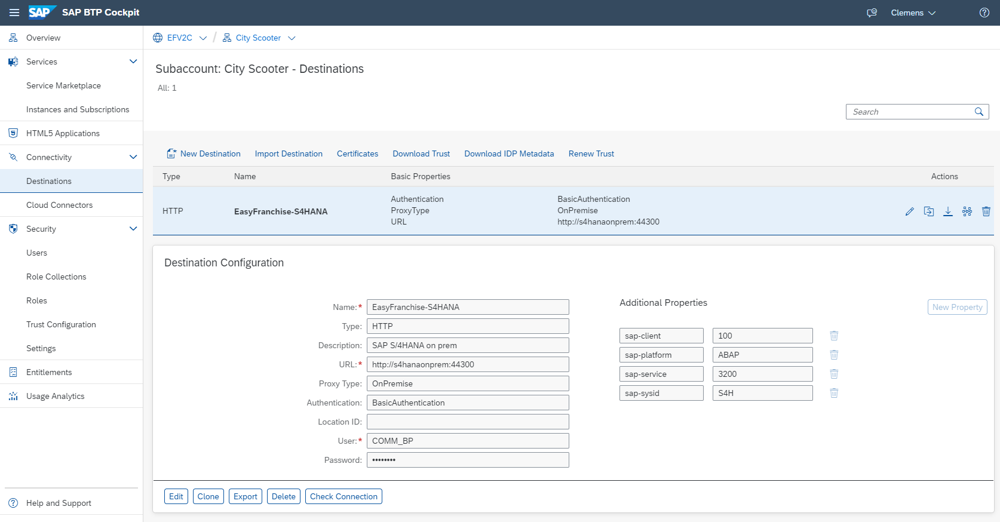
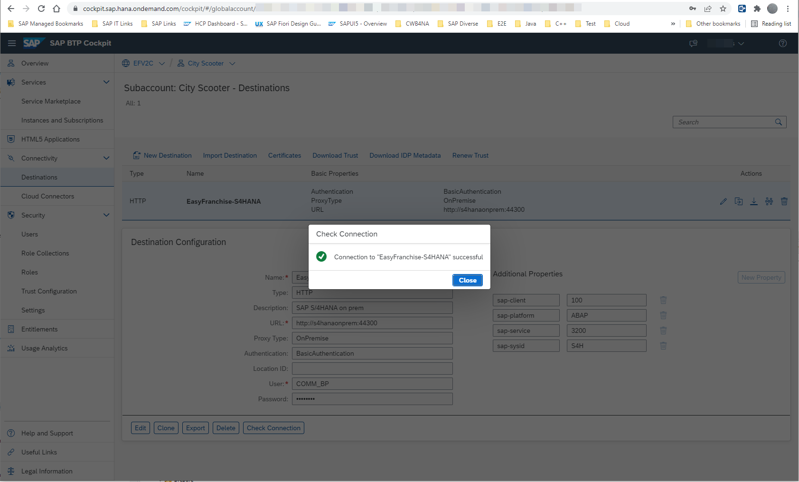

# Configure SAP BTP Cockpit

In SAP BTP Cockpit, you have to configure a **Destination** for your on-premise system. If you followed our instructions to enable a connection between EasyFranchise and SAP S/4HANA Cloud, then you might already have one destination. In that case delete the other one, as we want to reuse the same connection name.

You should now have an empty connection list:

1. Add the destination. Make sure that your parameters match the ones you gave at configuration of SAP Cloud Connector and SAP S/4HANA on-premise:

2. Use the connection test to make sure that a connection is possible:

