# Configure SAP S/4HANA SAP GUI

Follow the instructions to enable the Business Partner OData API Service on your on-premise system in section [Configure OData Service](https://github.com/SAP-samples/cloud-extension-s4hana-business-process/tree/mission/mission/configure-oData-Service). It is from another tutorial, so be sure to come back here after you are finished.

You will need the technical user name and password you created to continue. It is a good idea to check now, that the intended API is working as expected.

Open SAP Gateway Client by transaction /IWFND/GW_CLIENT in SAP GUI and test the Business Partner API. It should look similar to this:

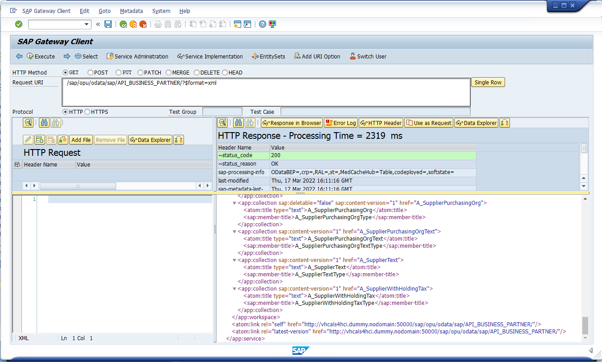

You can also look up the local URL for calling the BusinessPartner API in SAP Gateway Client. This URL can directly be used in a browser:

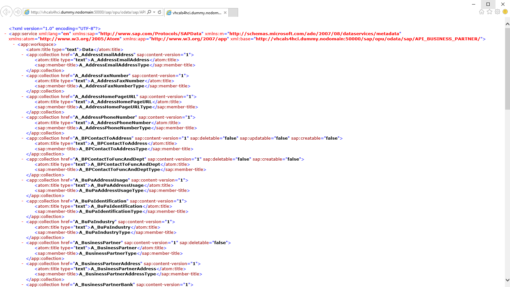

<!--- 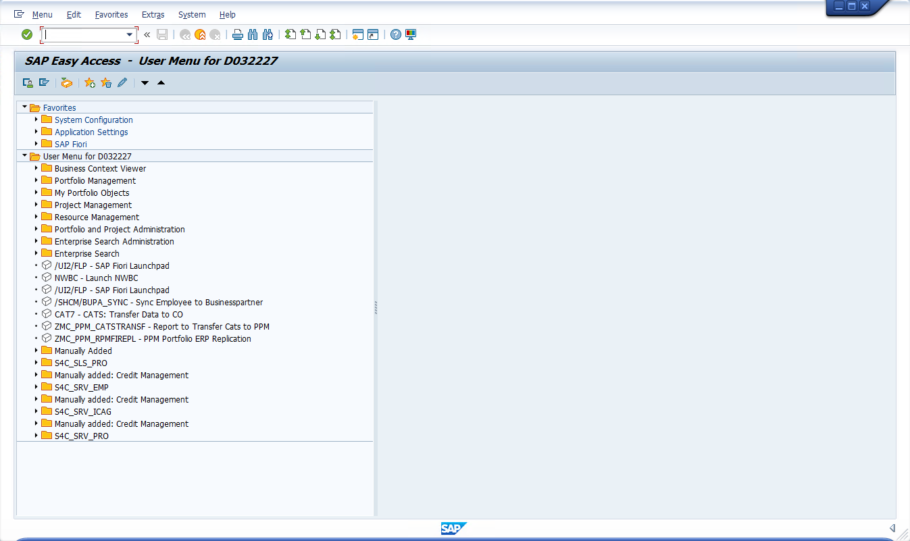
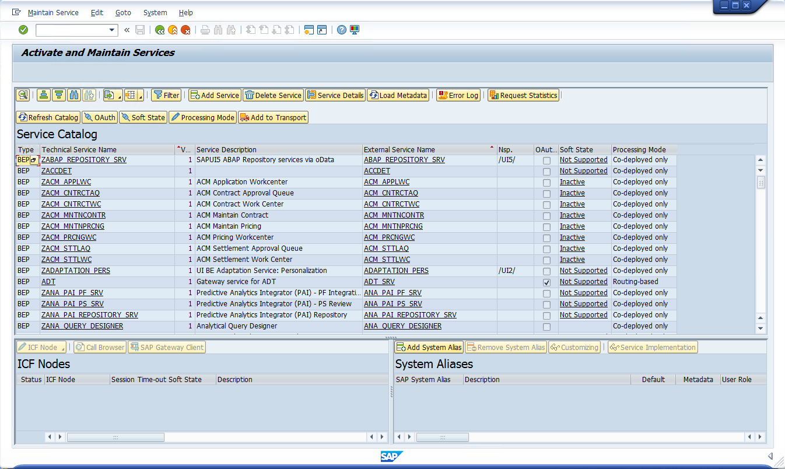
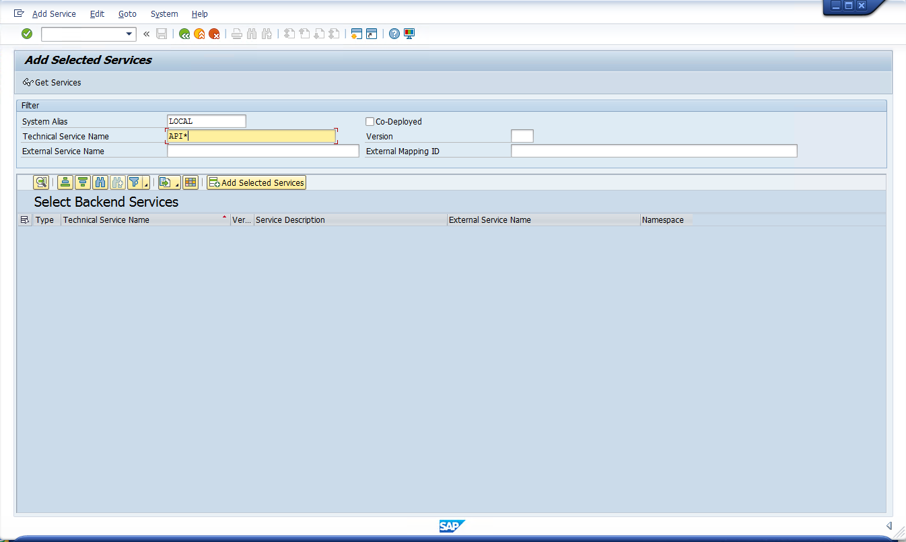
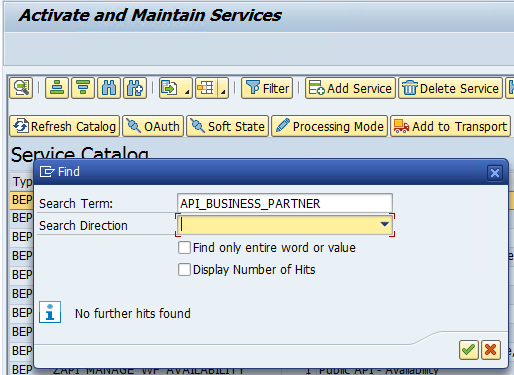
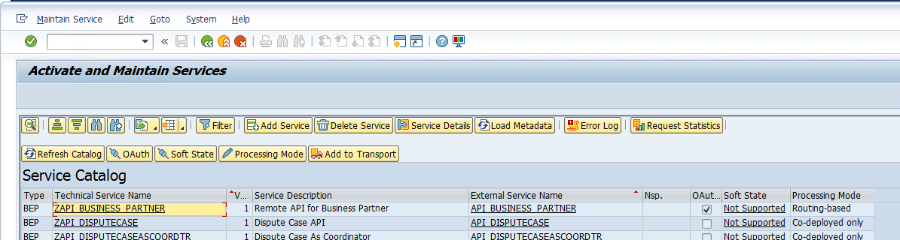
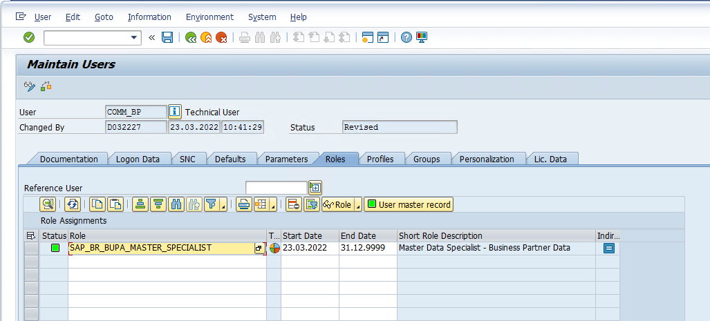
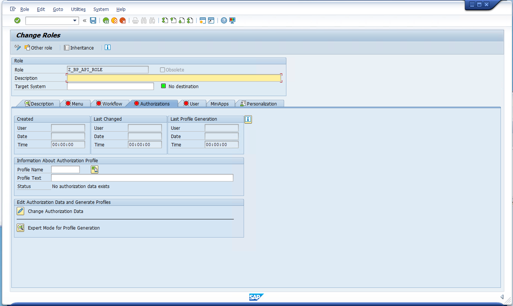
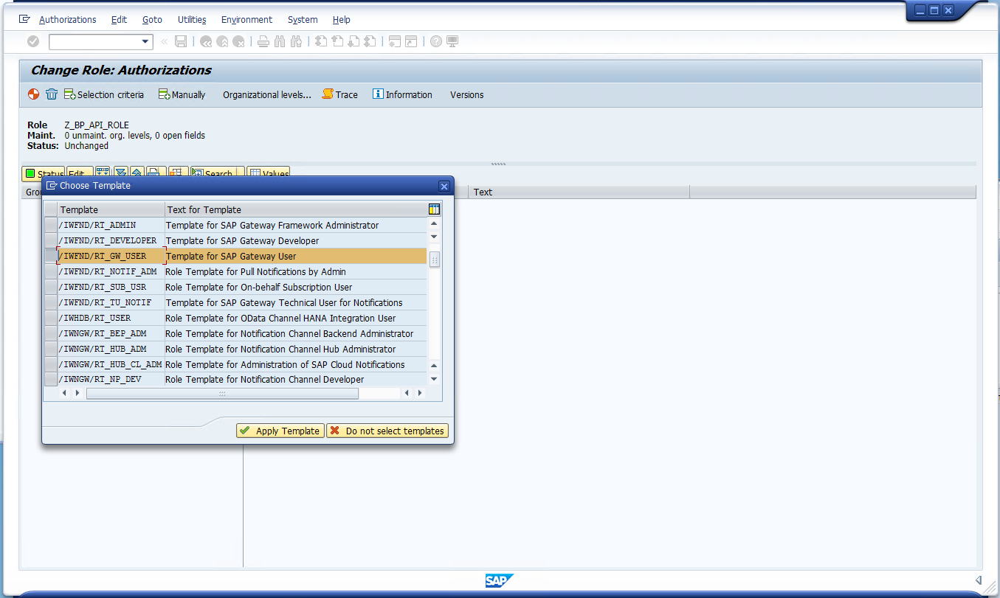
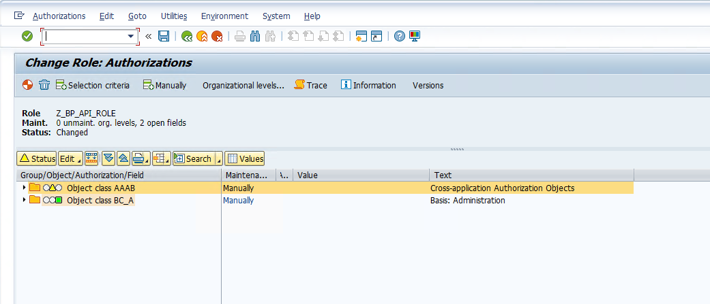
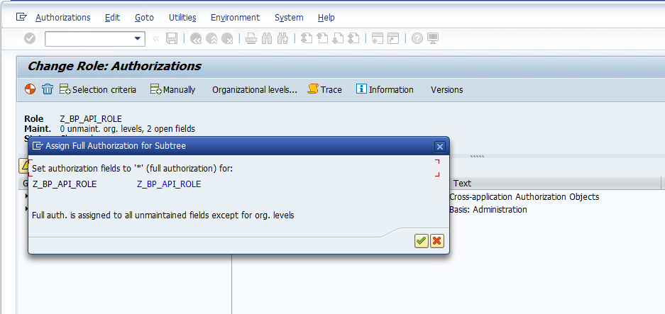
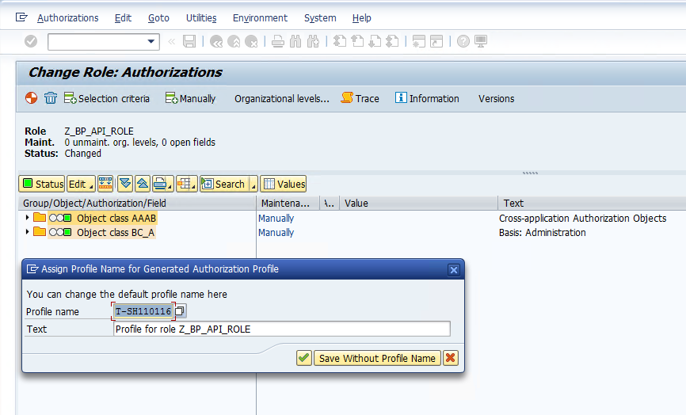
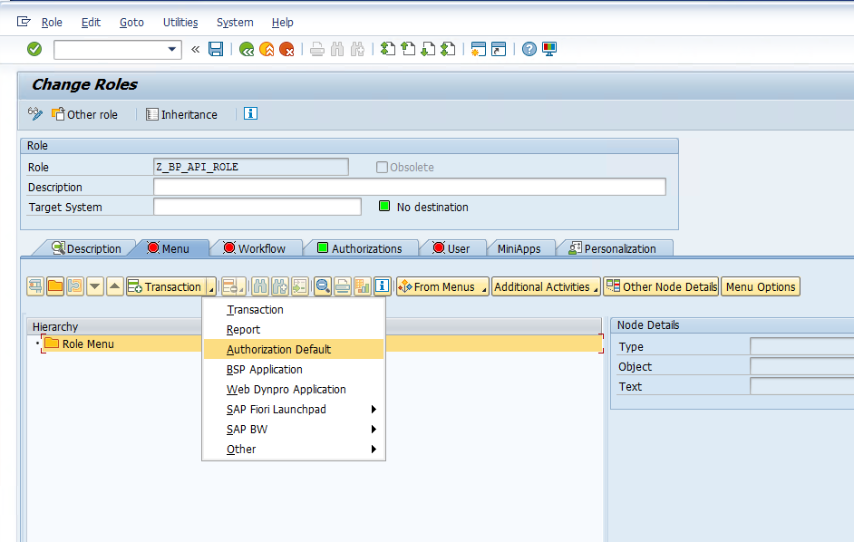

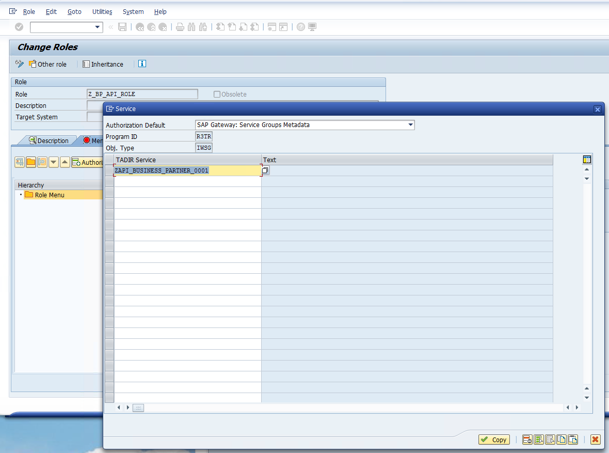
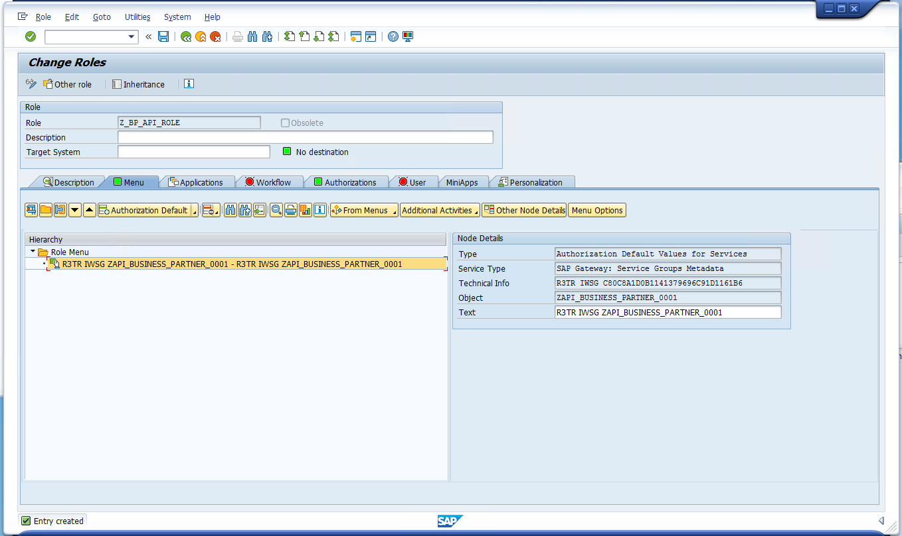
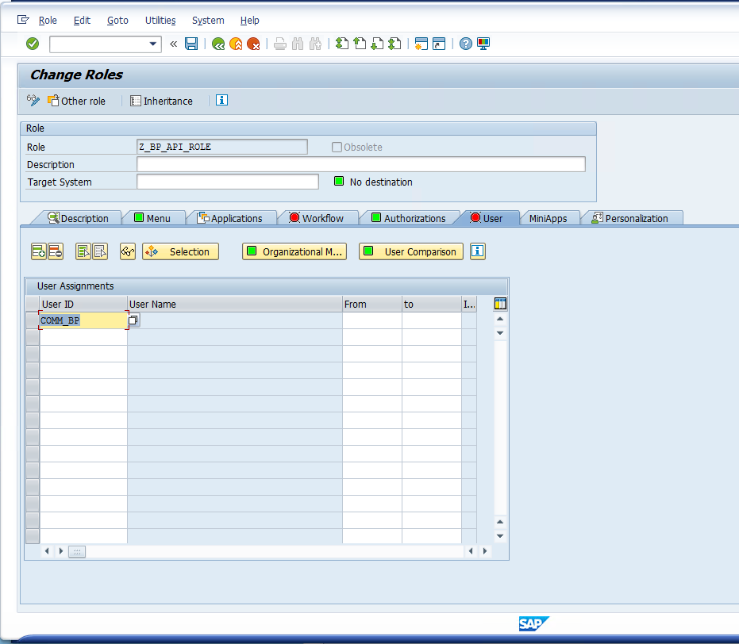
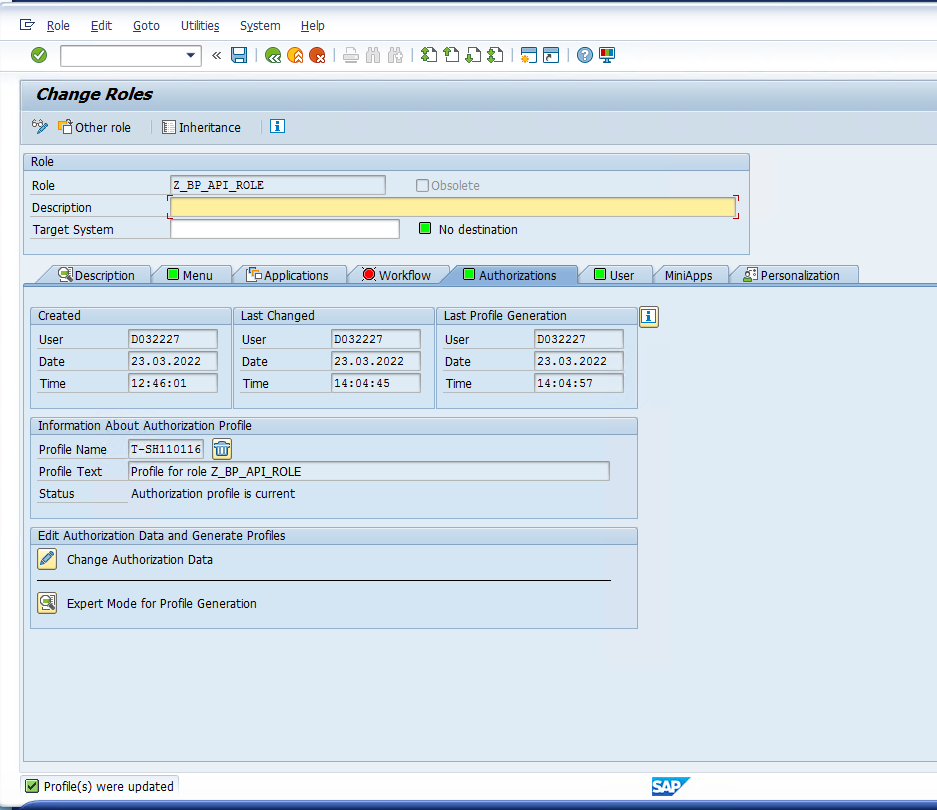
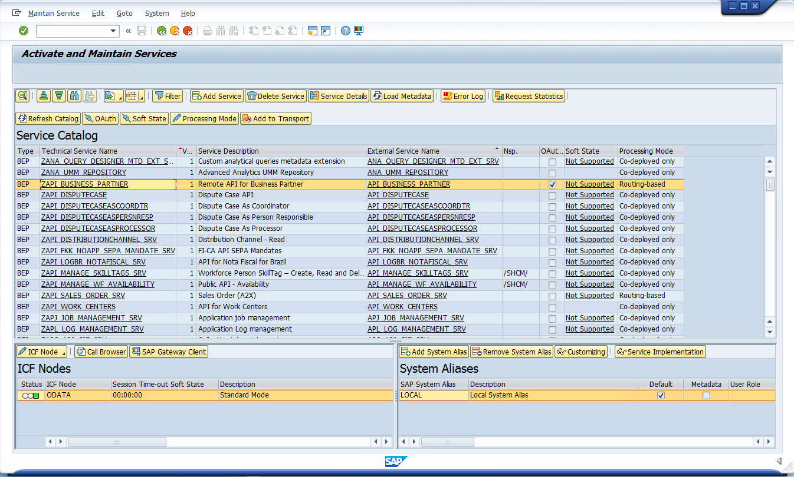 --->

