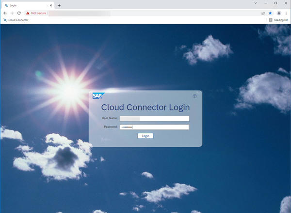
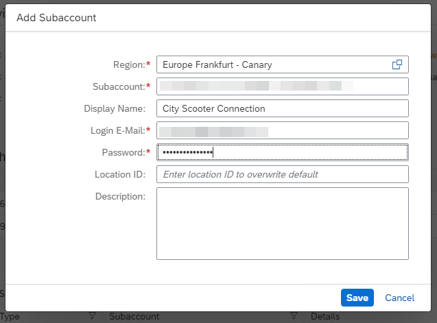
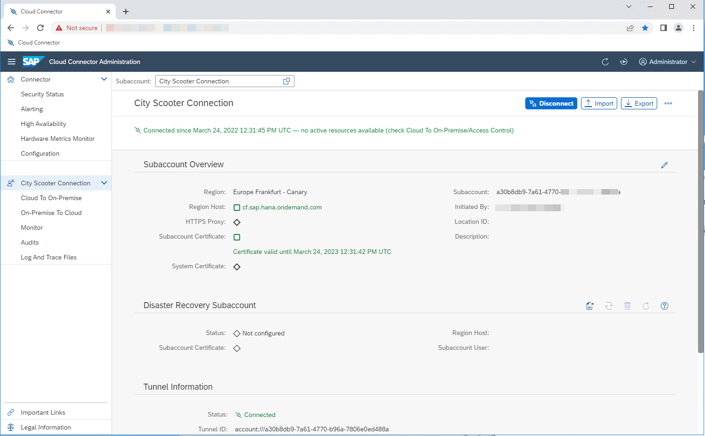
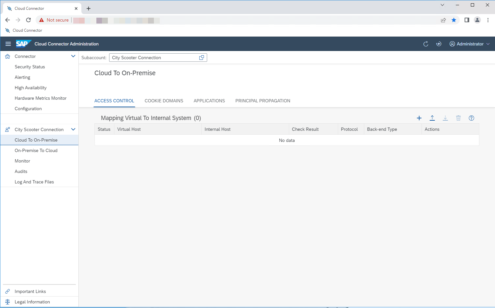
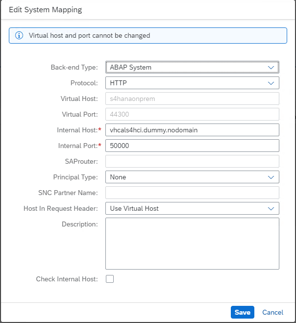
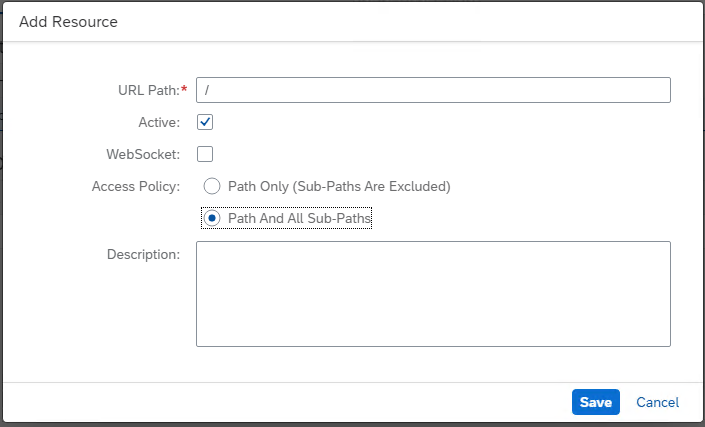

# Configure SAP Cloud Connector

1. Log in to your SAP Cloud Connector instance:

   

1. Add a subaccount by using the button. Select your region and copy the Subaccount ID. Be sure to use the customer subaccount (for example, **City Scooter**), not the partner subaccount:

   

1. You should get a connection to your subaccount:

   

1. Now, add a system mapping of type **Cloud to On-premise**:

   
   

1. Allow all resources below the path and it's sub-paths:

   
