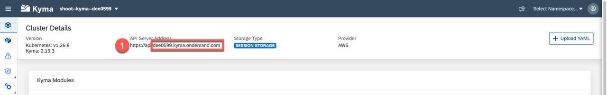

# Deployment via Script

In the setup folder, there is a shell script [easyfranchise-deployment.sh](../../../code/setup/easyfranchise-deployment.sh). Calling the script will guide you through the whole deployment of the EasyFranchise application. There is also the option to do a dry run to validate the yaml files that will be used for deployment.

## Preparation

We recommend using a Linux subsystem for the tutorial as our scripts are only available as bash scripts. Furthermore, most of the examples around Kubernetes, for example, are written for Linux/MacOs environments. See [Install WSL](https://docs.microsoft.com/en-us/windows/wsl/install) in the Microsoft documentation for more details.

* [Docker](https://docs.docker.com/get-started/#download-and-install-docker)
* [Docker Hub Account](https://hub.docker.com/)
* [Kubernetes CLI](https://kubernetes.io/docs/tasks/tools/#kubectl)
* [Kubernetes OpenID Connect (OIDC) authentication](https://github.com/int128/kubelogin)
* [jq](https://stedolan.github.io/jq/)
* [uuidgen](https://launchpad.net/ubuntu/bionic/+package/uuid-runtime)

> If you run through the manual deployment before, revert the changes you have done in the `.yaml` files. The build scripts will modify them according to your input.

## Deployment Script

Execute build script from within the [setup folder](../../../code/setup). 

```shell
./easyfranchise-deployment.sh
```
> Note: Make sure that the file is executable. If this is not the case, you can do it for example with ```chmod 777 easyfranchise-deployment.sh``` on Unic OS and then execute the script.

Execute build script in dry-run mode:

```shell
./easyfranchise-deployment.sh --dry-run
```

The script allows you to save the entered values as a JSON file within the setup folder. Note that the passwords will be stored in plain text. If you run the script multiple times, it will offer the user to read the configuration from the setup folder if it's present.

If you are using the script to deploy the application the first time, we recommend choosing the `Full-Deployment` options from the list given by the script.

```shell
Choose component for deployment or deploy the whole application
1) Approuter
2) DB-Service
3) BP-Service
4) EF-Service
5) SaaS-Broker
6) Email-Service
7) UI
8) Mock-Server
9) Full-Deployment
#?
```

This ensures that the components will be deployed in the right order. If you already have the application deployed, you can deploy single components as well.


## Input Parameter

There are certain parameters that you need to provide in the beginning of the script. See the following list for more details:

* Subdomain: The subdomain of the subaccount, where your application should be deployed, for example, `easyfranchise`.

  

* Cluster Domain: The full Kyma cluster domain that you can find in the downloaded **kubeconfig** file or in the Kyma dashboard, for example, `c-1ddaa90.kyma.ondemand.com`.

  

* Kubeconfig Url: Open SAP BTP Cockpit and navigate to the overview page of the subaccount where Kyma is enabled. There you will find the URL to download the `kubeconfig` file.

   

* Docker E-Mail: E-Mail address associated with the docker repository

* Docker ID: Username associated with the docker repository

* Docker Password: Password used to log in to the docker repository

* Docker Server: URL of the Docker Server (for example, https://index.docker.io/v1/ for Docker Hub)

* Docker Repository: The name of the docker repository where to store the created images. In case of Docker Hub this is a combination of account and repository name, which look like that: ```<docker account>/<repository name>``` e.g. ```user1234/efdeploy```

* SQL Endpoint: SQL endpoint of the database to be used. Use **Instances and Subscriptions** from the left side navigation, then select the application **SAP HANA Cloud**. The **SAP HANA Cloud Central** will open. Then copy the SQL endpoint like in the following screenshot:

  

* DB Admin: Username of the database admin (for example, `DBADMIN` if you followed the mission [Develop a Multitenant Extension Application in SAP BTP, Kyma runtime](https://discovery-center.cloud.sap/missiondetail/3683/3726/))

* DB Admin Password: Password that belongs to the DB Admin user given in the step before. If you used the btp-setup-automator, it can be found in the [usecase.json](https://github.com/SAP-samples/btp-setup-automator/blob/main/usecases/released/discoverycenter/3638-kyma-multitenant/usecase.json)