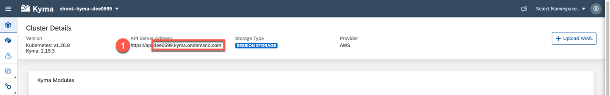
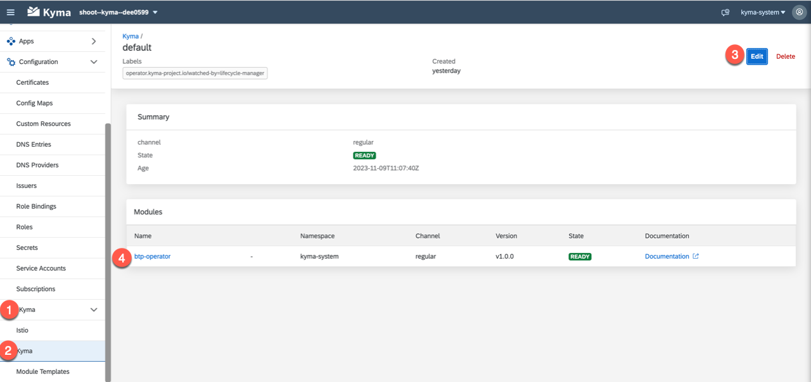

# Deploy the Artifacts Manually <!-- omit in toc -->

This section explains how to deploy each component manually to the Kyma cluster. The following steps give an overview of the components discussed.

- [Deploy the Configmap](../../../documentation/deploy/manual-deployment#deploy-the-configmap)
- [Deploy the Approuter](../../../documentation/deploy/manual-deployment#deploy-the-approuter)
- [Deploy the Broker](../../../documentation/deploy/manual-deployment#deploy-the-broker)
- [Deploy the Backend Components](../../../documentation/deploy/manual-deployment#deploy-the-backend-components)  
  - [Run Maven Build](../../../documentation/deploy/manual-deployment#run-Maven-build)
  - [Deploy the Business Partner Service](../../../documentation/deploy/manual-deployment#deploy-the-business-partner-service)
  - [Deploy the Easy Franchise Service](../../../documentation/deploy/manual-deployment#deploy-the-easy-franchise-service)
  - [Deploy the Database Service](../../../documentation/deploy/manual-deployment#deploy-the-database-service)
- [Deploy Email Service](../../../documentation/deploy/manual-deployment#deploy-email-service)
- [Deploy the UI](../../../documentation/deploy/manual-deployment#deploy-the-ui)

## Deploy the Configmap

1. Navigate to the root folder of the repository to execute the following commands.

1. To store configuration, you make use of a configmap called backend-configmap. The configmap stores the endpoints of the microservices, enables, or disables the scheduler and contains the name of the destination used for the connection to the SAP S4/HANA system. See [backend-configmap.yaml](../../../code/easyfranchise/deployment/k8s/backend-configmap.yaml) for more details.

1. As the configmap is mounted in all the microservices, you need to deploy it to the namespaces **backend** and **integration**. You can deploy the configmap using these two commands from your terminal:

   ```shell
   kubectl apply -n backend -f ./code/easyfranchise/deployment/k8s/backend-configmap.yaml
   kubectl apply -n integration -f ./code/easyfranchise/deployment/k8s/backend-configmap.yaml
   ```

   If the command was successful, the output should look like this:

   ```shell
   configmap/backend-configmap created
   ```

## Deploy the Approuter

The Approuter deployment is done through two steps. The first step creates the required instances to XSUAA and the subscription service. The second step builds and deploy the actual Approuter image.

1. Kubernetes artifacts for XSUAA service, SaaS Registry service, and Destination service are defined in [btp-services.yaml](../../../code/easyfranchise/deployment/k8s/btp-services.yaml). Adapt the following values in the file:

   - `<cluster-domain>` the full Kyma cluster domain. You can find the cluster name in the downloaded **kubeconfig** file or in the Kyma dashboard, for example, `c-1ddaa90.kyma.ondemand.com`.

     

   - `<provider-subdomain>` must be replaced with the subdomain of the sub account where the application should be deployed to. This can be found in the SAP BTP cockpit.

     

2. If you are using recently provisioned Kyma runtime, you need to enable the BTP operator module in Kyma under the **kyma-system** namespace. Follow the steps described in the [official documentation(https://help.sap.com/docs/btp/sap-business-technology-platform/enable-and-disable-kyma-module#loio1b548e9ad4744b978b8b595288b0cb5c)]. At the end, you should see the module **btp-operator** configured.

   

3. You can proceed with the deployment to the Kyma cluster. Navigate to root folder of the repository:

   ```shell
   kubectl apply -f ./code/easyfranchise/deployment/k8s/btp-services.yaml
   ```

3. Continue with the deployment of the Approuter itself. You need to build the Docker image and push it to the repository. If you are using dockerhub the `<docker-repository>` is a combination of your account name and the repository which looks like this: <docker account>/<repo name>

   ```shell
   docker build --no-cache=true --rm -t <docker-repository>:approuter-0.1  -f ./code/easyfranchise/deployment/docker/Dockerfile-approuter .
   docker push <docker-repository>:approuter-0.1
   ```

4. Before you can deploy the Approuter to the cluster, you need to adapt the [approuter.yaml](../../../code/easyfranchise/deployment/k8s/approuter.yaml) and replace the following placeholders:

   - `<image-name>` the image name you just created
   - `<cluster-domain>` same as above
   - `<provider-subdomain>` same as above

5. After that you can deploy:

   ```shell
   kubectl apply -f ./code/easyfranchise/deployment/k8s/approuter.yaml
   ```

6. Run the following command to verify that the deployment was successful:

   ```
   kubectl get pods -n integration
   ```

   You can find your newly deployed Approuter using the **Kyma dashboard**. Open it and select the namespace **integration** and open its**Pods**. Here you should now find an **approuter-xxxx**.

## Deploy the Broker

The SaaS Broker handles the on- and offboarding of a new tenant subscription.

1. Navigate to the root folder of the repository to build and push the Docker image:

   ```shell
   docker build --no-cache=true --rm -t <docker-repository>:broker-0.1  -f ./code/easyfranchise/deployment/docker/Dockerfile-broker .
   docker push <docker-repository>:broker-0.1
   ```

1. Before you can deploy the image, you need to replace the `<image-name>` tag in the [broker.yaml](../../../code/easyfranchise/deployment/k8s/broker.yaml) file with `<docker-repository>:broker-0.1`:

   ```shell
   kubectl apply -f ./code/easyfranchise/deployment/k8s/broker.yaml
   ```

1. Verify that you can find a new pod with the name **broker-xxxx** in the namespace **integration** of the Kyma cluster to validate the deployment.

## Deploy the Backend Components

The complete deployment of the backend consists of three microservices and a secret. The following section explains how to deploy the individual parts and what they do. In general all services follow the same pattern:

1. You need to build the docker image using the **Dockerfile** stored in the **docker** folder.
1. You need to push the build image to the docker repository.
1. You need to deploy the image to our Kubernetes cluster using the deployment descriptor stored in the **k8s** folder.

### Deploy the Business Partner Service

1. Navigate to the root folder of the repository and build the docker image:

   ```shell
   docker build --no-cache=true --rm -t <docker-repository>:bp-service-0.1  -f ./code/easyfranchise/deployment/docker/Dockerfile-bp-service .
   ```

   If the build was successful, the output should look like this:

   ```shell
     [+] Building 7.5s (10/10) FINISHED
     => [internal] load build definition from Dockerfile                0.2s
     => => transferring dockerfile: 438B                                0.0s
     => [internal] load .dockerignore                                   0.1s
     => => transferring context: 2B                                     0.0s
     => [internal] load metadata for docker.io/library/sapmachine:16    4.4s
     => [auth] library/sapmachine:pull token for registry-1.docker.io   0.0s
     => [1/4] FROM docker.io/library/sapmachine:16@sha256:6faf1bebba... 0.0s
     => [internal] load build context                                   2.0s
     => => transferring context: 37.95MB                                2.0s
     => CACHED [2/4] WORKDIR /var/app                                   0.0s
     => [3/4] ADD target/bp-service.jar /var/app/bp-service.jar         0.1s
     => [4/4] ADD target/dependency/* /var/app/                         0.2s
     => exporting to image                                              0.5s
     => => exporting layers                                             0.4s
     => => writing image sha256:3ccf24626b5c9e9e16627583bb53ffbedd29... 0.0s
     => => naming to docker.io/easyfranchise/kyma-multitentant:bp-service-0.1
   ```

1. Execute the following command to push the Docker image to your Docker repository:

   ```shell
   docker push <docker-repository>:bp-service-0.1
   ```

   If the push was successful, the output should look like this:

   ```shell
   The push refers to repository [docker.io/easyfranchise/kyma-multitentant]
   0cf50934d132: Pushed
   61142fb7d7a8: Pushed
   54e3917473c9: Layer already exists
   c10ac09adbb7: Layer already exists
   afa540012129: Layer already exists
   4942a1abcbfa: Layer already exists
   bp-service-0.1: digest: sha256:fc995e1040cd4c38b331f3c8ce4989c7716734db815d5126d3890994a44309c8 size: 1580
   ```

1. Adapt the [bp-service.yaml](../../../code/easyfranchise/deployment/k8s/bp-service.yaml) and enter the image name, that has been pushed. Search for <image-name> and enter the image name used in the step before `<docker-repository>:bp-service-0.1`.

1. Deploy the image using the following command:

   ```shell
   kubectl apply -f ./code/easyfranchise/deployment/k8s/bp-service.yaml
   ```

   If the deployment was successful, your output should look similar like this:

   ```shell
   deployment.apps/bp-service created
   service/bp-service created
   ```

### Deploy the Easy Franchise Service

1. Navigate to the root folder of the repository and build the docker image:

   ```shell
   docker build --no-cache=true --rm -t <docker-repository>:ef-service-0.1  -f ./code/easyfranchise/deployment/docker/Dockerfile-ef-service .
   docker push <docker-repository>:ef-service-0.1
   ```

1. Before you can deploy the image, you need to replace the <image-name> tag in the [ef-service.yaml](../../../code/easyfranchise/deployment/k8s/ef-service.yaml) file with `<docker-repository>:ef-service-0.1`.

1. Deploy the service:

   ```shell
   kubectl apply -f ./code/easyfranchise/deployment/k8s/ef-service.yaml
   ```

### Deploy the Database Service

1. Navigate to the root folder of the repository and build the docker image:

    ```shell
    docker build --no-cache=true --rm -t <docker-repository>:db-service-0.1  -f ./code/easyfranchise/deployment/docker/Dockerfile-db-service .
    docker push <docker-repository>:db-service-0.1
    ```

1. Before you can deploy the image, you need to replace the <image-name> tag in the [db-service.yaml](../../../code/easyfranchise/deployment/k8s/db-service.yaml) file with `<docker-repository>:db-service-0.1`.

1. Deploy the service:

    ```shell
    kubectl apply -f ./code/easyfranchise/deployment/k8s/db-service.yaml
    ```

## Deploy the Email Service

The Email service uses only a secret to store the credentials for the Gmail account used to send notifications. Similar to the backend, the secret is not part of the repository and needs to be created like described in common tasks.

As the Email service is based on Node.js, there is no need to build the service beforehand.

1. You start with building and pushing the Docker image. Navigate to the root folder of the repository and run the following commands:

   ```shell
   docker build --no-cache=true --rm -t <docker-repository>:emailservice-0.1 -f ./code/easyfranchise/deployment/docker/Dockerfile-email-service .
   docker push <docker-repository>:emailservice-0.1
   ```

1. Before you can deploy the image, you need to replace the <image-name> tag in the [email-service.yaml](../../../code/easyfranchise/deployment/k8s/email-service.yaml) file with `<docker-repository>:emailservice-0.1`.

1. Deploy the service:

   ```shell
   kubectl apply -f ./code/easyfranchise/deployment/k8s/email-service.yaml
   ```

## Deploy the UI

Before deploying the UI, you need to check the global variable **backendApi**, which is the common path for all API. In section [Test the Easy Franchise Application Locally](../../../documentation/prepare/test-app-locally#3-run-user-interface-locally), this variable has been updated to work with your local services.

1. To use the deployed services, open the file [main.js](../../../code/easyfranchise/source/ui/src/main.js).

1. Scroll down to the right place in the code and change the variable **backendApi** as follows:

   ```
   // Defining the url of the backend apis
   Vue.prototype.$backendApi = "/backend/easyfranchise/rest/efservice/v1";
   ```

1. As the UI does not need any kind of secrets nor configmaps, you can directly proceed with its deployment. The UI will be deployed in the **Frontend** namespace, which is defined in the namespace attribute of the [ui.yaml](../../../code/easyfranchise/deployment/k8s/ui.yaml). To start building the Docker image, navigate to the root folder of the repository and run the following commands:

   ```bash
   docker build --no-cache=true --rm -t <docker-repository>:ui-0.1  -f ./code/easyfranchise/deployment/docker/Dockerfile-ui .
   docker push <docker-repository>:ui-0.1
   ```

1. Before you can deploy the image, you need to replace the <image-name> tag in the deployment file with `<docker-repository>:ui-0.1`.

1. Deploy the service:

   ```bash
   kubectl apply -f ./code/easyfranchise/deployment/k8s/ui.yaml
   ```
