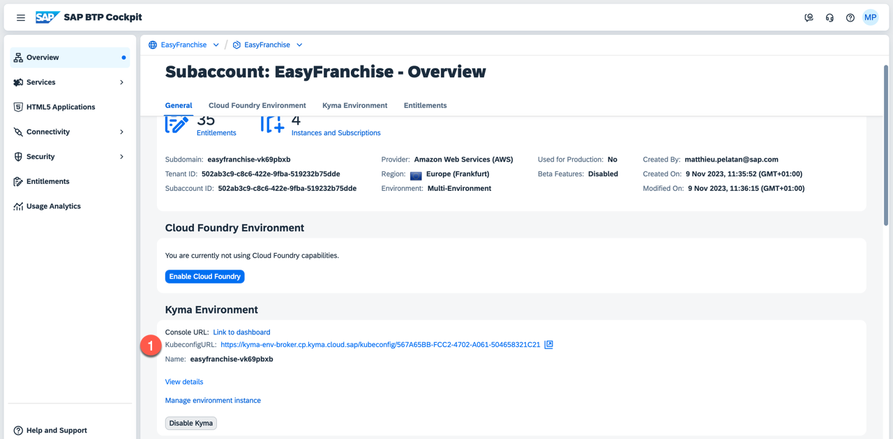
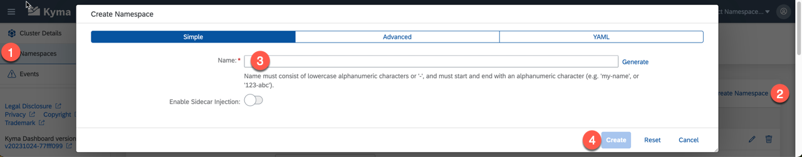
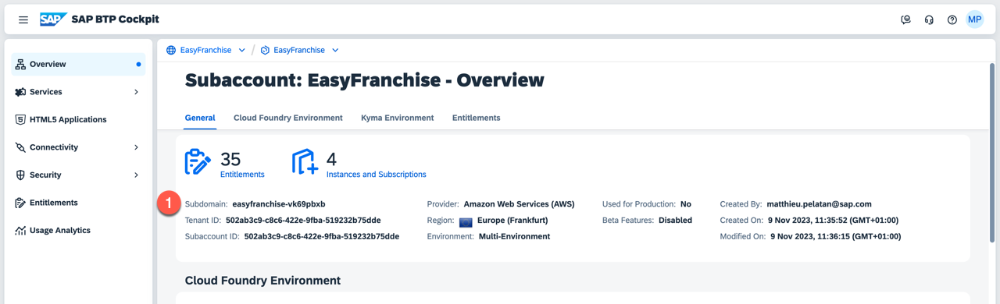
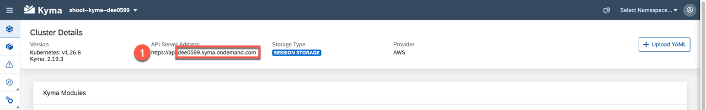

# Prepare the Deployment

## Configure Command Line Tool *kubectl*

The **kubectl** command line tool lets you control your clusters. You will use it to deploy the applications artifacts. But first you need to provide the details of the cluster.

1. Open the SAP BTP Cockpit and navigate to the overview page of the subaccount where Kyma is enabled. There you will find the url to download the kubeconfig file. 

   

2. See section [Organizing Cluster Access Using kubeconfig Files](https://kubernetes.io/docs/concepts/configuration/organize-cluster-access-kubeconfig/) in the Kubernetes documentation for more details about the kubeconfig file.

   One option is to configure the file access using the environment variable:

   ```shell
   # assuming the kubeconfig file name is kubeconfig.yaml
   export KUBECONFIG=kubeconfig.yaml
   ```
3. Using the following command you can recheck, if your configuration was successful:

   ```
   kubectl config view
   ```

> Note: Make sure that you have installed the Kubernetes OpenID Connect (OIDC) authentication plugin in order to use the command line tool. 

## Create Namespaces

Easy Franchise app consists of the following artifacts:

- Approuter
- Backend: DB Service, EF Service, BP Service
- Broker
- Email Service
- UI
- Optional: Business Partner Mock Server

In total you have three (or 4) namespaces to separate the artifacts:

- **integration** contains all micro-services that have dependencies to other SAP BTP services, for example, ef-approuter, ef-broker, db-service, and bp-service.
- **backend** contains only the Easy Franchise service, which acts as central entry point for all other backend services.
- **frontend** contains the UI components.
- **mock** contains the Business Partner Mock Server if you decide to use it instead of an SAP S/4HANA system.

Either you can create the namespaces using kubectl or using the Kyma dashboard.

Here are the steps using kubectl:

1. Open a shell and run:

   ```shell
   kubectl create namespace integration
   kubectl create namespace backend
   kubectl create namespace frontend

   kubectl label namespace integration istio-injection=enabled --overwrite
   kubectl label namespace backend istio-injection=enabled --overwrite
   kubectl label namespace frontend istio-injection=enabled --overwrite
   ```
   Optional if you want to use the Business Partner Mock
      ```shell
      kubectl create namespace mock
      kubectl label namespace mock istio-injection=enabled --overwrite
      ```

2.  You should see a message like `namespace/integration created` if the command was successful. In addition, the namespace should also be visible using the Kyma dashboard.

Here are the steps using the Kyma Dashboard:

1. Open the Kyma Dashboard and choose **Add new namespace**. Provide the namespace name and choose **Create**.

   

2. Create all 3 namespaces: **integration**, **backend**, **frontend** and optionally **mock**.

# Determine Placeholder Values

For manual deployment you need to provide multiple parameters.

- *Docker Repository*: a Docker registry to store images, for example https://hub.docker.com/.
- *Subdomain*: the subdomain of the subaccount, where your application is deployed, for example, easyfranchise.

  

- *Cluster Domain*: the full Kyma cluster domain. You can find the cluster name in the downloaded **kubeconfig** file or in the Kyma dashboard, for example, `c-1ddaa90.kyma.ondemand.com`.

  

- *image-name*: The following code snippet shows the example of a Kubernetes deployment file containing the place-holder "image-name". You will find a suggestion for the image name in the respective deployment step.

  ```yaml
  apiVersion: apps/v1
  kind: Deployment
  metadata:
    name: ui
    namespace: frontend
  spec:
    selector:
      matchLabels:
        app: ui
    template:
      metadata:
        labels:
          app: ui
      spec:
        imagePullSecrets:
         - name: registry-secret # replace with your own registry secret
        containers:
        - image: <image-name>
          name: ui
  ```

## Deploy Database Secret

A secret contains access information, that should not be saved in your code. That means that they should be created manually.
The database secret contains information such as databasename, sqlendpoint, databasename username, and password.

1. Update the [db-secret.yaml](../../../code/easyfranchise/deployment/k8s/db-secret.yaml) file which stores the information about the database with the correct values for your database. The snippet below shows the information contained in the secret: 

   ```yaml
   apiVersion: v1
   kind: Secret
   metadata:
     name: db-config
     namespace: integration
   type: Opaque
   stringData:
     db.properties: |
       db.sqlendpoint: <SAP HANA DB Host>
       db.admin: <Admin user>
       db.password: <password of the admin user>
   ```

   The `db.name` as well as the `db.sqlendpoint` for the secret can be found in the SAP BTP cockpit in the SAP HANA Cloud service overview. For the user credentials `db.admin` and `db.password`, you should use the **DBADMIN** database user.

2. As the secret is only used by the DB service, it needs to be deployed in the integration namespace. The namespace is defined in the secret itself. Use the following command to deploy the secret:

   ```shell
   kubectl apply -f <path to secret>
   ```

   If the command was successful, the output should look like this:

   ```shell
   secret/db-config configured
   ```

## Registry Secret

For the tutorial, we assume that the images will be stored in a private repository on Docker hub or in a company repository like JFrog Artifactory. Therefore, you need to provide the access information to your Kyma cluster that you can pull the images from those repositories.

Therefore, all `deployment.yaml` files contain an `imagePullSecret` entry, which is set to `registry-secret`. This secret needs to be available in all namespaces. If there is no secret required for your repository, simply delete the entry from all YAML files.

   ```yaml
   imagePullSecrets:
           - name: registry-secret # replace with your own registry secret
   ```

Here are the steps in case you are using **Docker hub**:

1. If you are using Docker hub and a private Docker repository, see the [Kubernetes documentation](https://kubernetes.io/docs/tasks/configure-pod-container/pull-image-private-registry/) for more details.

   As you can only create *one* private repository in a free Docker hub account, we have made sure in our instructions, that Docker images stored on Docker hub will have different tag names so that they can be stored under one repository.

   When we speak about repository name, we mean the combination of account and repo name that is usual with docker hub: `<docker account>/<repo name>`. An example would be `easyfranchise/kyma-multitenant`.

   Addressing an image will include the tag name:`<docker account>/<repo name>:<tag name>`. An example would be `easyfranchise/kyma-multitenant:bp-service-0.1`.

2. Log in to Docker using this command:

   ```shell
   docker login -u <docker-id> -p <password>
   ```

3. Apply the secret with this command for all namespaces: **integration**, **backend**, **frontend**:

   ```shell
   kubectl -n <namespace> create secret docker-registry registry-secret --docker-server=https://index.docker.io/v1/  --docker-username=<docker-id> --docker-password=<password> --docker-email=<email>
   ```


