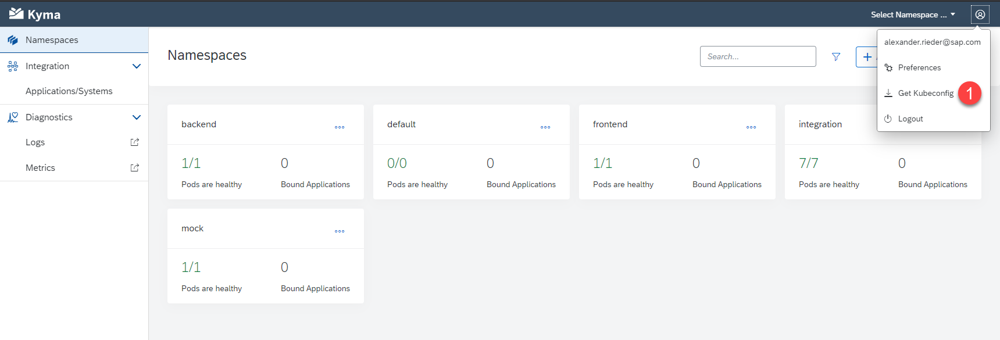

# Prepare the Deployment

Easy Franchise app consists of following deployable artifacts:

- Approuter
- Backend: DB Service, EF Service, BP Service
- Broker
- Email Service
- UI

For each of the components there are a set of Kubernetes yaml files for deployment under folder **k8s**.  All of these yaml files contains one or more of the following place-holder:

* `cluster_domain`
* `provider-subdomain`
* `image-name`

1. If you are doing the manual deployment these placeholders must be adapted according to your own environment setup. For the script based deployment you can create a copy of the [.env-template](/code/.env-template) and adapt the values there. The scripts will replace the values of the yaml files with the ones configured in your .env file.

   The neccessary values can be found following the description below.
   
   - EASYFRANCHISE_DOCKER_REPOSITORY: a docker registry to store images. e.g. https://hub.docker.com/ .
   
   - PROVIDER_SUBDOMAIN: the subdomain of the sub account where your application is deployed. e.g. easyfranchise
   
     
   
   - CLUSTER_DOMAIN: the full Kyma cluster domain. You can usually find the cluster domain in the Kyma console, e.g. c-08e5ce3.kyma.shoot.live.k8s-hana.ondemand.com
   
   
   Following code snippet shows the example a Kubernetes deployment file containing place-holder "image-name". The deployment script will build the "image-name" out of `EASYFRANCHISE_DOCKER_REPOSITORY` and replace it with actual image name. For the manual deployment you will find a suggestion for the image name in the respective step.
   
   ```yaml
   apiVersion: apps/v1
   kind: Deployment
   metadata:
     name: ui
     namespace: frontend
   spec:
     selector:
       matchLabels:
         app: ui
     template:
       metadata:
         labels:
           app: ui
       spec:
         imagePullSecrets:
           - name: registry-secret # replace with your own registry secret
         containers:
         - image: <image-name>
           name: ui
   ```

## Common Tasks

Before we can deploy the components we need to create the needed namespaces and the secrets used for the email service and the database.

### Get Kubeconfig
1. Open the Kyma dashboard via the account cockpit. And download the Kubeconfig and save it locally as shown below:
   
   
   
   Then export the kubeconfig with following command in your command console.
   
   ```shell
   # assuming the kubeconfig file name is kubeconfig.yaml
   export KUBECONFIG=kubeconfig.yaml
   ```

2. In order to execute all the neccessary steps of the tutorial you will need the follwing software available on your PC/Laptop.  

   > **_NOTE:_** The kubeconfig will expire after 8 hours.

### Create Namespaces

Before we can start deploying the artifacts to our cluster we need to create the namespaces for our application. In total we use three namespace to separate the artifacts from each other. You can either create the namespaces via the console or the Kyma dashboard. 

Backend
Contains the central backend micro-service **ef-service** which acts as central entry point all other backend services.

Frontend
The frontend namespace contains our ui component.

Integration
The integration namespace contains all micro-services that have dependencies to other BTP services, e.g. ef-approuter, ef-broker, db-service and bp-service.

1. Use the following commands to create the namespaces via a terminal

   ```shell
   kubectl create namespace integration
   kubectl create namespace backend
   kubectl create namespace frontend
   ```

   You should see a message like this if the command was successful. In addition the namespace should also be visible via the kyma dashboard.

   ```shell
   namespace/integration created
   ```

### Secrets

As secrets contain access information they should not be part of your code which mean they need to be created manually for our scenario. There are two secrets which are being used one for the database that contains the credentials to the database and one for the email service which contains the username and password for the used gmail account.

#### DB-Config

1. You need to create a secret file (e.g. db-secret.yaml) that stores the information about the database. You can use the following template and adapt it with your information:

   ```yaml
   apiVersion: v1
   kind: Secret
   metadata:
     name: db-config
     namespace: integration
   type: Opaque
   stringData:
     db.properties: |
       db.name: <SAP HANA DB Name>
       db.sqlendpoint: <SAP HANA DB Host>
       db.admin: <Admin user>
       db.password: <password of the admin user>
   ```

   The `db.name` as well as the `db.sqlendpoint` for the secret can be found in the SAP BTP Cockpit in the SAP HANA Cloud overview. For the user credentials `db.admin` and `db.password`,  you can either use an admin user which has the permission to create schemas or you can use the DBADMIN user which is being created during instance creation. 

2. As the secret is only used by the DB service it needs to be deployed to the integration namespace which is defined in the secret itself. Use the following command to deploy the secret: 

   ```shell
   kubectl apply -f <path to secret>
   ```
   
   If the command was successful the output should look the following: 
   ```shell
   secret/db-config configured
   ```


#### Email-Secret

3. You need to create a secret file (e.g. email-secret.yaml), use the template below to create the secret, that contain the the `<email username>` and `<email password>` for the mail provider used in the service (e.g. gmail)

   ```yaml
   apiVersion: v1
   kind: Secret
   metadata:
     name: email-secret
     namespace: integration
   type: kubernetes.io/basic-auth
   stringData:
     password: <email password>
     username: <email username>
   ```

4. As the email service will be deployed into the integration namespace also the secret needs to be applied to the same which is indicated by the namespace attribute in the secret. 

   ```shell
   kubectl apply -f <path to secret>
   ```

   If the command was successful the output should look the following:

   ```shell
   secret/email-secret configured
   ```

#### Registry Secret

For the tutorial we assume that the images will be stored in a private repository on docker hub or in an company repository like JFrog Artifactory. Therefore we need to provide the access information to our Kyma cluster that we can pull the images from those repositories.

5. Therefore all deployment.yaml files contain an imagePullSecret entry which is set to registry-secret. This secret needs to be available in all namespaces. If there is no secret required for your repository simply delete the entry from all yaml files. 

   ```yaml
   imagePullSecrets:
           - name: registry-secret # replace with your own registry secret
   ```

##### Docker Hub
If you are using docker hub and a private docker repository you can read more info in [this description](https://kubernetes.io/docs/tasks/configure-pod-container/pull-image-private-registry/).

As you can only create *one* private repository in a free docker hub account we have made sure in our instructions that docker images stored on docker hub will have different tag names so that they can be stored under one repository.

* When we speak of repository name we mean the combination of account and repo name that is usual with docker hub: ``<docker account>/<repo name>``. An example would be ``easyfranchise/kyma-multitentant``
* Addressing an image will include the tag name:``<docker account>/<repo name>:<tag name>``. An example would be ``easyfranchise/kyma-multitentant:bp-service-0.1``

6. Make sure you are logged into docker with hub with this command:

   ```shell
   docker login -u <docker-id> -p <password>
   ```

7. Then create and apply the secret with this command:

   ```shell
   kubectl -n <namespace> create secret docker-registry registry-secret --docker-server=https://index.docker.io/v1/  --docker-username=<docker-id> --docker-password=<password> --docker-email=<email>
   ```

   Make sure you have executed the command for all namespaces: **integration**, **backend**, **frontend**.
