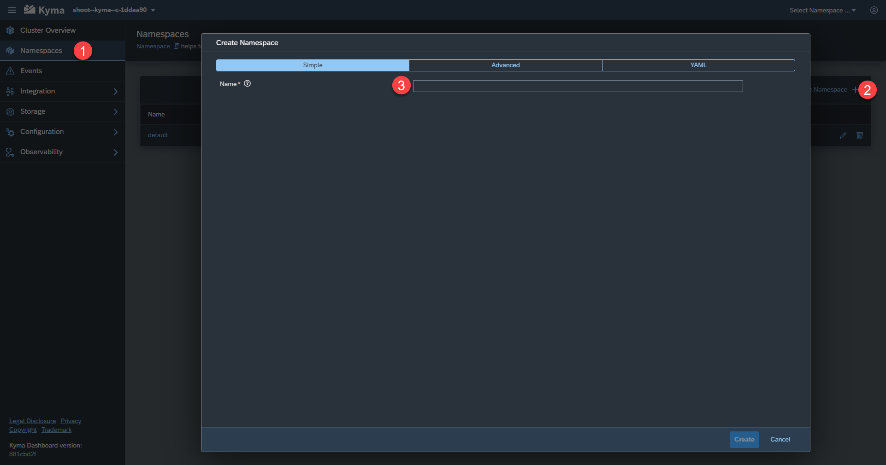
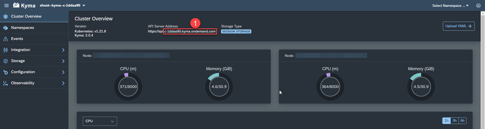

# Prepare the Deployment

## Configure Command Line Tool *kubeclt*

The **kubectl** command line tool lets you control your clusters. We will use it to deploy the applications artifacts. But first we need to provide the details of the cluster.

1. Open the Kyma dashboard via the account cockpit and download the kubeconfig file. 
   
   
2. Read the Kubernetes documentation [Organizing Cluster Access Using kubeconfig Files](https://kubernetes.io/docs/concepts/configuration/organize-cluster-access-kubeconfig/) to get more details on the kubeconfig file. 

   One option is to configure the file access via environment variable:
   
   ```shell
   # assuming the kubeconfig file name is kubeconfig.yaml
   export KUBECONFIG=kubeconfig.yaml
   ```
3. Via the following command you can recheck, if your configuration was succesfull: 
   ``` 
   kubectl config view
   ```

> Note: The kubeconfig will expire after 8 hours, so that you have to do the above steps regularly.

## Create Namespaces 

Easy Franchise app consists of the following artifacts:

- Approuter
- Backend: DB Service, EF Service, BP Service
- Broker
- Email Service
- UI

In total we will have three namespaces to separate the artifacts:

- **integration**: it contains all micro-services that have dependencies to other BTP services, e.g. ef-approuter, ef-broker, db-service and bp-service.
- **backend**: it contains only the Easy Franchise service, which acts as central entry point for all other backend services.
- **frontend**: it contains the ui components.

Either you can create the namespaces via kubeclt or via the Kyma dashboard.

Here are the steps using kubeclt:

1. Open a shell and run:

   ```shell
   kubectl create namespace integration
   kubectl create namespace backend
   kubectl create namespace frontend
   ```
1.  You should see a message like ``namespace/integration created``  if the command was successful. In addition the namespace should also be visible via the kyma dashboard.

Here are the steps using the Dashboard: 
1. Open the Kyma Dashboard and click **Add new namespace**. Provide the namespace name and click **Create**.
   
   
1. Create all 3 namespaces: **integration**, **backend**, **frontend**.

# Determine Placeholder Values

For manual deployment as well for the scripts based deployment you will need to provide multiple parameters. 

- *EASYFRANCHISE_DOCKER_REPOSITORY*: a docker registry to store images. e.g. https://hub.docker.com/.
- *PROVIDER_SUBDOMAIN*: the subdomain of the subaccount, where your application is deployed. e.g. easyfranchise
   
     
- *CLUSTER_DOMAIN*: the full Kyma cluster domain. You can find the cluster name in the downloaded **kubeconfig** file or in the URL of the Kyma dashboard. e.g. c-08e5ce3.kyma.shoot.live.k8s-hana.ondemand.com

  
- *image-name*: Following code snippet shows the example a Kubernetes deployment file containing place-holder "image-name". The deployment script will build the "image-name" out of `EASYFRANCHISE_DOCKER_REPOSITORY` and replace it with actual image name. For the manual deployment you will find a suggestion for the image name in the respective step.
  ```yaml
  apiVersion: apps/v1
  kind: Deployment
  metadata:
    name: ui
    namespace: frontend
  spec:
    selector:
      matchLabels:
        app: ui
    template:
      metadata:
        labels:
          app: ui
      spec:
        imagePullSecrets:
         - name: registry-secret # replace with your own registry secret
        containers:
        - image: <image-name>
          name: ui
  ```   

## Create Environment File for Script based Deployment

For each of the components there are a set of Kubernetes yaml files for deployment under folder **k8s**. All of these yaml files contains one or more placeholder values. The script will replace the values of the yaml files with the ones configured in your environment file.

1. Copy the file [code/.env-template](/code/.env-template) to `code/.env`
2. Modify the file and provide your values for:  
   * EASYFRANCHISE_DOCKER_REPOSITORY
   * PROVIDER_SUBDOMAIN
   * CLUSTER_DOMAIN
   
## Deploy Database Secret

A secret contains access information, that should not be saved in your code. That means that they should be created manually. 
The database secret contains information such as databasename, sqlendpoint, databasename username and password.

1. Create a secret file (e.g. db-secret.yaml) that stores the information about the database. You can use the following template and adapt it with your information:

   ```yaml
   apiVersion: v1
   kind: Secret
   metadata:
     name: db-config
     namespace: integration
   type: Opaque
   stringData:
     db.properties: |
       db.name: <SAP HANA DB Name>
       db.sqlendpoint: <SAP HANA DB Host>
       db.admin: <Admin user>
       db.password: <password of the admin user>
   ```

   The `db.name` as well as the `db.sqlendpoint` for the secret can be found in the SAP BTP Cockpit in the SAP HANA Cloud overview. For the user credentials `db.admin` and `db.password`,  you should use the **EFADMIN** database user.

2. As the secret is only used by the DB service, it needs to be deployed in the integration namespace. The namespace is defined in the secret itself. Use the following command to deploy the secret: 

   ```shell
   kubectl apply -f <path to secret>
   ```
   
   If the command was successful the output should look as follow: 
   ```shell
   secret/db-config configured
   ```

## Deploy Email Secret

As the Email service is sending mails, we need to provide information such as email user and password.

1. Use the below template to create the secret file (e.g. email-secret.yaml). Update  `<email username>` and `<email password>`.

   ```yaml
   apiVersion: v1
   kind: Secret
   metadata:
     name: email-secret
     namespace: integration
   type: kubernetes.io/basic-auth
   stringData:
     username: <email username>
     password: <email password>
   ```
2. As the Email service will be deployed into the integration namespace, the attribut namespace in the secret should be set to integration. Use the following command to deploy the secret: 

   ```shell
   kubectl apply -f <path to secret>
   ```

   If the command was successful the output should look as follow:

   ```shell
   secret/email-secret configured
   ```

## Registry Secret

For the tutorial we assume that the images will be stored in a private repository on docker hub or in an company repository like JFrog Artifactory. Therefore we need to provide the access information to our Kyma cluster that we can pull the images from those repositories.

Therefore all deployment.yaml files contain an imagePullSecret entry which is set to registry-secret. This secret needs to be available in all namespaces. If there is no secret required for your repository simply delete the entry from all yaml files. 

   ```yaml
   imagePullSecrets:
           - name: registry-secret # replace with your own registry secret
   ```

Here the steps in case you are using **Docker hub**:

1. If you are using docker hub and a private docker repository, you can read more info here on this [page](https://kubernetes.io/docs/tasks/configure-pod-container/pull-image-private-registry/).

   As you can only create *one* private repository in a free docker hub account, we have made sure in our instructions that docker images stored on docker hub will have different tag names so that they can be stored under one repository.

   When we speak about repository name, we mean the combination of account and repo name that is usual with docker hub: ``<docker account>/<repo name>``. An example would be ``easyfranchise/kyma-multitentant``

   Addressing an image will include the tag name:``<docker account>/<repo name>:<tag name>``. An example would be ``easyfranchise/kyma-multitentant:bp-service-0.1``

2. Logged into docker via this command:

   ```shell
   docker login -u <docker-id> -p <password>
   ```

3. Apply the secret with this command for all namespaces: **integration**, **backend**, **frontend**:

   ```shell
   kubectl -n <namespace> create secret docker-registry registry-secret --docker-server=https://index.docker.io/v1/  --docker-username=<docker-id> --docker-password=<password> --docker-email=<email>
   ```

 
