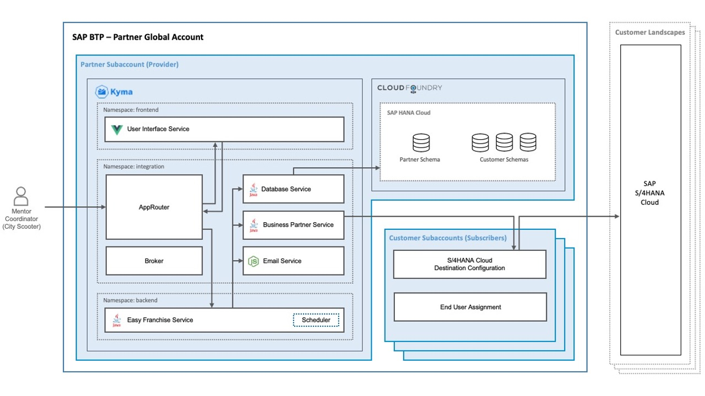

# Learn the Business Scenario of this Mission

The SAP partner *Easy Franchise* wants to provide their customers *City Scooter* and *Bicycle Sharing* an application for managing their franchise business. The application is used by *City Scooter* and *Bicycle Sharing* employees to assign mentors to each new business partner. At the end of the process, the assigned mentor is informed and can start coaching/onboarding the new business partner (franchisee).

The SAP partner *Easy Franchise* implements the application as an SAP S/4HANA Cloud extension on SAP Business Technology Platform (SAP BTP). To reduce costs, the SAP partner decides to go for a multitenant approach so that multiple customers can buy and use the application.

Here is a high-level overview of the multitenant approach:

# Solution Details

The SAP partner develops an Kyma-based multitenant application on SAP BTP.

All multitenant microservices of the application will run in the Kyma environment. In addition to that, the SAP partner uses an SAP HANA database to persist the data of the application. As SAP HANA is not yet available in Kyma today, the database will be running in the Cloud Foundry environment.

To manage customer-specific configuration, the partner creates a dedicated subaccount for each customer. Later on, the system admin of the customer gets access to the subaccount and can maintain the access details to the SAP S/4HANA Cloud tenant and manages the users of the application.

Here is a technical overview of the partner application:

# Involved Personas

### On the Easy Franchise Partner Side

**Partner system admin**

* Onboards and offboards new customers (City Scooter, Bicycle Sharing, and others)
* Runs and monitors the partner application

### On the Customer Side

**SAP S/4HANA Cloud manager**
* Creates/updates business partners of a customer in SAP S/4HANA Cloud system

**System admin**
* Provides following details to partner in order to configure the application
  * Identity provider metadata + principal propagation configuration
  * Details for mapping between groups and role collections
  * Optional: if the connection is for on-premise system, the system admin needs to install and configure SAP Cloud Connector (SCC)
* If required, the system admin can get access to a dedicated subaccount and configure the destination and manage the user assignment in the subscriber account for the mentor coordinator(s)

**Mentor coordinator**
* Assigns mentors to business partners (franchisees)
* Get email notification, when a new business partner is created in the SAP S/4HANA Cloud system

**Mentor** 
* Get email notification, when assigned as mentor to a franchisee
