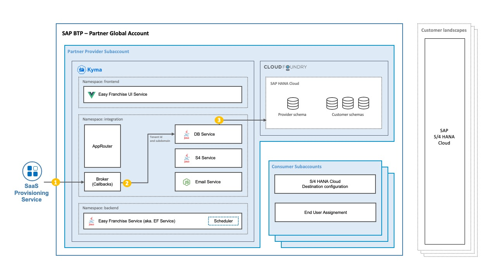

# Multitenancy in the Easy Franchise Scenario

Before starting the exploration of the applications components in the next chapter or even with the step-by-step guide, we thought it will be good to have a summary page explaining the key points of the [multitenancy concept](https://blogs.sap.com/2018/09/26/multitenancy-architecture-on-sap-cloud-platform-cloud-foundry-environment/) used in the Easy Franchise application. In general, multitenancy can be achieved in various ways. We show here only one example of implementing it but be aware that this may of course be different based on your needs.

## Separation of Data
When having multiple customers that use the same multitenant application, the separation of the data is key. In our scenario, this is done by creating one schema/user for each customer during the onboarding. As soon as a customer is onboarded, the SaaS Provisioning service sends a request to the application broker, which provides the necessary API (callbacks). The broke will, for example, invoke the DB service to create a schema/user for the new customer.

  Here are the explanation of the steps in the previous diagram:
  1. As soon as a customer is onboarded, the SaaS Registry triggers the onboarding process. A request with all information about the new tenant (for example, tenant ID and subdomain) in the body is sent to the application broker.
  1. The [broker](../../explore/broker/README.md) extracts the tenant ID and the subdomain out of the request body and triggers actions defined in the callbacks. In our case, the DB service is informed about the new onboarding.
  1. The [Database service](../../explore/db-service/README.md) creates a new schema/user for the new customer. Standard tables and default configuration are automatically generated.

## Authentication Flow
Having the data separated, let's have a look on how to consume the right data for the right customer.

  Here are the explanation of the steps in the previous diagram:
  1. An end user opens the application in a browser. The browser sends a request to the [Approuter](../../explore/approuter/README.md).
  1. The end user is redirected to the SAP Authorization and Trust Management service to log in.
  1. After a successful login, the SAP Authorization and Trust Management service sends a JWT token to Approuter, which extracts the tenant ID. The tenant ID will be needed later to call the data from the right tenant.
  1. The Approuter redirects to [UI](../../explore/ui/README.md).
  1. The UI sends a request to backend API via the Approuter.
  1. The Approuter injects the tenant ID in the request as a header and forwards the request to the [Easy Franchise service](../../explore/README.md).
  1. The Easy Franchise service receives request as an orchestrator and forwards it to the respective microservice including the tenant ID. Here, it's part of the URL, which makes it simpler to log or debug at development time.
  1. The [Database service](../../explore/README.md) requests data from the respective tenant.
  1. The [Business Partner service](../../explore/README.md) gets information from the destination in the respective subaccount and calls the SAP S/4HANA Cloud system.

## Customers Bringing Their SAP S/4HANA Cloud Systems 

Each customer brings their own SAP S/4HANA Cloud system. 
For each customer a dedicated customer subaccount in the partners global account is needed. 
Within that subaccount, a destination needs to be created. This destination contains the SAP S/4HANA Cloud connection details. The Business Partner service makes use of the Destination service to read the destination from the subaccount of the accessing tenant. See [Multitenancy in the Destination Service](https://help.sap.com/viewer/cca91383641e40ffbe03bdc78f00f681/Cloud/en-US/4e07f250fe5d441cab09f69e22909198.html) in the SAP Help Portal.

