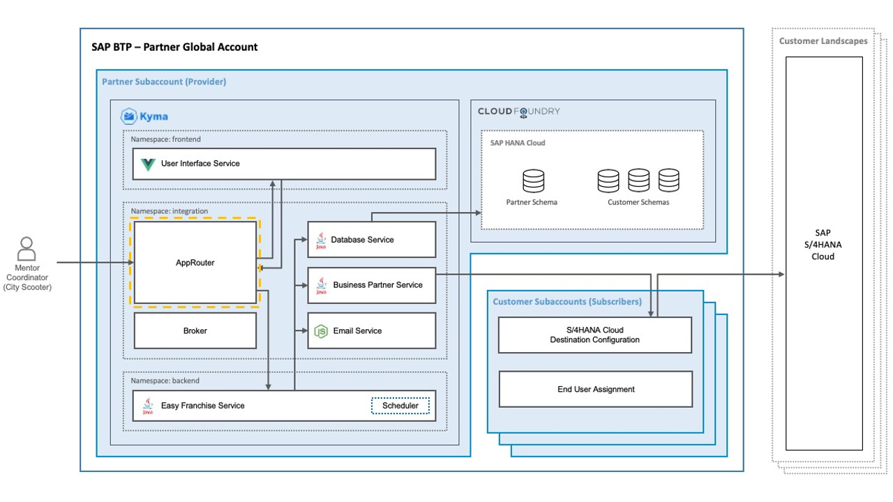
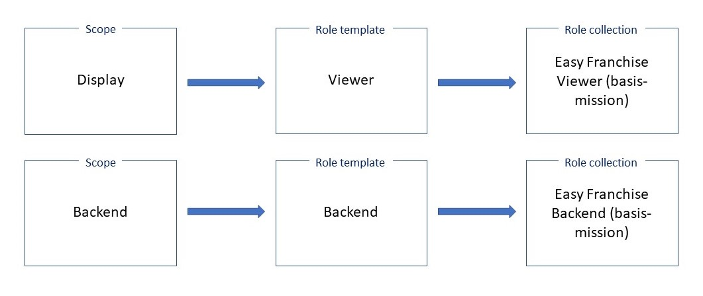

# Understand the Approuter



The Approuter is a Node.js [module](https://www.npmjs.com/package/@sap/approuter), which is available in the [npm](https://docs.npmjs.com/about-npm) repository. It represents a single entry point to an application, which might consist of several different apps (microservices). In our use case, it has the responsibility of performing authentication, authorization, and forwarding requests to Java based application **Easy Franchise Service**.

To understand how the Approuter is involved in the authentication flow and witch routs are needed, see section [Understand the Multitenancy Concept - Authentication Flow](../../../documentation/discover/multitenancy/README.md#authentication-flow).

## Configuring URL Routing

The routes are defined in [xs-app.json](../../../code/easyfranchise/source/approuter/xs-app.json). A route is a configuration that instructs the application router how to process an incoming request with a specific path.

In our case, we would like to route URLs matching the reg-expression `^/ui/(.*)$` to the destination **ui**. Destination configuration will be explained in the following section.

A scope check (authorization check) will also be performed automatically by the Approuter against the SAP Authorization and Trust Management service instance before forwarding the request to corresponding destination.
In our case, the UI access is only allowed for the scope **Display** and **Backend**.

This is the corresponding *ui* route:

```
     {
            "source": "^/ui/(.*)$",
            "target": "$1",
            "destination": "ui",
            "scope": ["$XSAPPNAME.Display", "$XSAPPNAME.Backend"]
     }
```

You can find extended explanation in the Approuter documentation in section [Routes](https://www.npmjs.com/package/@sap/approuter#routes).

As we have several routes, the [xs-app.json](../../../code/easyfranchise/source/approuter/xs-app.json) is more complex and also defines the **welcomeFile**:

```json
{
    "welcomeFile": "/ui/index.html",
    "routes": [
        {
            "source": "^/broker/(.*)$",
            "target": "$1",
            "destination": "broker"
        },
        {
            "source": "^/ui/(.*)$",
            "target": "$1",
            "destination": "ui",
            "scope": ["$XSAPPNAME.Display", "$XSAPPNAME.Backend"]
        },
        {
            "source": "^/backend/(.*)$",
            "target": "$1",
            "destination": "ef-service",
            "csrfProtection": false,
            "scope": ["$XSAPPNAME.Backend"]
        },
        {
            "source": "^/css/(.*)$",
            "destination": "ui",
            "authenticationType": "none"
        },
        {
            "source": "^/js/(.*)$",
            "destination": "ui",
            "authenticationType": "none"
        },
        {
            "source": "^/img/(.*)$",
            "destination": "ui",
            "authenticationType": "none"
        }
    ]
}
```

## Defining Routing Destinations

Destinations such as **ui** or **ef-service** as needed in the routes configuration are defined in the **ConfigMap** section of the [deployment.yaml](../../../code/easyfranchise/deployment/k8s/approuter.yaml). The URL behind each destination points to the corresponding service, which handles the request.

```yaml
apiVersion: v1
kind: ConfigMap
metadata:
  name: destinations-config
  namespace: integration
data:
  destinations: |
    [
      {"name":"ef-broker","url":"http://ef-broker.integration.svc.cluster.local:3002","forwardAuthToken" : true},
      {"name":"ef-ui","url":"http://ef-ui.frontend.svc.cluster.local:80","forwardAuthToken" : true},
      {"name":"ef-service","url":"http://efservice.backend.svc.cluster.local:80","forwardAuthToken" : true}
    ]
```

<!--
As an alternative, you could also check the scope by using a custom middleware as describe below. Please note that scope check only needs to be implemented once, i.e. either in the xs-app.json as shown above, or in the custom middleware as below.

```javascript
var ar = approuter();
ar.beforeRequestHandler.use('/', function (req, res, next) {

    if (!req.user) {
        res.statusCode = 403;
        res.end("Missing JWT Token");
    }

    xssec.createSecurityContext(req.user.token.accessToken, xsenv.getServices({uaa:{tag:'xsuaa'}}).uaa, function(error, securityContext) {
        if (error) {
            res.statusCode = 401;
            res.end("Security context creation failed: " + error);
        }
        if (securityContext.checkLocalScope("Display")) {
            res.statusCode = 200;
            console.log("authorization checked!");
            next();
        } else {
            res.statusCode = 403;
            res.end("User does not have proper role to access the app.");
        }
    });
});
```
-->


## Extending the Approuter with a Custom Middleware

As the Easy Franchise application is multitenant, you need to provide the tenant ID by each request to the backend service **Easy Franchise Service**. Therefore, the Approuter is extended with a custom middleware. For that purpose, you use a custom [approuter-start.js script](../../../code/easyfranchise/source/approuter/approuter-start.js), which is referenced in the [package.json](../../../code/easyfranchise/source/approuter/package.json). With the help of this custom middleware, every request sent to the backend gets an HTTP header with tenant ID. The following code snippet shows the implementation:

> Note: This is a technical requirement of our application and might not be applicable in general. Alternatively, the backend component (for example, the Easy Franchise service) could extract the tenant ID directly from the forwarded JWT token.

```javascript
var ar = approuter();
ar.beforeRequestHandler.use('/backend', function (req, res, next) {
    const token = req.user.token.accessToken;
    if (!token) {
        res.statusCode = 403;
        res.end("Missing JWT Token");
    }else {
        const decodedToken = jwt_decode(token);
        const tenant = decodedToken && decodedToken.ext_attr && decodedToken.ext_attr.subaccountid;
        req.headers['x-tenant-id'] = tenant;
        console.log("set header x-tenant-id to tenant id : "+ tenant);
        next();
    }
}
```

You can find more details on extending Approuter in [SAP BTP documentation](https://help.sap.com/viewer/4505d0bdaf4948449b7f7379d24d0f0d/2.0.01/en-US/6abdedefcb1f47878a07d49919124eef.html).

## SAP Authorization and Trust Management Service

The definition of the custom scopes and role collections are defined in the SAP Authorization and Trust Management service instance. Details can be found in the file [deployment_service.yaml](../../../code/easyfranchise/deployment/k8s/btp-services.yaml). The instance defines two scopes *Display* and *Backend*. In addition to that, two roles templates *Viewer* and *Backend* are defined respectively. Lastly, two role-collections are defined using role templates. Note that the name of role-collections must be unique across different subaccounts, otherwise the creation of the SAP Authorization and Trust Management service instance will fail in case of a name conflict. In our case, the subaccount domain <provider-subdomain> is appended to make the role collection name unique.



Moreover, a standard *callback* scope is included in order to onboard/offboard new customers.

```yaml
apiVersion: servicecatalog.k8s.io/v1beta1
kind: ServiceInstance
metadata:
  name: xsuaa-service
spec:
  clusterServiceClassExternalName: xsuaa
  clusterServicePlanExternalName: broker # unified service plan 'broker': https://jam4.sapjam.com/blogs/show/2dxT4cVGxTXZRJT0D1DQQM
  parameters:
    xsappname: easyfranchise
    tenant-mode: shared # use "shared" for multi-tenant application
    scopes:
      - name: $XSAPPNAME.Display
        description: Display Scope
      - name: $XSAPPNAME.Backend
        description: Backend Scope
      - name: $XSAPPNAME.Callback
        description: With this scope set, the callbacks for tenant onboarding, offboarding and getDependencies can be called.
        grant-as-authority-to-apps:
          - $XSAPPNAME(application,sap-provisioning,tenant-onboarding)
    role-templates:
      - name: Viewer
        description: Easy Franchise Viewer Role-Template
        scope-references: [$XSAPPNAME.Display]
      - name: Backend
        description:  Easy Franchise Backend Role-Template
        scope-references: [$XSAPPNAME.Backend]
    role-collections:
      - name: Easy Franchise Viewer (<provider-subdomain>)
        description: Easy Franchise Viewer Role-Collection
        role-template-references: [$XSAPPNAME.Viewer]
      - name: Easy Franchise Backend (<provider-subdomain>)
        description: Easy Franchise Backend Role-Collection
        role-template-references: [$XSAPPNAME.Backend]
...
```

## (Optional) Authentication Using the Identity Authentication Service

The SAP BTP has its own default identity provider. If needed, SAP BTP supports also identity federation, so that user identities from other systems can be used. To enable communication between SAP BTP and the custom identity provider (for example, Identity Authentication), you must cross-configure the communication endpoints of the involved systems, establishing a trust relationship between them. See the [SAP BTP documentation](https://help.sap.com/viewer/65de2977205c403bbc107264b8eccf4b/Cloud/en-US/7c6aa87459764b179aeccadccd4f91f3.html#loio7c6aa87459764b179aeccadccd4f91f3) for more details.
