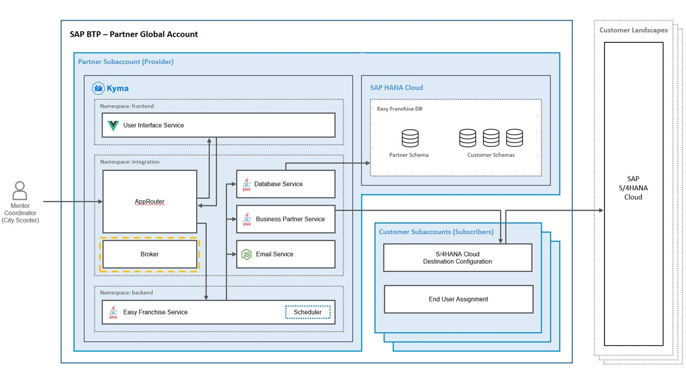

# Understand the Broker


This section demonstrates how to integrate SaaS Provision service to onboard/offboard new tenants. This is achieved by the following parts:

- Implement callback functions for onboarding, offboarding, and getDependency.
- Deploy broker and its Kubernetes service
- SaaS Provision service instance

## Implement Callback Functions

The broker provides the following callbacks:

- onSubscription: For onboarding/offboarding purpose. For the new tenant, the function takes care of constructing (1) a unique app URL and (2) its corresponding APIRule, and (3) setting up proper database schema for the new tenant.

- getDependencies: Return a list of dependent services. In our scenario **Destination** service is returned as dependent service.

The full implementation can be found in [server.js](/code/broker/server.js) under folder [broker](/code/broker).

See the [official documentation](https://help.sap.com/viewer/65de2977205c403bbc107264b8eccf4b/Cloud/en-US/3971151ba22e4faa9b245943feecea54.html) for more details.

## Deploy Broker with Service

Our callbacks are implemented using Node.js. Then the application is dockerized and deployed to Kyma along side a Kubernetes service to expose the application within Kyma cluster.

The full deployment YAML file can be found in [deployment.yaml](/code/broker/k8s/deployment.yaml).

The tenant-specific application URL is exposed through APIRule, which needs to be created dynamically through onboarding/offboarding process using [Kubernetes client for NodeJs](https://github.com/kubernetes-client/javascript). To create such APIRule, proper RoleBinding is granted through following definition:

```yaml
apiVersion: rbac.authorization.k8s.io/v1
kind: RoleBinding
metadata:
  name: broker-rolebinding
  namespace: integration
subjects:
  - kind: ServiceAccount
    name: default
    namespace: integration
roleRef:
  kind: ClusterRole
  name: kyma-namespace-admin
  apiGroup: rbac.authorization.k8s.io

```

## Create SaaS Provision Service Instance

The last part of this section is to create a SaaS Provision service. Following code snippet shows definition of SaaS Provision service for Kyma.

Note:

- Parameter **xsappname** must match the value of the same parameter defined in SAP Authorization and Trust Management service.

- Parameter **displayName** technically does not need to be unique. However, in case of deploying the application **with the same display name in multiple sub accounts under one global account**, having a unique name would help to identify the subaccount from which the application is subscribed. In the following example, the subdomain of the subaccount is added for such purpose.

- An APIRule for subscription is created so that the callback is reachable. Those callbacks need to be implemented by the application provider (discussed above).

- Two placeholders `<provider-subdomain>` and `<cluster-domain>` are defined below, and will be replaced by deployment script. See section [ManualDeployment](/documentation/deploy/manual-deployment/README.md) for more details.

```yaml
# Resource to create instance for SaaS Registry services
apiVersion: servicecatalog.k8s.io/v1beta1
kind: ServiceInstance
metadata:
  name: saas-registry-service
  namespace: integration
spec:
  clusterServiceClassExternalName: saas-registry
  clusterServicePlanExternalName: application
  parameters:
    # the xsappname refers to the one defined in xsuaa service
    xsappname: easyfranchise
    displayName: Easy Franchise (Multitenant) <provider-subdomain>
    description: An application on Kyma with multi-tenant
    category: "Demo applications"
    appUrls:
      # url registered in the kyma-broker which handles SaaS provisioning (subscription/deletion of saas instances)
      onSubscription: https://subscription.<cluster-domain>/callback/v1.0/tenants/{tenantId}
      getDependencies: https://subscription.<cluster-domain>/callback/v1.0/dependencies

```
