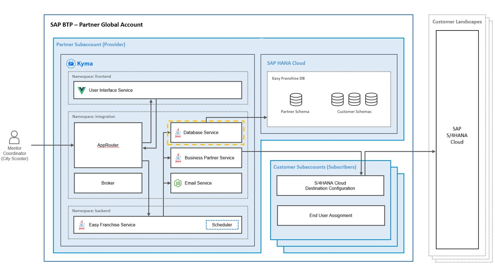

# Understand the Database Service



Database Service (DB Service) is a REST service responsible for all SAP HANA database operations.

DB Service is located within the *integration* namespace on Kyma. It is only accessible from the Kyma cluster. Here are the two main scenarios where the Database service is called:
* CRUD operations from the UI via Easy Franchise Service
* During the subscription/deletion process of the application via the Broker


# Service Implementation

 All REST services are implemented in two classes:
* [DBService.java](../../../code/easyfranchise/source/backend/db-service/src/main/java/dev/kyma/samples/easyfranchise/dbservice/DBService.java) implements tenant aware API: each call requires the presence of tenant id as path parameter. This is the vast majority of calls.
* [DBAdminService.java](../../../code/easyfranchise/source/backend/db-service/src/main/java/dev/kyma/samples/easyfranchise/dbservice/DBAdminService.java) implements admin calls that do not need the tenant info.

The REST API service URLs are structured as followed:

````
https://<subaccount domain>.<cluser-id>.kyma.shoot.live.k8s-hana.ondemand.com/easyfranchise/rest/dbservice/v1/<subaccount id>/<entity name>/<additonal path parameters>
````

Example full service URL for reading all Mentors from SAP HANA database could be:

```
https://dbservice.c-97d8b1a.kyma.shoot.live.k8s-hana.ondemand.com/easyfranchise/rest/dbservice/v1/420f7362-184e-4907-97bf-289c22906084/mentor
```

The implementation follows JAX-RS standards as described in [Jakarta RESTful Web Services 3.0 API Specification](https://jakarta.ee/specifications/restful-ws/3.0/apidocs/).

A typical GET REST service:

```java
    /**
     * Read all entries in MENTOR table.
     * @param tenantId
     * @param resContext
     * @return
     */
    @GET
    @Path("mentor")
    public Response getMentors(@PathParam("tenantId") String tenantId, @Context ContainerRequestContext resContext) {
        logger.info(Util.createLogDetails(resContext));
        try {
            List<Mentor> mentors = DB.getMentors(tenantId);
            Jsonb jsonb = JsonbBuilder.create();
            return createOkResponse(jsonb.toJson(mentors));
        } catch (WebApplicationException e) {
            logger.error(e.getMessage(), e);
            return createResponse(e);
        } catch (Exception e) {
            logger.error(UNEXPECTED_ERROR + e.getMessage(), e);
            return createErrorResponse();
        }
    }
```

All REST services usually handle these topics:
* Tracing the REST call via logger
* Forwarding the call to database class for the actual database operations
* Preparing the JSON or String response
* Exception handling

PUT calls are similar:

```java
    /**
     * Update MENTOR table entry. Create new entry if a zero Id is given.
     * For Id != 0 the old entry is updated.
     * @param tenantId
     * @param m
     * @param resContext
     * @return
     */
    @PUT
    @Path("mentor")
    @Consumes(MediaType.APPLICATION_JSON)
    public Response createOrUpdateMentor(@PathParam("tenantId") String tenantId, Mentor m, @Context ContainerRequestContext resContext) {
        logger.info(Util.createLogDetails(resContext));
        try {
            m = DB.createOrUpdateMentor(tenantId, m);
            Jsonb jsonb = JsonbBuilder.create();
            return createOkResponse(jsonb.toJson(m));
        } catch (WebApplicationException e) {
            logger.error(e.getMessage(), e);
            return createResponse(e);
        } catch (Exception e) {
            logger.error(UNEXPECTED_ERROR + e.getMessage(), e);
            return createErrorResponse();
        }
    }
```

Note that we use JAX-RS automatic marshalling only for input parameters. See **Mentor m** in the previous example. The **@Consume** annotation enables parsing of JSON input. We do not use automatic un-mashalling for returning a JSON string. Instead, all REST services that return JSON convert the result to string by directly using JSON utility classes. The reason is that you often want to filter anything you return by a REST service before you actually send it.

# Persistence Implementation

We use JPA for our persistence layer as described in [Jakarta Persistence API, Version 2.2](https://jakarta.ee/specifications/persistence/2.2/). As persistence provider we chose [Hibernate](https://hibernate.org/orm/) - due to its multitenancy capabilities. We use SAP HANA Cloud as our database and connect via [JDBC](https://help.sap.com/viewer/db19c7071e5f4101837e23f06e576495/hanacloud/en-US/030a162d380b4ec0bc6a284954c8256d.html).

## Overview

We tried to follow JPA standards as much as possible. Our entities, queries, transactions, and use of EntityManager are all standard JPA. Unfortunately, JPA does not define standards for multitenancy. Therefore, all multitenancy aspects are specific to hibernate and will not work when another persistence provider is used.

## Entities

Our entities used for mapping to/from database are [here](../../../code/easyfranchise/source/backend/shared-code/src/main/java/dev/kyma/samples/easyfranchise/dbentities).

This is one example:

```java
@Entity
@NamedQueries({ @NamedQuery(name = Mentor.QUERY_GETALL_ENTITIES, query = "SELECT u FROM Mentor u") })
public class Mentor {

    public static final String QUERY_GETALL_ENTITIES = "Mentor.getAll";

    // define primary key and use DB default key generation strategy
    @Id
    @GeneratedValue(strategy = GenerationType.AUTO)
    private long id;
    private String name;
    private String email;
    private String phone;
    private String experience;
    private int capacity;
    private LocalDateTime LastUpdate;

    // model relation to Franchise from here: Mentor.id is used as foreign key in Franchise.mentor_id
    @OneToMany
    @JoinColumn(referencedColumnName = "Id", name = "MentorId")
    private List<Franchise> franchises = new ArrayList<>();

    // getters and setters not shown

    @Override
    public String toString() {
        return "Mentor [id=" + id + ", Name=" + name + ", Email=" + email + ", Phone=" + phone + ", Experience="
                + experience + ", Capacity=" + capacity + ", franchises=" + franchises + "]";
    }
}
```

For most entities, we use a generated long value as primary key. The only exception is the entity Franchise, where the primary key is the business partner id coming from the SAP S/4HANA system.

## Schemas Operations During Onboarding/Offboarding

We implement multitenancy for database operations with a separate schema approach. See [Hibernate Multitenancy](https://docs.jboss.org/hibernate/orm/5.4/userguide/html_single/Hibernate_User_Guide.html#multitenacy) for details.

A tenant is added during the subaccount onboarding and deleted during the offboarding. The creation of schemas during the onboarding consists of the following steps:
1. DB Service is called from the broker with new tenant id and subdomain as parameters.
2. Check if tenant/subdomain already exits.
3. New DB user is created with a `create user` SQL query. For SAP HANA this means that also a new database schema with the same name is created and will be automatically used if this user logs on. The new database schema name is the provided subdomain in upper case letters. We have decided to use the subdomain instead of the tenant id as schema name because such a string (for example, `420f7362-184e-4907-97bf-289c22906084`) is too long as schema name of an SAP HANA database.
4. A new entry is created in the table `TENANT` of EFADMIN schema with tenant ID, subdomain, and database schema name. This table will be used later on by each request to provide the mapping between tenant ID and schema name.
5. Tables are created in the new database schema. The SQL commands are read from a [script file](../../../code/easyfranchise/source/backend/shared-code/src/main/resources/create.sql).
6. Default values (for example, logo image) are written to the `Configuration` table in the new schema.


#### Schema Users

We have 2 different kinds of users (and their default schemas) in use:
* EFADMIN schema, which is a single schema for maintaining info of all the other schemas. Only the table `TENANT` is available in EFADMIN schema. It's needed to store tenant ID, subdomain, and DB SCHEMA name of each tenant.
* Customer schemas, which are storing the entities specific to each customer.

#### Tenant Aware Operations

All tenant aware operations follow this procedure:

1. REST API receives the call and extracts the tenant ID from path.
2. Look up the schema name based on the tenant ID in the `TENANT` table.
3. Now that we have the schema name, a database connection can be opened to the right SAP HANA schema. Hibernate provides a set of API for creating schema aware connections. Details are implemented in [DB.java](../../../code/easyfranchise/source/backend/db-service/src/main/java/dev/kyma/samples/easyfranchise/dbservice/DB.java)). These schema/tenant aware connections are stored in connection pools, so that it is not necessary to create a new connection for every call.
4. Hibernate provides then a regular EntityManager instance to work with that database schema. All operations with that EntityManager are by default restricted to the tenant-specific schema.
5. For _READ_ operations, the EntityManager instance is used to execute queries. Usually the result is one or more entity instances that are returned to the caller.
6. For _WRITE_ operations, a transaction context is created and entities are written to the DB via `EntityManager.merge()`.

# List of API Endpoints

The path of all APIs begins always with `/easyfranchise/rest/dbservice/v1/<TENANT-ID>`. It is then followed by the path listed below for each individual REST call.

| Path                         | Description                    | Curl Example                                                                                                                                                                                    |
|:-----------------------------|:-------------------------------|:------------------------------------------------------------------------------------------------------------------------------------------------------------------------------------------------|
| onboard/{subdomain}          | onboard new subaccount         | ``curl -X PUT http://localhost:8090/easyfranchise/rest/dbservice/v1/<TENANT-ID>/onboard/cityscooter01``                                                                                         |
| onboard/{subdomain}/{schema} | Only for local development: onboard new subaccount.         | ``curl -X PUT http://localhost:8090/easyfranchise/rest/dbservice/v1/<TENANT-ID>/onboard/cityscooter01/CITYSCOOTER01`` |
| offboard                     | offboard subaccount            | ``curl -X PUT http://localhost:8090/easyfranchise/rest/dbservice/v1/<TENANT-ID>/offboard``|
| franchise                    | read FRANCHISE table and return all entries   | ``curl http://localhost:8090/easyfranchise/rest/dbservice/v1/<TENANT-ID>/franchise``|
| franchise/{businesspartnerId}| create FRANCHISE table entry   | ``curl -X PUT "http://localhost:8090/easyfranchise/rest/dbservice/v1/<TENANT-ID>/franchise/1000110"``|
| franchise/{businesspartnerId}&#8594; /mentor/{mentorId}| Assign Mentor to Franchise   | ``curl -X PUT "http://localhost:8090/easyfranchise/rest/dbservice/v1/<TENANT-ID>/franchise/1000110/mentor/2"``|
| mentor                       | update MENTOR table entry   | ``curl -X PUT "http://localhost:8090/easyfranchise/rest/dbservice/v1/<TENANT-ID>/franchise/1000110/mentor/2"``|
| mentor/{mentorId}            | read MENTOR table entry   | ``curl -X GET "http://localhost:8090/easyfranchise/rest/dbservice/v1/<TENANT-ID>/mentor/2"``|
| mentor                       | read all entries in MENTOR table   | ``curl -X GET "http://localhost:8090/easyfranchise/rest/dbservice/v1/<TENANT-ID>/mentor"``|
| mentor/{mentorId}            | delete entry in MENTOR table   | ``curl -X DELETE "http://localhost:8090/easyfranchise/rest/dbservice/v1/<TENANT-ID>/mentor/222"``|
| coordinator                  | update COORDINATOR table entry | ``curl -X PUT "http://localhost:8090/easyfranchise/rest/dbservice/v1/<TENANT-ID>/coordinator" -H "Content-Type: application/json" -d '{"email":"mail@abc.def","id":"","name":"firstname lastname"}'`` |
| coordinator                  | read all COORDINATOR table entries | ``curl "http://localhost:8090/easyfranchise/rest/dbservice/v1/<TENANT-ID>/coordinator"`` |
| coordinator                  | delete entry in COORDINATOR table | ``curl -X DELETE "http://localhost:8090/easyfranchise/rest/dbservice/v1/<TENANT-ID>/coordinator/222"`` |
| config/franchisor            | read franchisor from CONFIGURATION table | ``curl "http://localhost:8090/easyfranchise/rest/dbservice/v1/<TENANT-ID>/config/franchisor"`` |
| config/franchisor            | write franchisor to CONFIGURATION table | ``curl "http://localhost:8090/easyfranchise/rest/dbservice/v1/<TENANT-ID>/config/franchisor"`` |
| config/logourl            | read logourl from CONFIGURATION table | ``curl "http://localhost:8090/easyfranchise/rest/dbservice/v1/<TENANT-ID>/config/logourl"`` |
| config/logourl            | write logourl to CONFIGURATION table | ``curl "http://localhost:8090/easyfranchise/rest/dbservice/v1/<TENANT-ID>/config/logourl"`` |
| config/schema            | read DB schema name from TENANT table in database admin schema | ``curl "http://localhost:8090/easyfranchise/rest/dbservice/v1/<TENANT-ID>/config/schema"`` |
| config/subdomain            | read subdomain from TENANT table in database admin schema | ``curl "http://localhost:8090/easyfranchise/rest/dbservice/v1/<TENANT-ID>/config/subdomain"`` |
|                              |                                |                                                                                                                                                                                                 |
