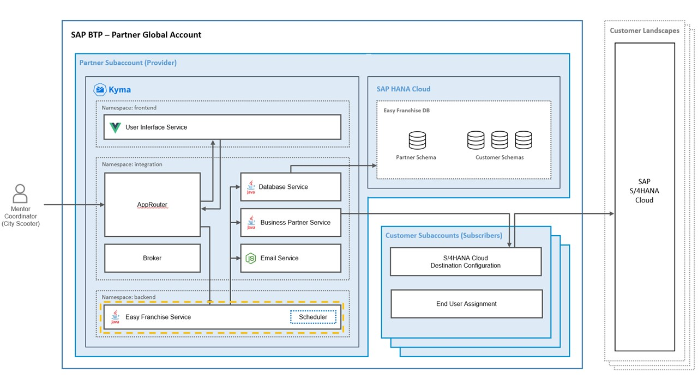

# Understand the Easy Franchise Service

 
The Easy Franchise service provides all backend functionalities to consume the data from the UI. It's a kind of orchestrator and mainly dispatches incoming calls to the other backend services. The service is located in the *backend* namespace, while the other backend services are in *integration* namespace.

## Service Implementation
All REST APIs are implemented in [EasyFranchiseService.java](/code/backend/ef-service/src/main/java/dev/kyma/samples/easyfranchise/EFService.java). The REST API service URLs are structured as followed:
```
https://**subaccount domain**.**cluser-id**.kyma.shoot.live.k8s-hana.ondemand.com/backend/easyfranchise/rest/efservice/v1/**entity name**/**additonal path parameters**
```

The APIs require an HTTP header entry specifying the tenant ID: ``x-tenant-id: 28186c4d-53d7-4a08-9510-8f42bc396a93``. More details on how tenant ID is added by our Approuter can be found in this [section](/documentation/explore/approuter/README.md#extend-approuter-by-injecting-custom-middleware).

For example all mentors can be displayed by calling the following:
```
https://dev-sub-01.c-97d8b1a.kyma.shoot.live.k8s-hana.ondemand.com/backend/easyfranchise/rest/efservice/v1/mentor
```

Implementation follows JAX-RS standards ([Jakarta RESTful Web Services 3.0 API Specification](https://jakarta.ee/specifications/restful-ws/3.0/apidocs/)). Here is a typical method handling a GET request:

```java
    /**
     * Get all mentors.
     * 
     * @param headers
     * @param resContext
     * @return
     */
    @GET
    @Path("mentor")
    public Response getAllMentors(@Context HttpHeaders headers, @Context ContainerRequestContext resContext) {
        logger.info(Util.createLogDetails(resContext, headers));
        try {
            var tenantId = Util.validateTenantAccess(headers);
            // call dbservice to read mentors
            ConnectionParameter param = new ConnectionParameter(Util.getDBServiceUrl(tenantId) + "mentor").setAcceptJsonHeader();
            Connection.call(param);
            if (param.status != HttpStatus.SC_OK) {
                throw new WebApplicationException(param.content, param.status);
            }
            return createOkResponse(param.content);
        } catch (WebApplicationException e) {
            logger.error(e.getMessage(), e);
            return createResponse(e);
        } catch (Exception e) {
            logger.info("confirmation mentor NOT read");
            logger.error(UNEXPECTED_ERROR + e.getMessage(), e);
            return createErrorResponse();
        }
    }
```

All REST services usually handle these topics:
* Tracing the REST call via logger
* Opening a connection to the DB Service and performing the requested operation (READ or WRITE)
* Exception handling

## Rest Client
As mentioned before, the Easy Franchise service has a kind of orchestrator role between the services and therefore needs open connections to the respective services. That's why we need a Java class for that purpose - usually a *REST Service Client* or more generally *Http Client*. There are a lot of options in standard Java packages or 3rd party frameworks, but we decided to use our own implementation in [Connection.java](/code/backend/shared-code/src/main/java/dev/kyma/samples/easyfranchise/communication/Connection.java). Please see the implementation for more details.

## Scheduler
The scheduler is needed to run only one task: trigger via the Email Service notifications to Mentor Coordinators when new business partners (Franchisees) are added in the SAP S/4HANA Cloud system.
The scheduler service is implemented as part of the Easy Franchise service. Once activated, the service runs every 5 minutes. The service can be enabled or disabled in the [backend-configmap](/code/backend/config/backend-configmap.yaml) or at runtime via the following REST service:
```
/backend/easyfranchise/rest/efservice/v1/scheduler/on
```
Any other path parameter than *on* will disable the scheduler service.


## List of API Endpoints


### Tenant-Aware API Endpoints

Each of the below calls need the TENANT-ID as header:

```
curl -X <GET|PUT> http://<host>/easyfranchise/rest/efservice/<PATH>
     --header 'x-tenant-id: <TENANT-ID>'
```

When running local and using the `local_dev=true` the header `x-tenant-id` is not used and the TENANT-ID is taken from a property file. 
(Read more details in section [Start and Test the Microservices DB-Service, BP-Service and EF-Service](/documentation/prepare/test-app-locally/README.md))
```
curl -X <GET|PUT> http://localhost:8080/easyfranchise/rest/efservice/<PATH>
```


| Path                         | Description                    | Curl                                                                                                                                                                                            |
|:-----------------------------|:-------------------------------|:------------------------------------------------------------------------------------------------------------------------------------------------------------------------------------------------|
| franchisee                   | get all franchisee             | ``curl -X GET http://localhost:8080/easyfranchise/rest/efservice/v1/franchisee``|             
| franchisee/{BUSINESS-PARTNER}| creates a new franchisee       | ``curl -X PUT http://localhost:8080/easyfranchise/rest/efservice/v1/franchisee/<BUSINESS-PARTNER>``|
| config/franchisor            | gets the franchisor            | ``curl -X GET http://localhost:8080/easyfranchise/rest/efservice/v1/franchisor``|
| config/franchisor            | sets the franchisor            | ``curl -X PUT -d "city-scooter-local" http://localhost:8080/easyfranchise/rest/efservice/v1/config/franchisor``|
| config/logourl               | get the logo URL               | ``curl -X GET http://localhost:8080/easyfranchise/rest/efservice/v1/config/logourl``|
| config/logourl               | set the logo URL               | ``curl -X PUT -d "https://mycopany.com/logo.png" http://localhost:8080/easyfranchise/rest/efservice/v1/config/logourl`` |
| mentor/notify                | notify the Mentor by calling the EMail Service| ``Curl -X PUT http://localhost:8080/easyfranchise/rest/efservice/v1/mentor/notify -H "Content-Type: application/json" -d '{"mentor":{"email":"tom.miller@millers-company.com","name":"Tom Miller"},"franchise":{"emailAddress":"peter.maier@cityscooter.de","fullName":"City Scooter - Walldorf"}}'``|
| mentor                       | get all mentors                | ``curl -X GET http://localhost:8080/easyfranchise/rest/efservice/v1/mentor``|
| mentor                       | create a mentor                | ``curl -X PUT http://localhost:8080/easyfranchise/rest/efservice/v1/mentor -H "Content-Type: application/json" -d '{"name":"Miller Tom","email":"tom.miller@millers-company.com","phone":"0815123456","experience":"beginner","capacity":"4"}'``|
| mentor/{mentorId}            | delete a mentor                | ``curl -X DELETE http://localhost:8080/easyfranchise/rest/efservice/v1/mentor/<MENTOR-ID>``|
| franchisee/{businesspartnerId}/mentor/{mentorId} | assign mentor to franchisee | ``curl  -X PUT http://localhost:8080/easyfranchise/rest/efservice/v1/franchise/<BUSSINES-PARTNER_ID}/mentor/<MENTOR-ID>``|
| coordinator                  | get all coordinators           | ``curl -X GET http://localhost:8080/easyfranchise/rest/efservice/v1/coordinator``|
| coordinator                  | create or update coordinator   | ``curl -X PUT http://localhost:8080/easyfranchise/rest/efservice/v1/coordinator --header 'Content-Type: application/json' --data-raw '{"name": "John Smith", "email": "john.smith@cityccooter.com}'``|
| coordinator                  | delete coordinator             | ``curl -X DELETE http://localhost:8080/easyfranchise/rest/efservice/v1/coordinator/<COORDINATOR-ID>``|


### Tenant in Depended API Endpoints

| Path                         | Description                                           | Curl                                                                           |
|:-----------------------------|:------------------------------------------------------|:-------------------------------------------------------------------------------|
| scheduler/{STATUS} | enable or disable the Schedule, STATUS ='on' or 'off' | ``curl -X GET http://localhost:8080/easyfranchise/rest/efservice/v1/scheduler/<STATUS>`` |


