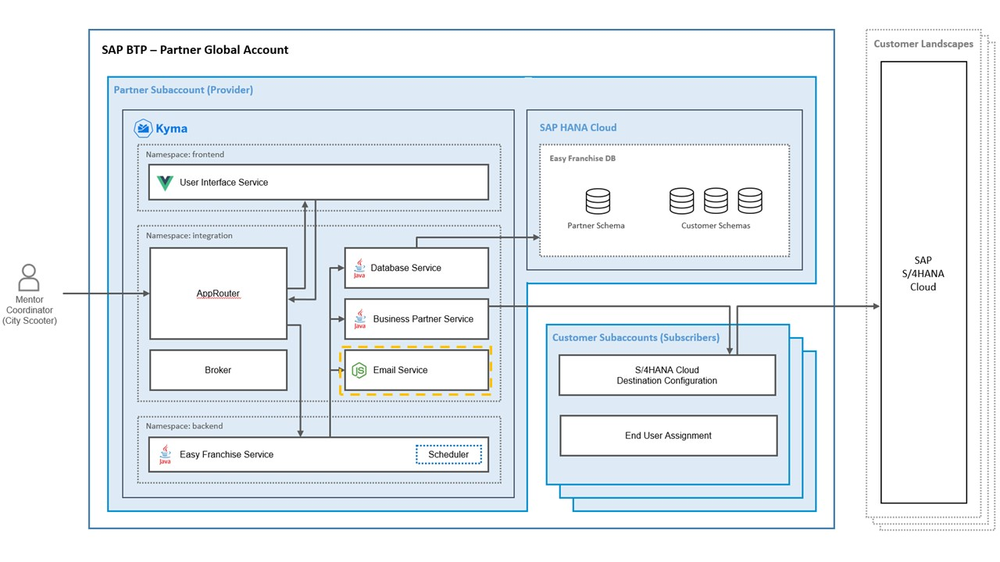

# Understand the Email Service

 

The Email service is a REST service responsible for sending email notifications. The service is implemented in Node.js using the [Express Framework](https://expressjs.com/de/) and the [nodemailer](https://nodemailer.com/about/) library.

The Email service is located within the *integration* namespace on Kyma. It is not accessible from outside our Kyma cluster. Only the Easy Franchise service performs calls to this service. Here are the 2 use cases when the service is triggered:

* Notifying the mentor coordinators about new business partners (franchisees)
* Notifying the respective mentor about a new assignment

## Service Implementation

Compared to the other components, this service is not tenant-aware as it simply sends emails to the given email addresses.
The service is implemented in the class [server.js](../../../code/easyfranchise/source/email-service/server.js), where 2 APIs are implemented.

To configure the email used to send the notifications, the customer admin has to go on the admin corner of the page and add the technical email address in the section **General Settings**.

1. Method Notify Coordinator

   The method is called from the scheduler service within the Easy Franchise service when new business partner (franchisees) are created in the SAP S/4HANA Cloud system. The subscribed coordinators get then a notification with all new franchisees. The body of the request is structured as followed:

   ```json
   {
      "newFranchiseNames":[
         "City Scooter - München",
         "City Scooter - London",
         "City Scooter - Hamburg",
         "City Scooter - Stuttgart"
      ],
      "newFranchiseCount":4,
      "coordinators":[
         {
            "name":"Coordinator Name",         
            "email":"coordinator@cityscooter.com"
         }
      ]
   }
   ```

1. Method Notify Mentor

   The method is called from the Easy Franchise service when a new mentor is assigned to the business partner (franchisee). The assigned mentor receives an email with the contact information and the name of the new franchisee. The body of the request is structured as followed:

   ```json
   {
      "mentorName":"Name of the Mentor",
      "email":"mentor@cityscooter.com",
      "franchiseName":"City Scooter - München",
      "franchiseEmail":"munich@cityscooter.com"
   }
   ```

## List of API Endpoints

The path of all APIs begins with `/easyfranchise/rest/emailservice/v1/<TENANT-ID>`. It is then followed by the path listed in the following table for each individual REST call.

| Path   | Description  | Curl Example  |
|:-------|:-------------|:--------------|
| notifycoordinator     | Send a mail to the subscribed coordinators   | ``curl --verbose -X PUT "http://localhost:3002/easyfranchise/rest/emailservice/v1/<TENANT-ID>/notifycoordinator" -H "Content-Type: application/json" -d '{"newFranchiseNames":["new franchisee 1","new franchisee 2"],"newFranchiseCount":2,"coordinators":[{"name":"<coordinator-name>","email":"<coordinator-email>"}]}'``|
| notifymentor          | Send a mail to the assigned mentor | ``curl --verbose -X PUT "http://localhost:3002/easyfranchise/rest/emailservice/v1/<TENANT-ID>/notifymentor" -H "Content-Type: application/json" -d '{"mentorName":"<mentor-name>","email":"<mentor-email>","franchiseName":"<assigned-franchisee>","franchiseEmail":"<franchisee-email>"}'``|
