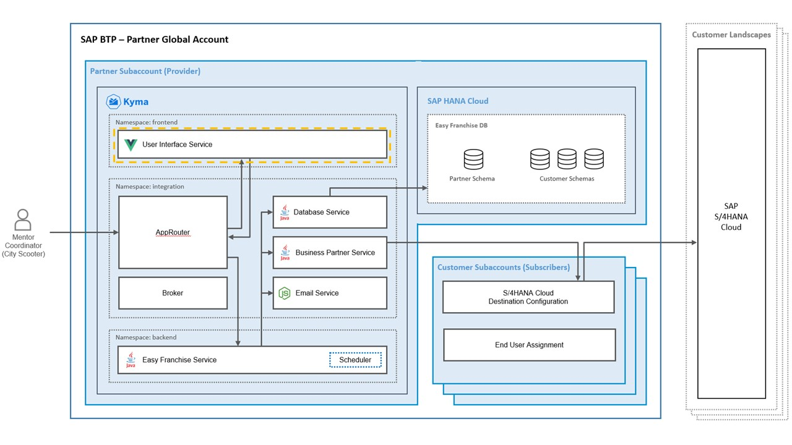

# Understand the User Interface

 

The user interface of the Easy Franchise application is developed with [SAP Fundamental Vue Library](https://sap.github.io/fundamental-styles/?path=/docs/introduction-overview--page). [SAP Fundamental Styles](https://sap.github.io/fundamental-styles/?path=/docs/introduction-overview--page) is a lightweight presentation layer, that can be used with various UI frameworks. With Fundamental Library Styles, consistent SAP Fiori apps in any web-based technology can be built. In this tutorial Vue is used as a framework to develop graphical user interfaces.

# Structure of Application

The Easy Franchise application contains 4 different UI screens and each screen is divided in UI components.

## Main.js

In this file all required frameworks, for example, FundamentalVue or bootstrap are imported. Also all subpages of the application are imported centrally here. In `main.js` file, the Vue router is used to enable navigation trough the different subpages of the application. To simplify calling all the APIs to the backend in the whole application, the URL to the backend is defined in the `main.js` file once, so it can be then called via a variable from all other components. The backend URL of a local running application differs from the deployed version on Kyma. The *backend api* variable is also used to change easily between the different URLs.

```
// Defining the url of the backend apis
Vue.prototype.$backendApi = "/backend/easyfranchise/rest/efservice/v1";
// backend api for local development
Vue.prototype.$backendApi = "http://localhost:8080/easyfranchise/rest/efservice/v1";
```

## App.vue

This page is the central component of the application, where the whole structure of the pages is defined: fiori-nav-bar, router-view, and modal-intro. Each displayed page has a top bar included, which allows navigation through the entire application.
In the router, view all properties and events needed in the child components that are declared.
In case there is no information maintained in the application yet, a modal to add basic information is maintained.
Here, all the calls to load data, like the different mentors or franchises from the backend, are done and the loaded information then is stored in variables to use them in other components too.

```
// Loading all franchises details from backend
    loadAllFranchises() {
      const apiUrl = this.$backendApi + "/franchisee";
      fetch(apiUrl)
      .then(response => response.json())
      .then(data => {
        this.allFranchises = data;
        console.log("[DEBUG] Loading allFranchises: ", data);
      });
    },
```

As soon as a page is loaded or refreshed, the mounted function loads all franchises, coordinators, and company details to ensure the application always displays the latest data.


## FranchisesOverview.vue

In this component, the start page of the application is developed, where all the available franchises are shown in a table. This component can access all the franchises via properties from the App.vue page, where they were loaded from the backend. 
The franchises are divided between new and already existing franchises. As long as a franchise does not have any mentor assigned, it is shown as a new franchise. By clicking a franchise on the table, the detailed page of the franchise is loaded.

## FranchiseDetails.vue

When choosing a franchise, the ID of this franchise is used to get the data from the backend. This data is then shown in the franchise details page, where it is possible to assign mentors to the franchise. 
If no mentor is selected yet, a button to assign mentors is displayed. This button then opens a modal with available mentors to be chosen from. By choosing **Assign and inform mentor**, the mentor is saved to the backend and an email is sent to the new mentor.
After a mentor is selected, the contact details of the mentors are shown instead of the button. Also, it is possible to change the mentor in this area.

## AdminCorner.vue

All general settings can be done in the admin corner component. In this page, it is possible to change the name or logo of the company via an input field. Also, the mentors can be maintained in the admin corner section of the application. It is either possible to use mock data by clicking the respective button or to add new mentors via a modal.


