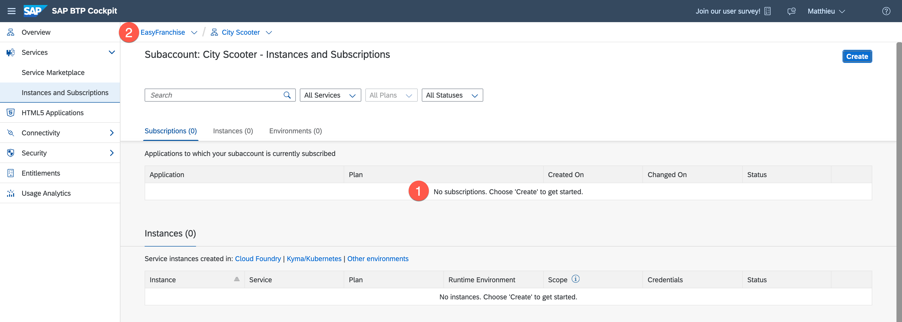
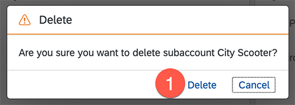

# Offboarden a Customer
Once a customer decide not to use the application anymore, the partner needs to offboard him.

1. The first step is to remove the application subscription in the customer subaccount. Open the SAP BTP cockpit and click on **Instances and Subscriptions** under **Services** in the left sidebar. 

1. Click the 3 dots icon by the application and select **delete**.

   

1. Confirm the deletion by clicking on **Delete Subscription**.
   
   

1. Once the process of the offboarding is done, the customer subaccount could be deleted. Navigate to the **Account Explorer** of the global account EasyFranchise.
   
   

1. Click the 3 dots icon of the subaccount tile and select **Delete**.

   
   
1. Confirm the subaccount deletion.
   
   
