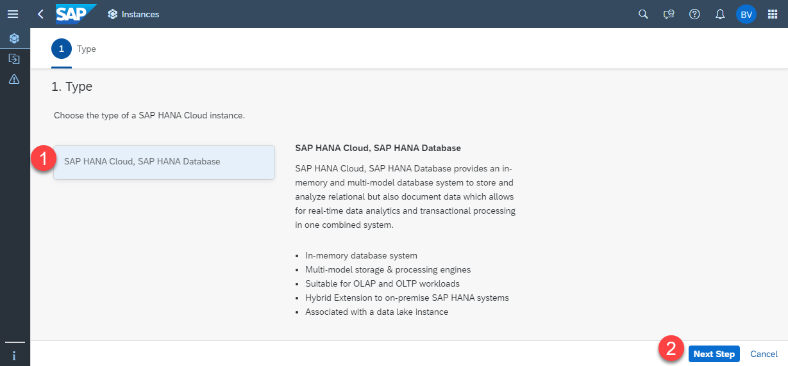
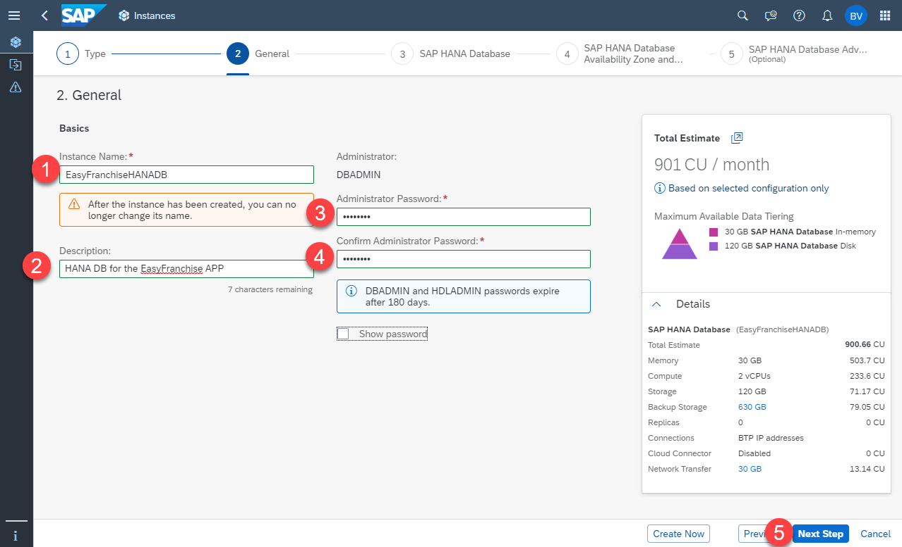
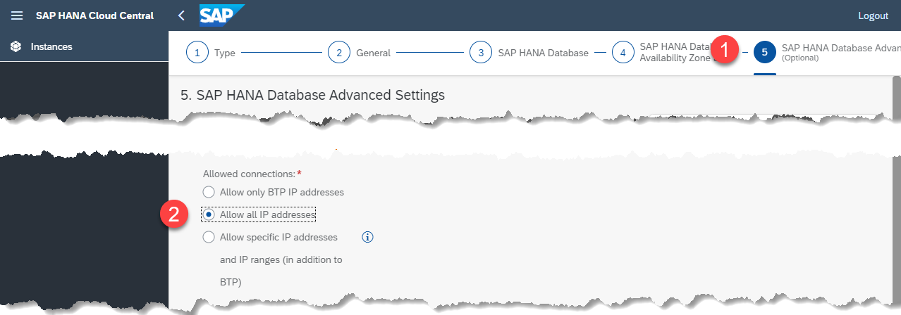
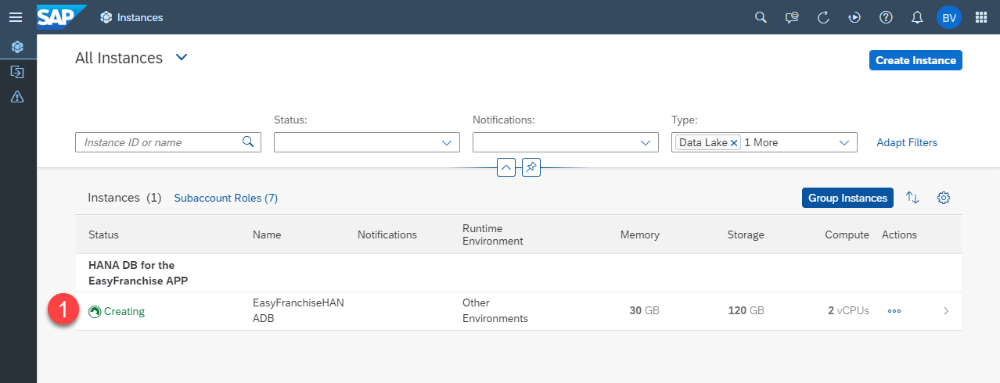
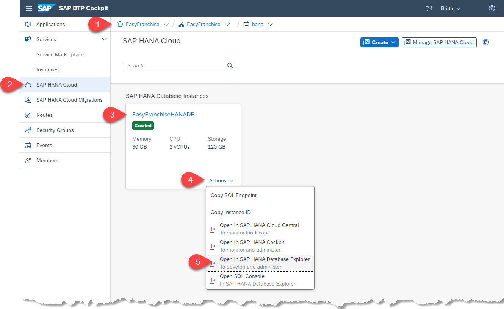
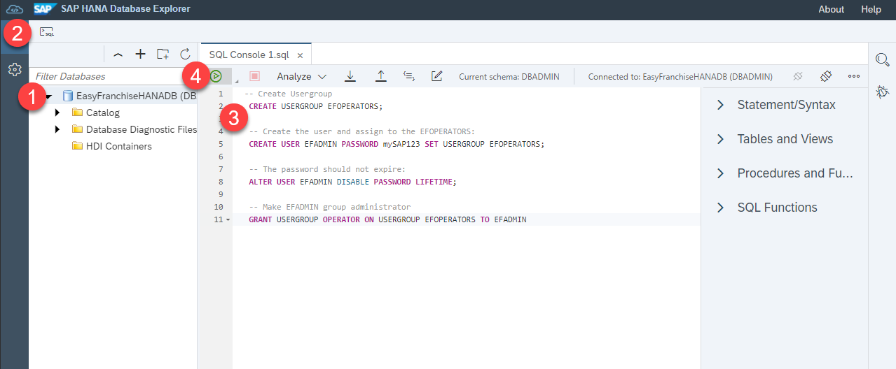
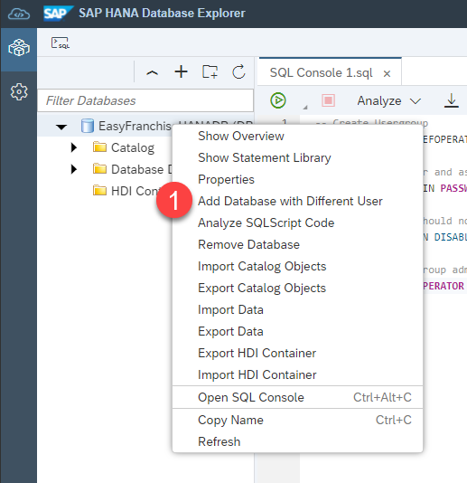
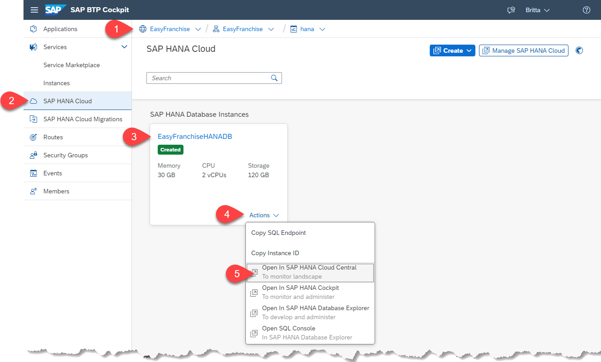

# Get and Configure the SAP HANA Cloud Database

## Create the SAP HANA Cloud Instance

If you would like to use an already existing database, this is also fine and you can skip this step.

1. Open your **Easy Franchise** subaccount with the space **hana**.

   

2. Choose **SAP HANA Cloud** in the left side menu, choose **Create** and select **SAP HANA database**.

   

3. In the new browser window choose the type **SAP HANA Cloud, SAP HANA Database** and then choose **Next Step**.

   

4. In the step **General**:
   * Select the correct **Organization** and **Space**.
   * Provide the **Instance Name**, for example **EasyFranchiseHANADB**, and a meaningful description.
   * Enter the **Password** for the **DBADMIN** user. Remember this password to use it later.

   

5. Choose **Next** until you come to step **(5) SAP HANA Database Advanced**. Select the **Allow All IP addresses** radio button. This is needed because the Kyma cluster is not yet part of the allowed SAP BTP IP addresses and it allows you to run the Easy Franchise application locally.

   

5. Choose **Create** and verify the details of the new instance. Finalize the creation.

6. Wait until the instance is created and the status turns to **RUNNING**.

   


# Create EFADMIN

We recommend not to use the default *DBADMIN* user for day-to-day activities. Instead, use *EFADMIN* user to create dedicated database users.
See [User Management with the SAP HANA Database Administrator DBADMIN](https://help.sap.com/viewer/f9c5015e72e04fffa14d7d4f7267d897/2021_2_QRC/en-US/5b35402c47b344d882ac13c661aff1c0.html) in SAP Help Portal for more details.

The following steps describe how to create an user **EFADMIN**.

>*Hint:* If you would like to share the SAP HANA Database, but would like to have your own independent access, you can create your own database admin and use this instead.

1. To open the **SAP HANA Database Explorer**, choose the `...` and then choose **Open the SAP HANA Database Explorer**.

   

2. Log in with the user **DBADMIN**.

   

3. In the Database list, you should find **EasyFranchiseHANADB**. If not, add it using the `+` button.

4. Open an SQL Console and execute the following SQL statements, which will create an **EFADMIN** database user in the user group **EFOPERATORS**.
   Update the password in the SQL Console before executing. Remember the password to use it later:

   ```
   -- Create usergroup
   CREATE USERGROUP EFOPERATORS;

   -- Create the user and assign to the EFOPERATORS:
   CREATE USER EFADMIN PASSWORD mySAP123 SET USERGROUP EFOPERATORS;

   -- The password should not expire:
   ALTER USER EFADMIN DISABLE PASSWORD LIFETIME;

   -- Make EFADMIN group administrator
   GRANT USERGROUP OPERATOR ON USERGROUP EFOPERATORS TO EFADMIN
   ```

   > Note: The editor may show you an error message that "USERGROUP IS NOT SUPPORTED". This is a bug, continue, and run the script. The usergroup will still be created.

   

5. Later on you can use the option **Add Database with Different User** to gain access via the *EFADMIN* database user.

   

>**WARNING:** When the *DBADMIN* wants to create a new user, the usergroup has to be specified
> as they now have more than one usergroup. The according SQL command would be:
>
>```CREATE USER NEWDBUSER SET USERGROUP DEFAULT```

# How to Find JDBC Connection Properties

Later in the tutorial, you need some of the properties to configure the JDBC connection.

1. Open the **SAP HANA Cloud Central**
   
   
2. In the **SAP HANA Cloud Central** select your SAP HANA Database instance. Find the property values:
   - *db.name*: The name of your SAP HANA Database. In this case, it is **EasyFranchiseHANADB**.
   - *db.sqlendpoint*: Choose `...` and use **Copy SQL Endpoint**. This will copy the endpoint details to the clipboard.
      For example, you might get something like `01234567-89fe-012c-a000-000cd00000fa.hana.prod-eu10.hanacloud.ondemand.com:443`.

   

1. For the database user properties, use the *EFADMIN*:
   - *db.admin*: EFADMIN (or your individual database admin user name)
   - *db.password*: the password


   > *Hint when not using *EFADMIN**: The database user must be allowed to create or drop new database user.
   > All these database users should be able to create tables and update table content.
