# Get and Configure the SAP HANA Cloud Database

## Create the SAP HANA Cloud Instance

If you would like to use an already existing database, this is also fine and you can skip this step.

1. Open your **Easy Franchise** subaccount 
2. Expand the **Services** and open **Services Marketplace** and select and open **SAP HANA Cloud**.
   
   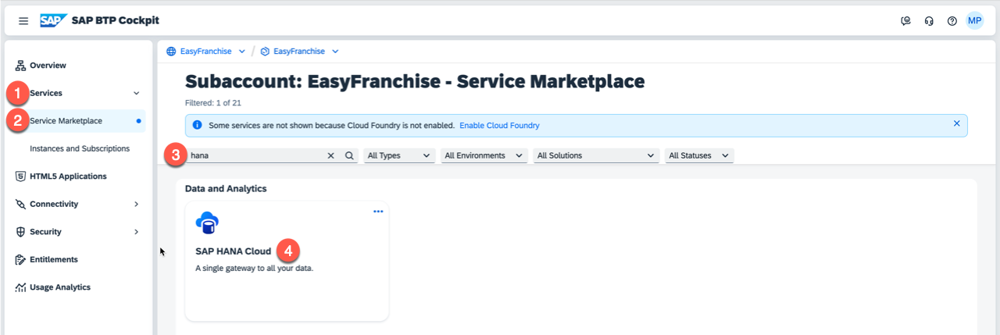
3. In the **Application Plans** section you should find a plan **tools**. Expand the 3 dots on the right side of the plan info line and select **Create**. In the following dialog accept the pre-selected service and plan and choose **Create**.
   
   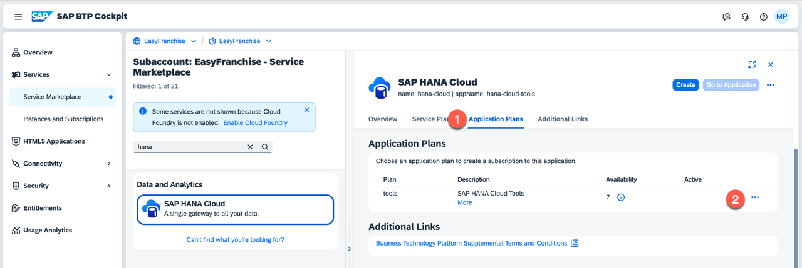
4. Don't open the **Subscription** as you first have to assign the role collection **SAP HANA Cloud Administrator**  to gain full access. Expand **Security** and open  **Users** and select yourself. Open the **Assign Role Collection** dialog on the right side by expanding the 3 dots. 

   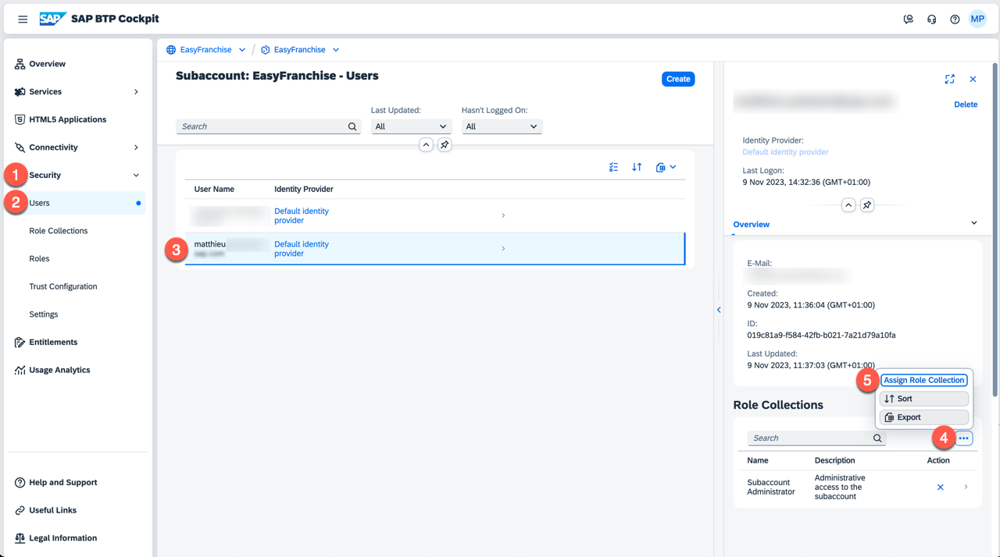
5. Assign yourself the role collection **SAP HANA Cloud Administrator**
   
   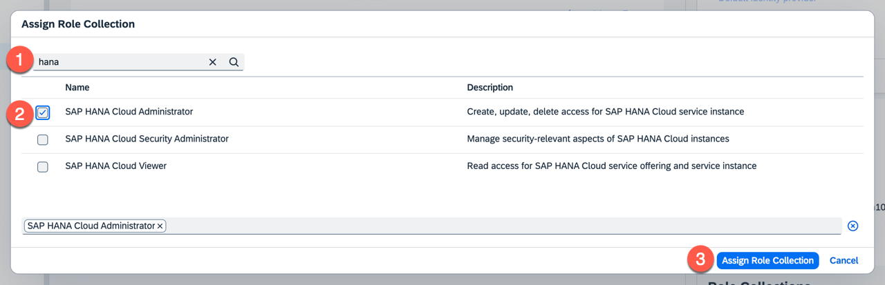
6. Go back to the **Instances and Subscriptions** and select the just created subscription  **SAP HANA Cloud** with plan **tools**.
   
   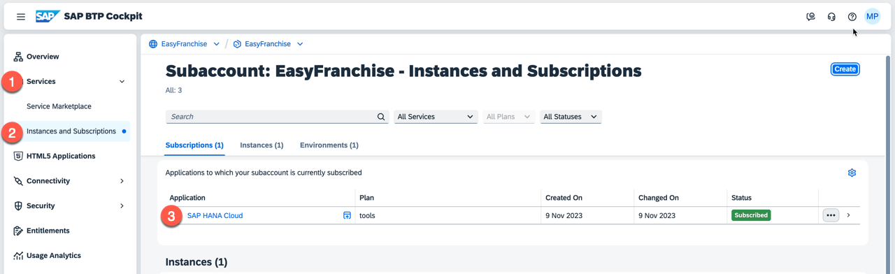
7. The **SAP HANA Cloud Central** will open. Press **Create Instance**.

   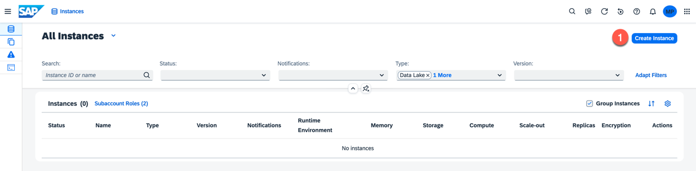
8. In the new browser window choose the type **SAP HANA Cloud, SAP HANA Database** and then choose **Next Step**.

   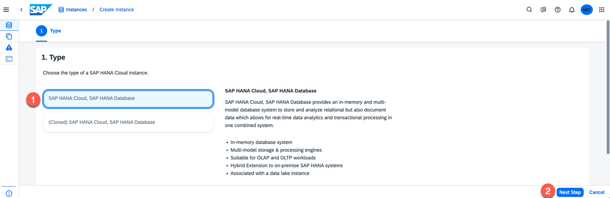

9. In the step **General**:
   * Provide the **Instance Name**, for example **EasyFranchiseHANADB**, and a meaningful description.
   * Enter the **Password** for the **DBADMIN** user. Remember this password for future use.

   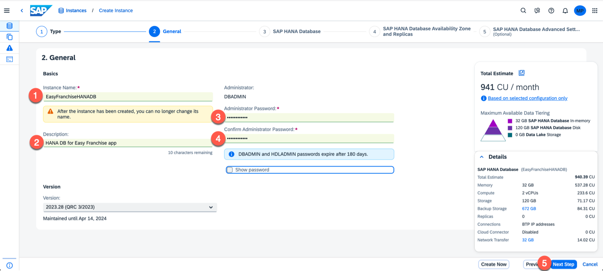
10. Choose **Next** until you come to step **(5) SAP HANA Database Advanced**. Select the **Allow All IP addresses** radio button. This is needed because the Kyma cluster is not yet part of the allowed SAP BTP IP addresses and it allows you to run the Easy Franchise application locally. Finally choose **Review and Create**. 

    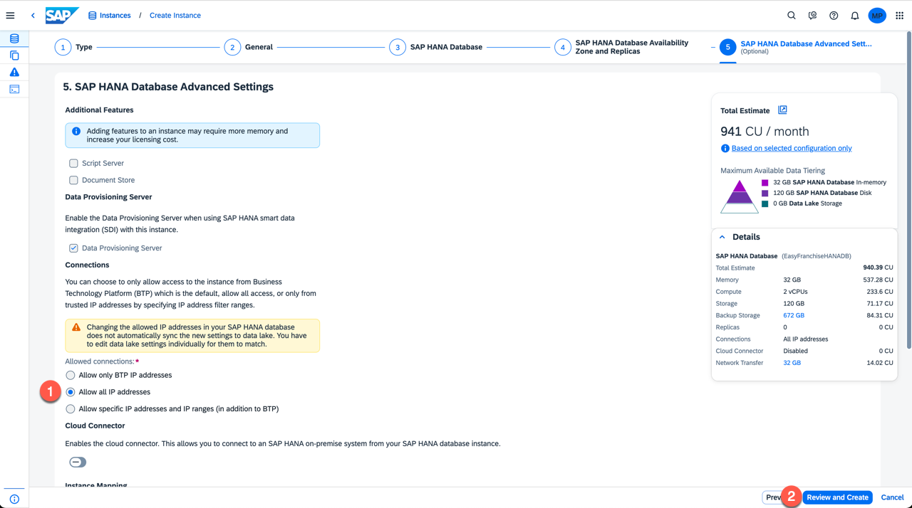

11. Then verify the details and choose **Create Instance** to finalize the instance creation.

12. Wait until the instance is created, so that the status changes to **RUNNING**.

    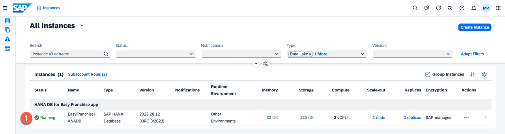

# How to Find JDBC Connection Properties

Later in the tutorial, you will need some of the properties to configure the JDBC connection.

1. Once the database is running expand the 3 dots and select **Copy SQL Endpoint**. This will copy the endpoint details to the clipboard.
   
   For example, you might get something like `01234567-89fe-012c-a000-000cd00000fa.hna1.prod-eu10.hanacloud.ondemand.com:443`.
   
   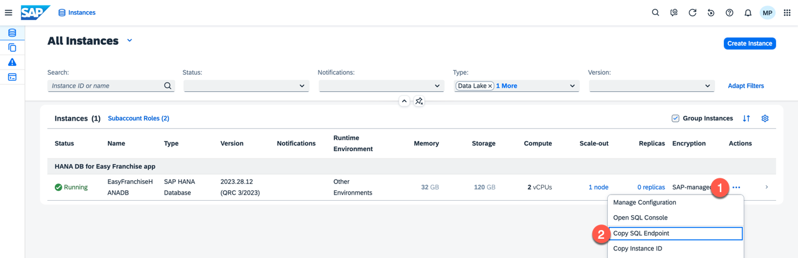
   
2. Summary of database properties:
   - *db.name*: The name of your SAP HANA Database. In this case, it is **EasyFranchiseHANADB**.
   - *db.sqlendpoint*: Choose `...` and use **Copy SQL Endpoint** as described in previous step
   - *db.admin*: DBADMIN
   - *db.password*: password saved at the beginning of the instance creation

   > *Note:* In a productive scenario it is advised to create a dedicated user for the database and not to use the DBADMIN user directly. 
