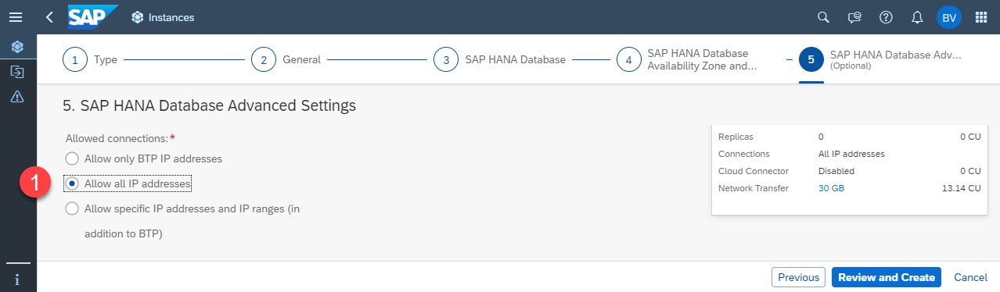

# Get and Configure the SAP HANA Cloud Database

## Create the SAP HANA Cloud Instance

If you would like to use an already existing database, this is also fine and you can skip this step.

1. Open your **Easy Franchise** subaccount with the space **hana**.

   

2. Choose **SAP HANA Cloud** in the left side menu, choose **Create** and select **SAP HANA database**.

   

3. In the new browser window choose the type **SAP HANA Cloud, SAP HANA Database** and then choose **Next Step**.

   

4. In the step **General**:
   * Select the correct **Organization** and **Space**.
   * Provide the **Instance Name**, for example **EasyFranchiseHANADB**, and a meaningful description.
   * Enter the **Password** for the **DBADMIN** user. Remember this password to use it later.

   

5. Choose **Next** until you come to step **(5) SAP HANA Database Advanced**. Select the **Allow All IP addresses** radio button. This is needed because the Kyma cluster is not yet part of the allowed SAP BTP IP addresses and it allows you to run the Easy Franchise application locally.

   

5. Choose **Create** and verify the details of the new instance. Finalize the creation.

6. Wait until the instance is created and the status turns to **RUNNING**.

   

# How to Find JDBC Connection Properties

Later in the tutorial, you need some of the properties to configure the JDBC connection.

1. Open the **SAP HANA Cloud Central**
   
   
2. In the **SAP HANA Cloud Central** select your SAP HANA Database instance. Find the property values:
   - *db.name*: The name of your SAP HANA Database. In this case, it is **EasyFranchiseHANADB**.
   - *db.sqlendpoint*: Choose `...` and use **Copy SQL Endpoint**. This will copy the endpoint details to the clipboard.
      For example, you might get something like `01234567-89fe-012c-a000-000cd00000fa.hana.prod-eu10.hanacloud.ondemand.com:443`.

   

1. For the database user properties, use the *DBADMIN*:
   - *db.admin*: DBADMIN
   - *db.password*: the password

> *Note: In a productive scenario it is advised to create a dedicated user for the database and not to use the DBADMIN user directly. 
