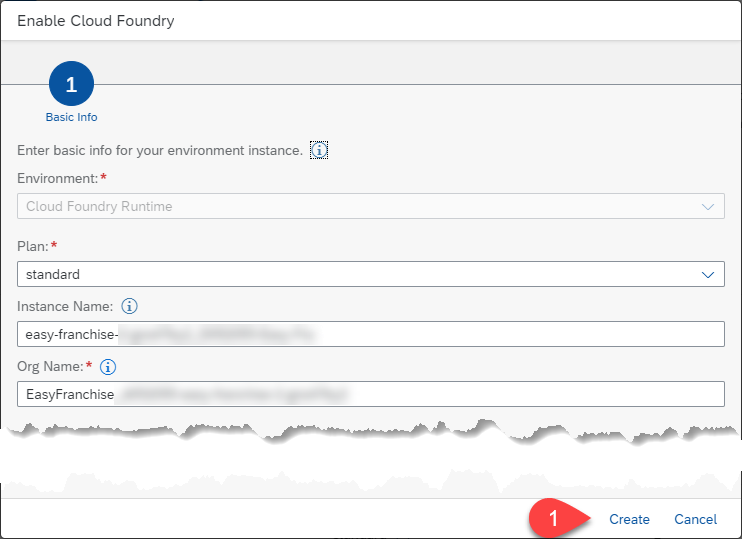

# Set Up the Provider Subaccount in SAP BTP

## Create the Provider Subaccount 
To host the Easy Franchise application, we will create a provider subaccount. 

1. Open the SAP BTP cockpit and create a new subaccount from the **Account Explorer**.
 

1. In the dialog that opens, specify the following details:
   * **Display Name**: **Easy Franchise**  
   * **Subdomain**: Use the predefined entry to avoid name clashes (it will show up after you choose a region)
   * **Region**: Choose a region close to you (Note: If you go for the Free-Tier-Model stick to AWS regions)
  
   

## Configure Entitlements 
Now that we have created the provider subaccount, we will add entitlements. 
 
1. Navigate to the **Entitlements** page.
2. Choose **Configure Entitlements** and then choose **Add Service Plans**.
3. Search for **Kyma runtime**.
4. Select the suggested plan.
5. Select Entitlement **SAP HANA Cloud** and mark the plan **hana**.
6. Choose **Add 2 Service Plans**.
7. Save your changes.

   

## Enable the Cloud Foundry and the Kyma Environments

> Note: The **Cloud Foundry** environment is only needed for the **SAP HANA Cloud Instance** as this is today not possible to have the database directly in the Kyma environemnt. We will update this chapter, as soon as this is possible.

1. Navigate back to the **Overview** page of the subaccount.
2. Choose **Enable Cloud Foundry**.

   
3. In the opened dialogue leave the settings as suggested and press button **Create**.
 
    
6. Navigate back to the **Overview** page of the subaccount and choose **Enable Kyma**. 
7. In the opened dialog: 
   * Step 1 - **Basic Info**: Use the suggested parameters
   * Step 2 - **Addional Parameters**: Select a region close to you and choose the smallest machine type. Use the minimal possible value for parameter **Autoscaller**.
   * Step 3 - **Review**: Review your settings and choose **Create**. 
8. Enabling Kyma will take around 30 minutes.

## Create a Cloud Foundry Space

We need a space in the Cloud Foundry environment, where we can create the **SAP HANA Cloud Instance**. 

1. Navigate to the **Spaces** page.
2. Choose **Create Space**.
3. Enter a name, for example, **hana**.
4. Choose **Create**.
  
   
   
## Assign Role Collection for the Kyma Environment

This step can only be done, if the creation process of the Kyma Environment is finished. The needed Role Collections appear only once the Kyma environment has been enabled. 

1. Navigate to the **Role Collections**.
2. You should see two Kyma-related role collections: **KymaRuntimeNamespaceAdmin** and **KymaRuntimeNamespaceDeveloper**. 
3. Choose **KymaNamespaceAdmin** and press **Edit**. In the new dialog, assign your user to the role collection and save the changes.
4. Finally assign your user also to the role **KymaRuntimeNamespaceDeveloper**. 

   
  
##  Validate Account Setup

Follow the following steps to verify that the setup was successful. 

1. Choose the **Overview** page of the provider subaccount.
2. Check that **Cloud Foundry Environment** is enabled and has a space **hana**.
3. Check that you have a running Kyma environment.
   
   
4. Click **Link to dashboard** under **Kyma Envitoment**. The Kyma dashboard should open in a new browser tab.
   
   

