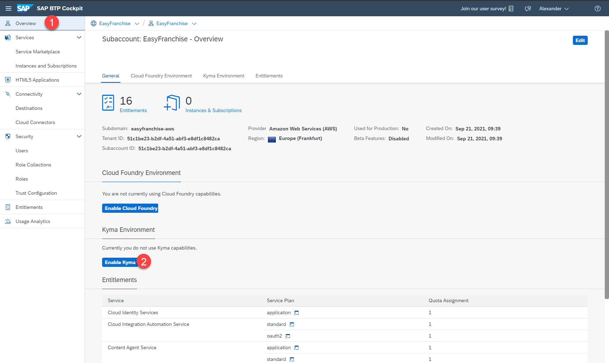

# Set Up the Provider Subaccount in SAP BTP

## Create the Provider Subaccount

To host the Easy Franchise application, we will create a provider subaccount.

1. Open the SAP BTP cockpit and create a new subaccount from the **Account Explorer**.

2. In the dialog that opens, specify the following details:
   * **Display Name**: **Easy Franchise**
   * **Subdomain**: Use the predefined entry to avoid name clashes (it will show up after you choose a region)
   * **Region**: Choose a region close to you (Note: If you go for the Free-Tier-Model stick to AWS regions)

   

## Configure Entitlements

Now that we have created the provider subaccount, we will add entitlements.

1. Navigate to the **Entitlements** page.
1. Choose **Configure Entitlements** and then choose **Add Service Plans**.
1. Search for **Kyma runtime**.
1. Select the suggested plan.
1. Select Entitlement **SAP HANA Cloud** and mark 2 plans:
   * **tools (Application)**
   * **hana-free**
1. Search for **Authorization and Trust Management Service** and choose the plan **broker**
1. Choose **Add 4 Service Plans**.
1. Save your changes.

   

## Enable the Kyma Environment

1. Navigate back to the **Overview** page of the subaccount.
2. Choose **Enable Kyma**.

   
3. In the opened dialog accept the pre-defined values and choose **Create**.
4. Enabling Kyma will take around 30 minutes.

## Validate Account Setup

Follow the steps to verify that the setup was successful:

1. Choose the **Overview** page of the provider subaccount.
2. Check that you have a running Kyma environment.

   

3. Choose **Link to dashboard** under **Kyma Environment**. The Kyma dashboard should open in a new browser tab.

   

   Per default, the user that has enabled the Kyma Environment is granted with the cluster admin role. In order to give access to further users have a look at the [Kyma Help Documentation](https://help.sap.com/products/BTP/65de2977205c403bbc107264b8eccf4b/148ae38b7d6f4e61bbb696bbfb3996b2.html?locale=en-US). You need to follow the steps described under Kyma 2.x.
