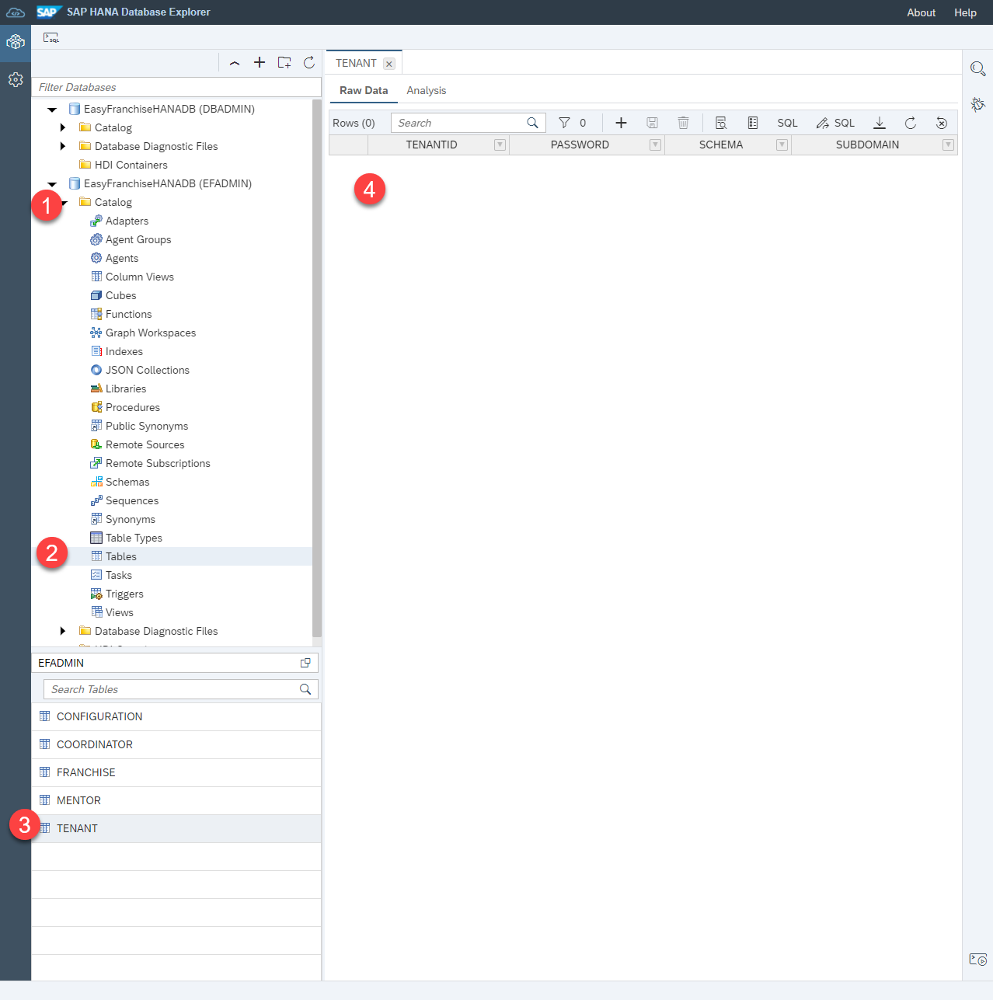
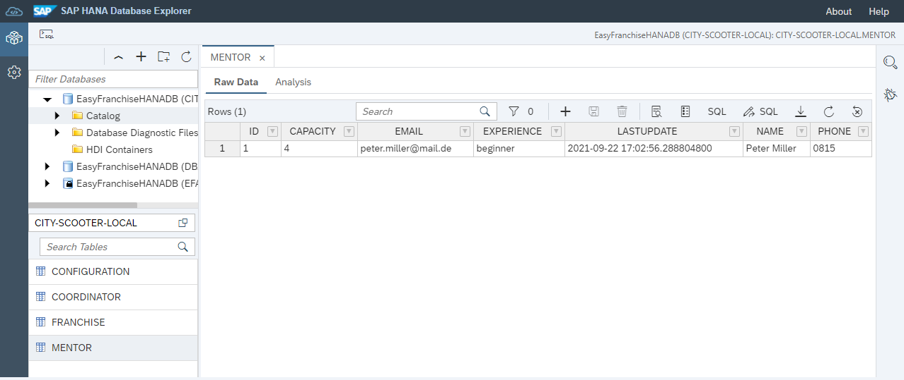
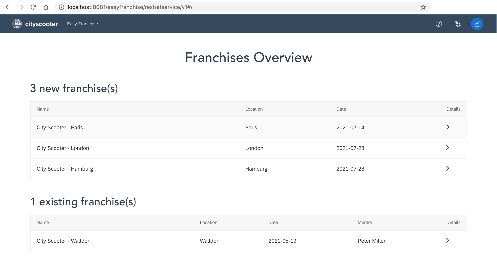
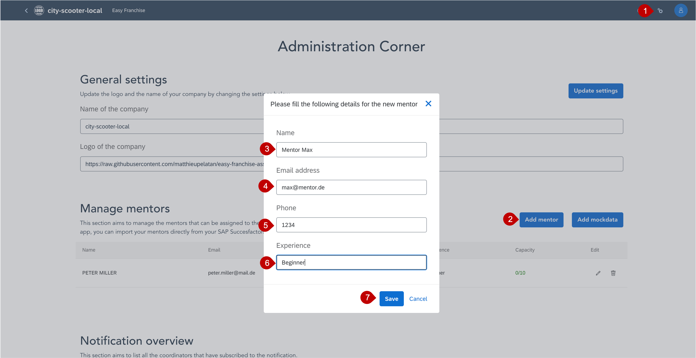
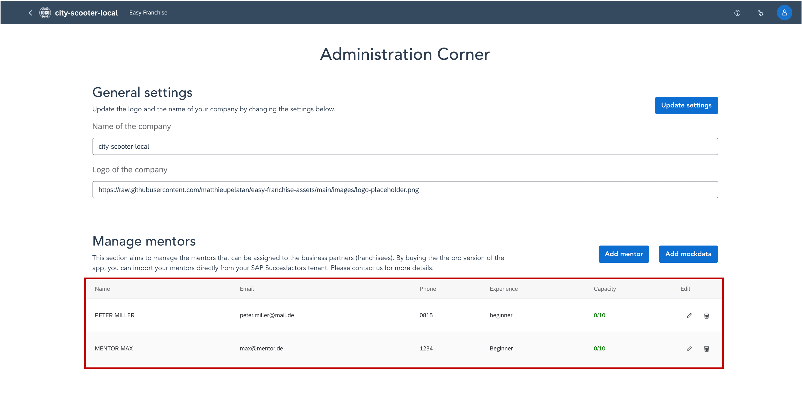

# Test the Easy Franchise Application Locally

Optionally, you may want to run the application locally before you deploy it in the subaccount in the SAP BTP, Kyma environment. Here are the steps needed to have a working app on your local machine:
* [Start and Test the Database Service, the Easy Franchise Service, and the Business Partner Service](#1-start-and-test-the-microservices-db-service-bp-service-and-ef-service)
* [Run the Email Service](#2-run-the-email-service-locally)
* [Run the User Interface Locally](#3-run-user-interface-locally)


## 1. Start and Test the Database Service, the Easy Franchise Service, and the Business Partner Service

In this section you will learn how to build and run the Database service, the Business Partner Service, and the Easy Franchise service locally.
To understand the coding, read these exploration sections:
* [Information about the Java Microservices](/documentation/explore/README.md#additional-information-about-the-java-microservices)
* [Database Service](/documentation/explore/db-service/README.md)
* [Business Partner Service](/documentation/explore/bp-service/README.md)
* [Easy Franchise Service](/documentation/explore/ef-service/README.md)

### Prerequisites

- You have installed Java and Maven as described in the section [Local Development Setup](/documentation/prepare/set-up-local-environment/README.md).
- You have prepared the SAP HANA Cloud properties for a JDBC connection as described in section [Get and Configure your SAP HANA Cloud Instance](/documentation/prepare/configure-hana/README.md).
- You have an SAP S/4HANA Cloud system or a Business Partner mock server up and running as described in section [SAP S/4HANA or Business Partner Mock Server](/documentation/prepare/configure-s4/README.md).

### Configure Properties

For your local run, you have to configure some properties in a `hiddenconfig.properties` file:
1. Clone the sources of this GitHub [repository](https://github.com/SAP-samples/btp-kyma-multitenant-extension) or download and extract the ZIP file to your local system.
2. Copy the file [code/backend/shared-code/src/main/resources/hiddenconfig-template.properties](/code/backend/shared-code/src/main/resources/hiddenconfig-template.properties) to `hiddenconfig.properties` in the same folder.
3. Maintain your SAP HANA Cloud JDBC connection properties in the `db.*` section. This should look like this:

   ```
   db.name: EasyFranchiseHANADB
   db.sqlendpoint: your_hostname.hanacloud.ondemand.com:443
   db.admin: EFADMIN
   db.password: your_efadmin_password
   ```

   See [How to find JDBC Connection Properties](/documentation/prepare/configure-hana#how-to-find-jdbc-connection-properties) for more details.

4. Update the `s4hana.destination.*` properties. You can either use your SAP S/4HANA Cloud system, or the [Business Partner mock server](/code/business-partner-mock-server).

   If you use the SAP Business Partner mock server to run the application locally, use:

   ```
   s4hana.destination.URL: http://localhost:8081
   s4hana.destination.User:
   s4hana.destination.Password:
   s4hana.destination.Authentication: NoAuthentication
   s4hana.destination.Type: http
   ```

   If you are using your SAP S/4HANA Cloud system, copy the following snippet updated with your values:

   ```
   s4hana.destination.URL: https://xxxxxxxx-api.s4hana.ondemand.com
   s4hana.destination.User: <your Communicatrion Arragement User>
   s4hana.destination.Password: <Password of the Communication User>
   s4hana.destination.Authentication: BasicAuthentication
   s4hana.destination.Type: http
   ```

   If you don't have a **Communication User** learn how to get one in section [Enable the Business Partner OData V2 Rest API in an SAP S/4HANA Cloud System](/documentation/appendix/enable-odata-of-s4hana/README.md).

### Build

Build the project:
1. Open a command line window and change to directory to [code/backend](/code/backend) containing the main [pom.xml](/code/backend/pom.xml). Run the following Maven command:

   ```mvn clean install```

   > Info: When running this command the first time, many JAR files will be downloaded to your local Maven repository.

   The second run will be faster as all these downloads will be no longer necessary.

   You should see a successful build of all four modules and an allover **BUILD SUCCESS**:

   ```
      [INFO] Reactor Summary for easyfranchise 1.0-SNAPSHOT:
      [INFO]
      [INFO] easyfranchise ...................................... SUCCESS [  0.784 s]
      [INFO] shared-code ........................................ SUCCESS [ 18.696 s]
      [INFO] db-service ......................................... SUCCESS [  9.189 s]
      [INFO] bp-service ......................................... SUCCESS [  4.606 s]
      [INFO] ef-service ......................................... SUCCESS [  6.742 s]
      [INFO] ------------------------------------------------------------------------
      [INFO] BUILD SUCCESS
      [INFO] ------------------------------------------------------------------------
   ```

   In each project folder, a new folder **target** is created containing the build result.

### Start All Services

1. Run the following commands to start the services. Start each in a separate command line window and in the correct folder.

   In folder [code/backend/ef-service](/code/backend/ef-service):

   ||command (``> cd ef-service``)|
   |:-----|:----|
   |windows|```java -cp ".\target\*;.\target\dependency\*" -Dlocal_dev=true dev.kyma.samples.easyfranchise.EFServer 8080```|
   |unix   |```java -cp "./target/*:./target/dependency/*" -Dlocal_dev=true dev.kyma.samples.easyfranchise.EFServer 8080```|


   In folder [code/backend/bp-service](/code/backend/bp-service):

   ||command (``> cd bp-service``)|
   |:-----|:----|
   |windows|```java -cp ".\target\*;.\target\dependency\*" -Dlocal_dev=true dev.kyma.samples.easyfranchise.ServerApp 8100```|
   |unix   |```java -cp "./target/*:./target/dependency/*" -Dlocal_dev=true dev.kyma.samples.easyfranchise.ServerApp 8100```|

   In folder [code/backend/db-service](/code/backend/db-service):

   ||command (``> cd db-service``)|
   |:-----|:----|
   | windows | ```java -cp ".\target\*;.\target\dependency\*" -Dlocal_dev=true dev.kyma.samples.easyfranchise.ServerApp 8090```|
   | unix    | ```java -cp "./target/*:./target/dependency/*" -Dlocal_dev=true dev.kyma.samples.easyfranchise.ServerApp 8090```|


   Each service will run on a different port (8080, 8100, 8090). Don't use different ones. The `hiddenconfig.properties` relies on them!

   >*Hint:* Just in case you want to debug one of the applications using port `8888` you can start the Java process using the following command. Then, connect with your IDE to the external Java process on port `8888`.

   >```
   >java -Xdebug -Xrunjdwp:transport=dt_socket,address=8888,server=y,suspend=y -cp "./target/*;./target/dependency/*" -Dlocal_dev=true dev.kyma.samples.easyfranchise.ServerApp <port>
   >```

### Executing the First Admin Rest Call

Database tables in EFADMIN schema are not existing yet.
[Hibernate](https://hibernate.org/orm/) creates the tables at runtime when they are needed for the first time.
To understand how this works, see section [Database Service](/documentation/explore/db-service/README.md) for more details.

Let's now execute the first REST call to trigger the table creation. This tutorial uses [curl](https://curl.se/), but feel free to use any other REST tool of your choice.
Windows users have to rely on unix-like shells to execute the curl commands we present here. Using *curl* for windows would require a different command syntax.

1. With the following curl command, check that no tenants exist so far:

   ```
   curl --verbose -X GET http://localhost:8090/easyfranchise/rest/dbadminservice/v1/config/tenants
   ```

   Expected result:

   * return status: `200 OK`
   * content: ``[]``
   * 

   The first run will take a bit longer than the next one, as database table creation has to be carried out.

2. Let's have a look into table data of our database:
   - Open the SAP HANA Database Explorer and add your database with user EFADMIN.
   - Expand the **Catalog** and select **Tables**.
   - Find the newly created table **TENANT** and open via Context Menu *Open Data*. No records exist yet.

     


### Onboard the First Tenant

Each tenant will get his own database user and schema to store their tenant data.

1. To onboard a tenant with TENANT-ID=*123456789-local-tenant-id* and SUBDOMAIN=*city-scooter-local* call:

   ```curl --verbose -X PUT "http://localhost:8090/easyfranchise/rest/dbservice/v1/123456789-local-tenant-id/onboard" -H "Content-Type: application/json" -d '{"subaccountId":"123456789-local-tenant-id","subdomain":"city-scooter-local"}'```

2. Get a list of all tenants and find your CITYSCOOTER:

   ```curl --verbose -X GET http://localhost:8090/easyfranchise/rest/dbadminservice/v1/config/tenants```

   Expected output of the curl command:

   ```
   [
       {
           "password": "mySAP123",
           "schema": "CITY-SCOOTER-LOCAL",
           "subdomain": "city-scooter-local",
           "tenantid": "123456789-local-tenant-id"
       }
   ]
   ```

3. Refresh the data of the **TENANT** table and review the content.

   

4. Tenant-dependent Easy Franchise service, Database service, or Business Partner service calls need **TenantId** as a header or in the path.
   As a workaround for the local development, the `hiddenconfig.properties` file needs to be updated.
   Check that you have the correct configuration fitting to your **TenantId** above:  `devmode.tenantid: 123456789-local-tenant-id`.
   (If you have to update the property you have to stop all java services, build and restart them.)
5. Open SAP HANA Database Explorer and add a new database connection with user `city-scooter-local` and the password you find in the **TENANT** Table.
   Find the newly created Tables like **CONFIGURATION**, **COORDINATOR**, **FRANCHISE**, and **MENTOR**.

   

### Getting Franchises

Most of the properties of a franchisee are read from the SAP S/4HANA Cloud system. For the local run of the SAP S/4HANA Cloud service, the according `s4hana.destination.*` properties have to be configured in the `hiddenconfig.properties` file.

1. Let's first get a better understanding of the OData V2 REST endpoint of the SAP S/4HANA Cloud system.

   Copy the following URL to your browser and log in with your Customer Arrangement user and its password:

   ```
   https://<S4-HANA-CLOUD-PATH>/sap/opu/odata/sap/API_BUSINESS_PARTNER/$metadata
   ```

   > *Warning:* The Business Partner mock server only implements this single request the Business Partner service will call. Other requests are not implemented.

   The response will provide the OData metadata. Knowing this enables you to build complex OData queries. See [URI Conventions (OData Version 2.0)](https://www.odata.org/documentation/odata-version-2-0/uri-conventions/) for more details.

   Let's request all business partners:

   ```
   https://<S4-HANA-CLOUD-PATH>/sap/opu/odata/sap/API_BUSINESS_PARTNER/A_BusinessPartner
   ```

2. The class [BPService.java](/code/backend/bp-service/src/main/java/dev/kyma/samples/easyfranchise/bpservice/BPService.java) just queries for business partners. For a more detailed explanation, see section [Business Partner Service](/documentation/explore/bp-service/README.md).
    Now, let's call a REST API in our Business Partner service. If you chose a different tenant ID above, update the request accordingly:

    ```
    curl  -X GET 'http://localhost:8100/easyfranchise/rest/bpservice/v1/123456789-local-tenant-id/bupa'
    ```

    As a result, you should get a JSON-based list of business partners.

    If you use the Business Partner mock server, the result will look like the following JSON. For an SAP S/4HANA Cloud system it should look like this:

    ```json
    {
        "d": {
            "results": [
                {
                    "BusinessPartner": "1000111",
                    "BusinessPartnerFullName": "City Scooter - Walldorf",
                    "BusinessPartnerGrouping": "BP02",
                    "CreationDate": "/Date(1621382400000)/",
                    "to_BusinessPartnerAddress": {
                        "results": [
                            {
                                "CityCode": "",
                                "CityName": "Walldorf",
                                "HouseNumber": "2",
                                "PostalCode": "69190",
                                "StreetName": "Dietmar-Hopp-Allee",
                                "to_EmailAddress": {
                                    "results": [
                                        {
                                            "EmailAddress": "walldorf@city-scooter.de"
                                        }
                                    ]
                                }
                            }
                        ]
                    }
                },
                ...
            ]
        }
    }
   ````


3. The Easy Franchise service "converts" this response to a more UI-friendly JSON. Some data form the database are "merged" as well.

   ```
   curl --verbose -X GET 'http://localhost:8080/easyfranchise/rest/efservice/v1/franchisee'
   ```

   This is a JSON response example:

   ```json
   [
       {
           "businessPartner": "1000111",
           "businessPartnerGrouping": "BP02",
           "cityCode": "",
           "cityName": "Walldorf",
           "creationDate": "2021-05-19",
           "emailAddress": "walldorf@city-scooter.de",
           "fullName": "City Scooter - Walldorf",
           "houseNumber": "2",
           "postalCode": "69190",
           "streetName": "Dietmar-Hopp-Allee"
       }, ..
    ]
    ```
###  Create a Mentor

The REST calls of the Easy Franchise service are used from the UI. Let's have a look at how to create a mentor via REST call.

1. Let's create the mentor Peter Miller. The following curl command should return `200 OK`.

   ```curl --verbose -X PUT "http://localhost:8080/easyfranchise/rest/efservice/v1/mentor" -H "Content-Type: application/json" -d '{"name":"Peter Miller","email":"peter.miller@mail.de","phone":"0815","experience":"beginner","capacity":"4"}'```

   Remember that the original REST call would have to provide the tenantId via header `-H 'x-tenant-id: {tenantId}'`. In the local run, it's taken from the `hiddenconfig.properties` file.

2. Get a list of all mentors:

   ```curl --verbose -X GET "http://localhost:8080/easyfranchise/rest/efservice/v1/mentor"```

   The mentor you just created should be contained in the response JSON. The JSON should look like this:

   ```
   [
       {
           "id": 1,
           "name": "Peter Miller",
           "email": "peter.miller@mail.de",
           "phone": "0815",
           "capacity": 4,
           "experience": "beginner",
           "lastUpdate": "YYYY-MM-DDT15:09:05.2553577"
   	}
   ]
   ```

3. Open the **Raw Data** tab of the table **MENTOR** of the database user CITY-SCOOTER-LOCAL and find the inserted mentor.

   

   > *You see no Mentor?* Check that you have selected the **MENTOR** table of the correct database user. Neither DBADMIN nor EFADMIN can see the **MENTOR** table content.

### Assign Mentor to a Franchisee

1. We have to make a business partner as a franchisee. You need the key, which you can find in the above REST calls, for example, `"businessPartner": "1000111"` and replace it in the following curl command:

   ```
   curl --verbose -X PUT 'http://localhost:8080/easyfranchise/rest/efservice/v1/franchisee/<businessPartner>'
   ```

   so that you would run, for example:

   ```
   curl --verbose -X PUT 'http://localhost:8080/easyfranchise/rest/efservice/v1/franchisee/1000111'
   ```

2. Assign a mentor to the franchisee. Replace the placeholders accordingly:

   ```
   curl --verbose -X PUT 'http://localhost:8080/easyfranchise/rest/efservice/v1/franchisee/<businessPartner>/mentor/<mentorId>'
   ```

   command with the correct sample values inserted:


   ```
   curl --verbose -X PUT 'http://localhost:8080/easyfranchise/rest/efservice/v1/franchisee/1000111/mentor/1'
   ```

3. Verify the assignment by requesting all franchisees:

   ```
   curl --verbose -X GET 'http://localhost:8080/easyfranchise/rest/efservice/v1/franchisee'
   ```

   You will find the property `"mentorId": 1,` in the right franchisee data:

   ```
    [
        {
            "businessPartner": "1000111",
            "businessPartnerGrouping": "BP02",
            "cityCode": "",
            "cityName": "Walldorf",
            "creationDate": "2021-05-19",
            "emailAddress": "walldorf@city-scooter.de",
            "fullName": "City Scooter - Walldorf",
            "houseNumber": "2",
            "mentorId": 1,
            "mentorName": "Peter Miller",
            "postalCode": "69190",
            "streetName": "Dietmar-Hopp-Allee"
        } ...
    ]
   ```

## 2. Run the Email Service Locally

### Prerequisites

- You have Node.js installed as described in the section [Development Setup](/documentation/prepare/set-up-local-environment/README.md)
- You have an email account, which can be used to send emails (for example, Gmail)

### Configure Properties

The Email service prepares the notification and sends it to a mail server, which forwards it to the right person. In our case, we use here Gmail but you can use any other mail server. To give access to the mail server, we first need to save the credentials as environment variables.

Add your username/password in the following command ans run it in a terminal:

```shell
export EMAIL_USERNAME=<Username>
export EMAIL_PASSWORD=<Password>
```
> Note: If you are also using Gmail, be sure that 2FA is disabled. To verify this, see [Google Account Security](https://myaccount.google.com/security).

### Build

1. Open a command line window and navigate to the directory [code/email-service](/code/email-service).

2. Build the project:

```shell
npm install
```

   Your output should not contain an error and should look like this:

```shell
npm WARN deprecated har-validator@5.1.5: this library is no longer supported
npm WARN deprecated uuid@3.4.0: Please upgrade  to version 7 or higher.  Older versions may use Math.random() in certain circumstances, which is known to be problematic.  See https://v8.dev/blog/math-random for details.
npm WARN deprecated request@2.88.2: request has been deprecated, see https://github.com/request/request/issues/3142

added 131 packages, and audited 132 packages in 27s

30 packages are looking for funding
  run `npm fund` for details

found 0 vulnerabilities
```

### Start the Service

To start the service, run the following command in the same folder:

```shell
npm start
```

You should receive the following output:

```shell
> start
> node server.js

Application listening on port 3002
```

### Test the Email Service

The Email service should listen to http://localhost:3002. Check out the [API Endpoints](/documentation/explore/email-service#list-of-api-endpoints) in the Explore section.


## 3. Run User Interface Locally

> Note: To simplify debugging in the browser, we recommend installing the browser extension [Vue.js devtools](https://chrome.google.com/webstore/detail/vuejs-devtools/nhdogjmejiglipccpnnnanhbledajbpd) for Google Chrome.

1. Go back to your IDE and open the **ui** folder of the application.
2. Navigate to the **src** folder and open the file **main.js**.
3. Scroll down in the code to the section **Defining the url of the backend apis**.
4. Make sure that in the code the URL for local development is used:

   ```
   Vue.prototype.$backendApi = "http://localhost:8080/easyfranchise/rest/efservice/v1";
   ```

   > Note: if you are running the services on a remote virtual machine or access it via hostname or IP adress, you have to use that instead of localhost.

5. Open a new terminal and change directory to **ui**:

   ```
   cd ui
   ```

6. Create node modules in your repository by running:

   ```
   npm install
   ```

7. Run your application locally:

   ```
   npm run serve
   ```

8. Click the link in terminal to open your application in the browser.

   

9. Congratulations! You now have a first version of your application running.

   

## Test User Interface

1. Click the gear icon on the top right to navigate to the settings page.
2. Scroll down to the **Manage Mentor** section of the page.
3. In this section, the mentor **Peter Miller** you have created earlier is listed.
4. Create a new mentor by choosing **Add Mentor**.
5. In the pop-up add the data for your new mentor:
   - Name: Mentor Max
   - Email Address: max@mentor.de
   - Phone: 1234
   - Experience: Beginner
  
   

6. Choose **Save** to finish the creation.
7. Your new mentor appears in the UI.

   
8. Go back to the terminal to see if the mentor is also saved in the backend of the application.
9. Run the curl command to get a list of all the mentors available:

   ```
   curl --verbose -X GET "http://localhost:8080/easyfranchise/rest/efservice/v1/mentor"
   ```
   
10. The mentor you just created and the mentor created earlier should be contained in the response JSON. The JSON should look like this:

    ```
    [
        {
            "id": 1,
            "name": "Peter Miller",
            "email": "peter.miller@mail.de",
            "phone": "0815",
            "capacity": 4,
            "experience": "beginner",
            "lastUpdate": "YYYY-MM-DDT15:09:05.2553577"
    	},
        {
            "id": 2,
            "name": "Mentor Max",
            "email": "mentor@max.de",
            "phone": "1234",
            "capacity": 4,
            "experience": "beginner",
            "lastUpdate": "YYYY-MM-DDT15:09:05.2553577"
    	},
      
    ]
    ```
