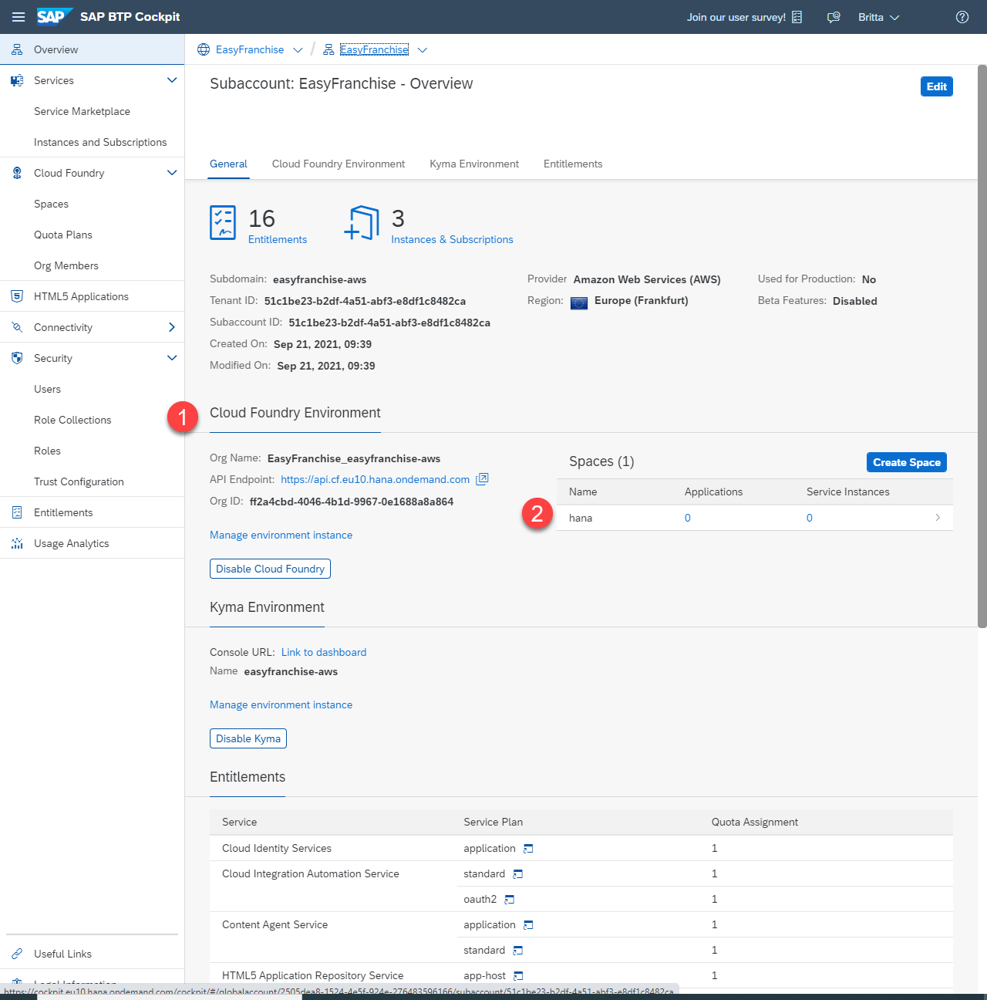
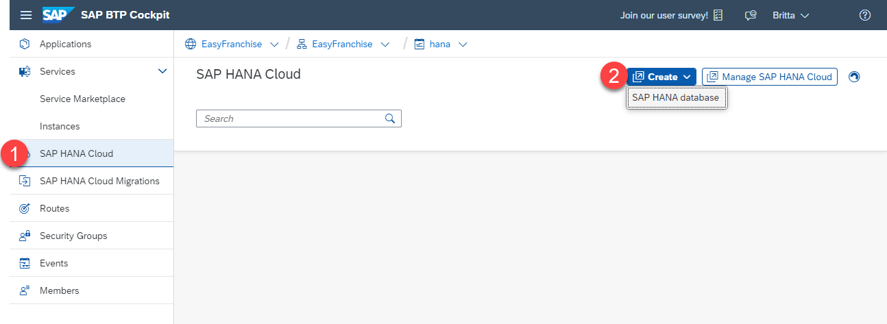
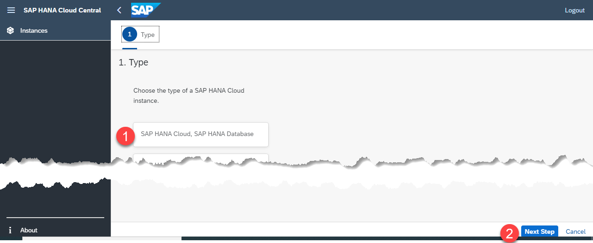
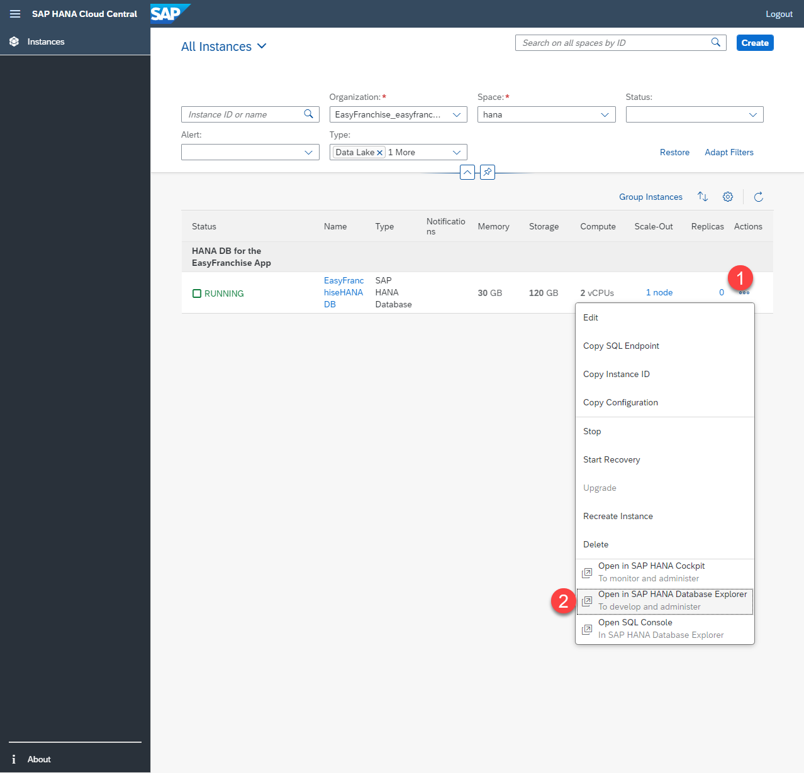
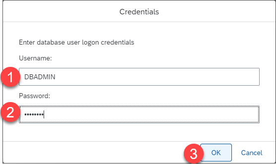
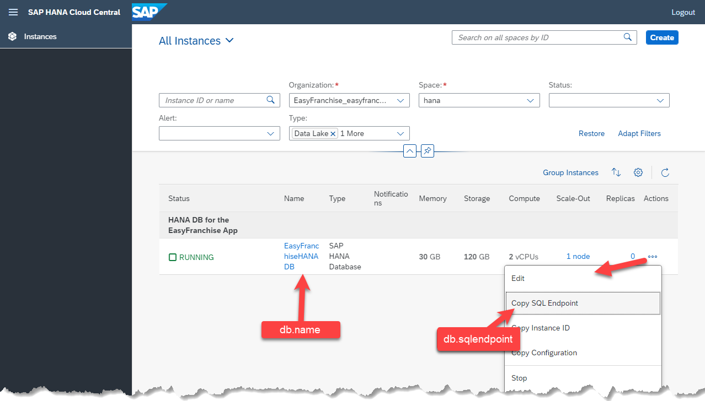

# Get and Configure the HANA Cloud Database

## Create the SAP HANA Cloud Instance

The Below steps describe how to create an SAP HANA Cloud Instance.
If you would like to "reuse" an already existing database this is also fine and you can skip this step.

1. Open your *EasyFranchise* account with the space *hana*. 

   
2. Select *SAP HANA Cloud* in the left side menu and click button *Create* and select *SAP HANA database*.
   
   
3. In the new browser window choose the type *SAP HANA Cloud, SAP HANA Database* and press button *Next Step*

   
4. In the Step *General* select the correct Organization and Space. 
   Provide the *Instance Name* e.g. "EasyFranchiseHANADB" and if you like an description. 
   Provide the *Password* for the *DBADMIN* user. Remember this Password for later usage. 
  
   

   Press button Next until you come to step *(5) SAP HANA Datbase Advanced*. Check *Allow All IP adresses* for connections. This is needed because the Kyma cluster is not yet part of the whitelisted BTP IP Adresses and also it allows you to run the EasyFranchise application localy. 
   
   

   
5. Press *Create* Button and check the provides New Instance summary. Finalize the creation.
6. Wait until the instance is created and the status turns to *RUNNING*.

   


# Create EFADMIN

Its recommended to not use the default DBADMIN user for day-to-day activities. 
Instead, use this user to create dedicated database users.
Read more here [help.sap.com: User Management with the SAP HANA Database Administrator DBADMIN](https://help.sap.com/viewer/f9c5015e72e04fffa14d7d4f7267d897/2021_2_QRC/en-US/5b35402c47b344d882ac13c661aff1c0.html)

In the below steps describe how to create an EFADMIN user:

>*Hint:* if you would like to share the SAP HANA Database with your collects, but would like to have your own independent access, you can create your own database admin and use this instead. 

1. Open the SAP HANA Database Explorer by clicking on the ``...`` and selecting *Open the SAP HANA Database Explorer*
 
   
2. Login with the User DBADMIN. 
  
   
3. In the Database list you should find *EasyFranchiseHANADB*. If not add it via the + Button.
4. Open and SQL Console and execute the below SQL statements, 
   which will create you a *EFADMIN* Database User in the new created user group *EFOPERATORS*. 
   Please update the password in the sql before executing. Remember the password for later use: 
   ```
   -- Create Usergroup
   CREATE USERGROUP EFOPERATORS;
   
   -- Create the user and assign to the EFOPERATORS:
   CREATE USER EFADMIN PASSWORD mySAP123 SET USERGROUP EFOPERATORS;
   
   -- The password should not expire: 
   ALTER USER EFADMIN DISABLE PASSWORD LIFETIME;
   
   -- Make EFADMIN group administrator 
   GRANT USERGROUP OPERATOR ON USERGROUP EFOPERATORS TO EFADMIN
   ```
   
   > Note: The editor may show you an error message that "USERGROUP IS NOT SUPPORTED". This is a bug, continue and run the script. The usergroup will still be created.

   
5. For later use use *Add Database with Different User* to gain acces via the EFADMIN Database user
   

>**WARNING:**  When the *DBADMIN* wants to create a new User, the UserGroup has to be specified 
> as he now has more than one Usergroup. The according sql would be: 
>
>```CREATE USER NEWDBUSER SET USERGROUP DEFAULT```

# How to find JDBC Connection Properties

Later in the tutorial you will need some properties to configure the JDBC connection. 

1. Open the *SAP HANA Cloud Central* and select your HANA instance. Find the property values: 
   - *db.name*:  The name of your SAP HANA Database. In the above Steps decided for *EasyFranchiseHANADB*.
   - *db.sqlendpoint*:  click on the "..."-Button and use *Copy SQL Endpoint*. This will copy the Endpoint details to the clipboard. 
      For example you might get something like ``01234567-89fe-012c-a000-000cd00000fa.hana.prod-eu10.hanacloud.ondemand.com:443``. 
	  

      
	  
2. For the Database user properties use the EFADMIN:
   - *db.admin*: EFADMIN (or your individual Database Admin user name)
   - *db.password*: the password 

   
   > *Hint when not using EFADMIN*: the database user must be allowed to create or drop new database user.
   > He and the newly created database user should be able to create Tables and update table content.
