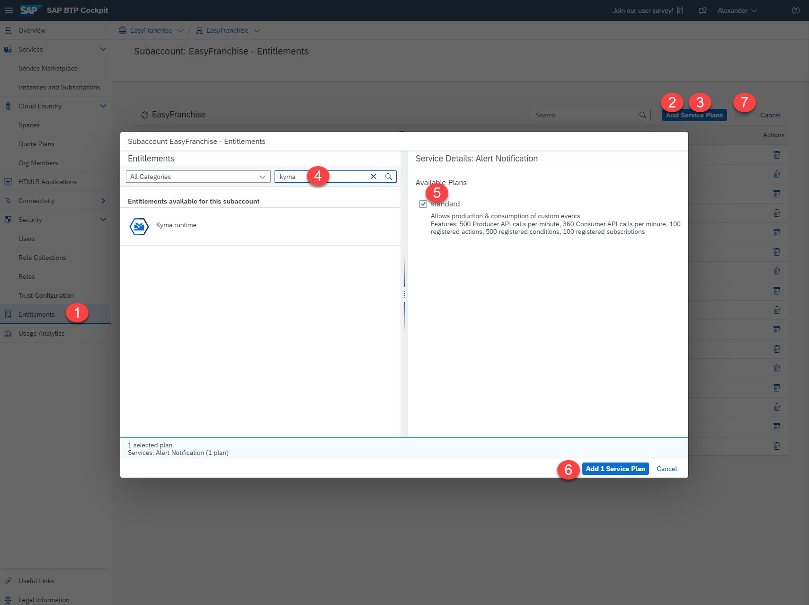
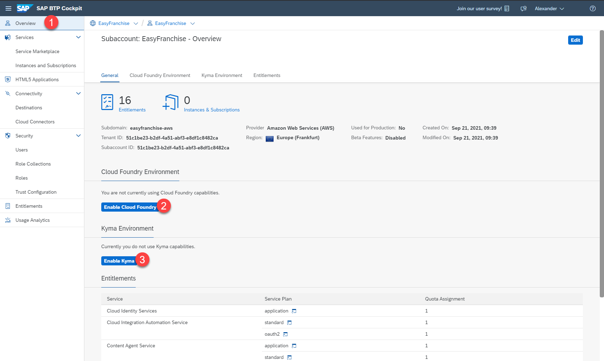
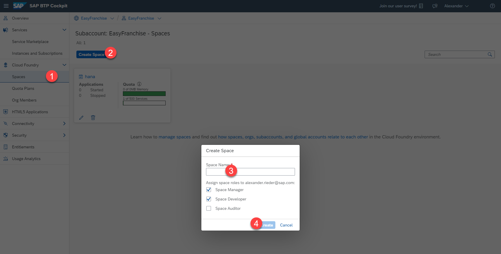
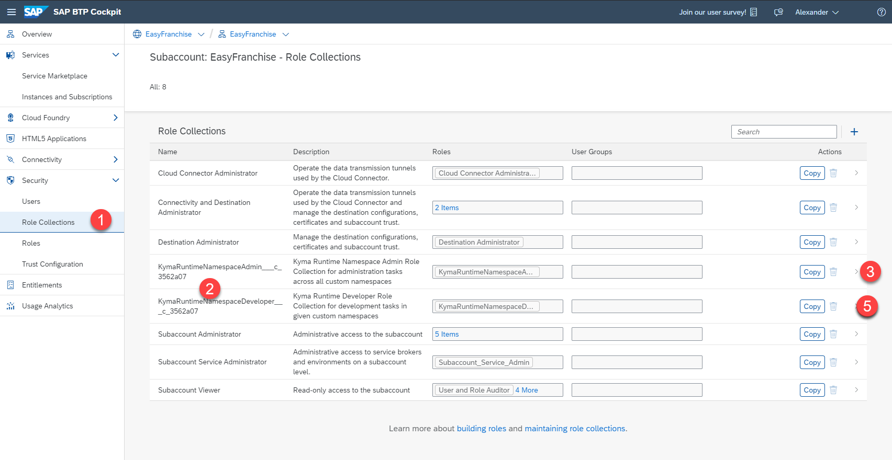
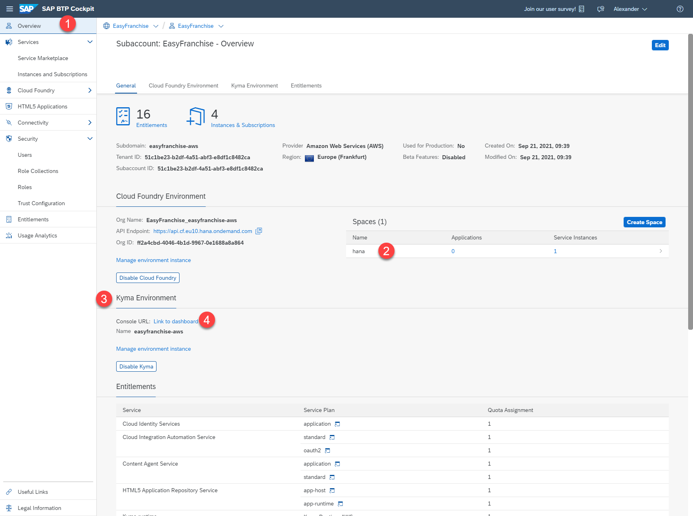

# Set up the SAP BTP Account

## Create the provider subaccount. 
In order to host the EasyFranchise application, we will create a provider subaccount. 

1. First open the BTP Cockpit and create a new subaccount from the Account Explorer
 

1. In the dialog that opens you can specify the details of the subaccount to be created. Create the subaccount with the following details:
   * Name: Easy Franchise  
   * Subdomain: Use the predefined to avoid name clashes  (will show up after you choose a region)
   * Region: Choose a region close to you (Note: If you go for the Free-Tier-Model stick to AWS regions)

## Prepare Environments
After we have created the subaccounts we will use the Easy Franchise account to setup the Environments.

1. Add Kyma Runtime and SAP HANA Cloud Entitlement to Subaccount 
   1. Navigate to Entitlements
   2. Click on Configure
   3. Click on Add Service Plans
   4. Search for Kyma Runtime
   5. Mark the suggested plan (repeat step 4 and 5 for the SAP HANA Cloud with Plan hana)
   6. Click on Add 2 Service Plan
   7. Save your changes
   

2. Enable Cloud Foundry and Kyma Environment
   1. Navigate back to the overview of the subaccount
   2. Click on Enable Cloud Foundry (leave the settings as suggested)
   3. Click on Enable Kyma
      1. Step 1: Use the suggested parameters
      2. Step 2: Select a region close to you and choose the smallest machine type. For Autoscaller set min to 1.
      3. Step 3: Review your settings and click on create (creation takes around 30 minutes)
     
3. Create a cloud foundry space
   1. Navigate to Spaces
   2. Click on Create Space
   3. Enter a name, for example, hana
   4. Click on create
   
   
4. Assign Role Collection for Kyma Environment (only available when Kyma Environment is ready)
   1. Navigate to Role Collections
   2. You should see two Kyma related role collections KymaRuntimeNamespaceAdmin and KymaRuntimeNamespaceDeveloper
   3. Click on KymaNamespaceAdmin
   4. In the new screen click on Edit and assign your user to the role collection and save the changes.
   5. Repeate the assignement with the second role collection
  
  
5. Verify Environment
If everthing went well you should see a similar picture in the account overview. 
   1. Click on overview
   2. Check that you have a Cloud Foundry space
   3. Check that you have a running kyma environment
   4. Click on the link to open the kyma dashboard
   
