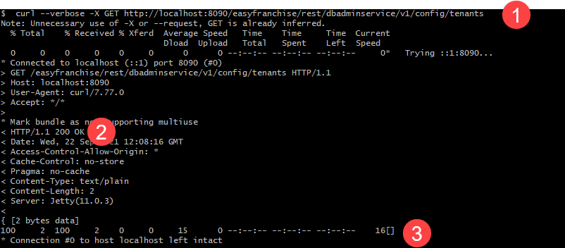
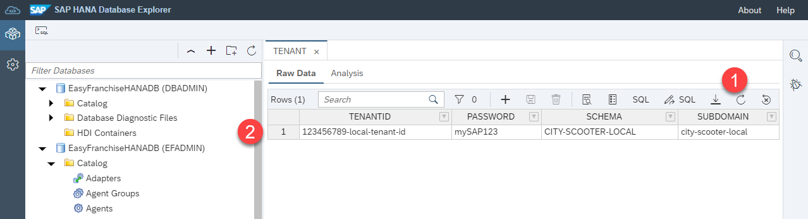
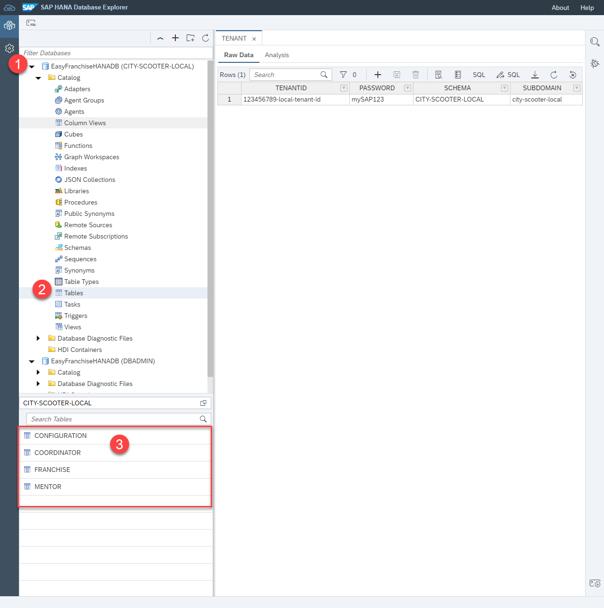

# Test the EasyFranchise Application Locally
Optionally, you may want to run the application locally before you deploy it to the Kyma environment. Here are the steps needed to have a working app on your local machine:
* [Start and Test the Microservices DB Service, EF Service and BP Service](#1-start-and-test-the-microservices-db-service-bp-service-and-ef-service)
* [Run the Email Service](#2-run-the-email-service-locally)
* [Run User Interface Locally](#3-run-user-interface-locally)


## 1. Start and Test the Microservices DB Service, BP Service and EF Service
In this section you will learn how to build and run database service, SAP S4/HANA Service and EF Service locally. 
To understand the coding read these exploration sections:
* [Information about the Java Microservices](/documentation/exploration/README.md#additional-information-about-the-java-microservices)
* [DB Service](/documentation/exploration/db-service/README.md)
* [BP Service](/documentation/exploration/bp-service/README.md)
* [EF Service](/documentation/exploration/ef-service/README.md)

### Prerequisites 
- You have installed Java and Maven a s described in section [Local Development Setup](/documentation/step-by-step-guide/preparation/set-up-local-environment/README.md).
- You know HANA JDBC Connection properties as described in section [Get and Configure your HANA Cloud Instance](/documentation/step-by-step-guide/preparation/configure-hana/README.md).
- SAP S/4HANA or Business Partner mock server is up and running as described in section [SAP S/4HANA or Business Partner Mock Server](../../preparation/configure-s4/README.md).

### Configure Properties
For your local run you have to configure some properties in a `hiddenconfig.properties` file: 
1. Clone the sources of this GitHub repository or download and extract the ZIP file to your local system. 
2. Copy the file [code/backend/shared-code/src/main/resources/hiddenconfig-template.properties](../../../../code/backend/shared-code/src/main/resources/hiddenconfig-template.properties) to `hiddenconfig.properties` in the same folder. 
3. Maintain your HANA JDBC connection properties in `db.*` section. This should look something like this:

   ```
   db.name: EasyFranchiseHANADB 
   db.sqlendpoint: your_hostname.hanacloud.ondemand.com:443
   db.admin: EFADMIN
   db.password: your_efadmin_password
   ```

   See [here](../../preparation/configure-hana#how-to-find-jdbc-connection-properties) where to find your values. 
4. Update the `s4hana.destination.*` properties. You can either use your SAP S4/HANA system or the [Business Partner Mock Server](../../../../code/business-partner-mock-server).
  
   If you use the SAP Business Partner Mock Server local running use:
   ```
   s4hana.destination.URL: http://localhost:8081
   s4hana.destination.User: 
   s4hana.destination.Password: 
   s4hana.destination.Authentication: NoAuthentication
   s4hana.destination.Type: http
   ```
 
   If you are using your SAP S4/HANA Cloud system use the following snippet updated with your values:
   
   ```
   s4hana.destination.URL: https://xxxxxxxx-api.s4hana.ondemand.com
   s4hana.destination.User: <your Communicatrion Arragement User>
   s4hana.destination.Password: <Password of the Communication User>
   s4hana.destination.Authentication: BasicAuthentication
   s4hana.destination.Type: http 
   ```
  
### Build 
Build the project:
1. Open a command line window and change to directory [code/backend](../../../../code/backend) containing the main [pom.xml](../../../../code/backend/pom.xml). Run the following maven command: 

   ```mvn clean install```
   
   > Info: When running this command the first time a lot of jars will be download to your local maven repo. 

   The second run will be faster as all those downloads are no longer necessary. 
   
   You should see a successful build of all 4 modules and an allover  **BUILD SUCCESS**: 

   ```   
      [INFO] Reactor Summary for easyfranchise 1.0-SNAPSHOT:
      [INFO]
      [INFO] easyfranchise ...................................... SUCCESS [  0.784 s]
      [INFO] shared-code ........................................ SUCCESS [ 18.696 s]
      [INFO] db-service ......................................... SUCCESS [  9.189 s]
      [INFO] bp-service ......................................... SUCCESS [  4.606 s]
      [INFO] ef-service ......................................... SUCCESS [  6.742 s]
      [INFO] ------------------------------------------------------------------------
      [INFO] BUILD SUCCESS
      [INFO] ------------------------------------------------------------------------
   ```   

   In each project folder a new folder *target*  is created containing the build result. 
  
### Start all Services
1. Run the following commands to start the services. Start each in a separate command line window and in the correct folder.

   in folder [code/backend/ef-service](../../../../code/backend/ef-service):

   ||command (``> cd ef-service``)|
   |:-----|:----|
   |windows|```java -cp ".\target\*;.\target\dependency\*" -Dlocal_dev=true dev.kyma.samples.easyfranchise.EFServer 8080```|
   |unix   |```java -cp "./target/*:./target/dependency/*" -Dlocal_dev=true dev.kyma.samples.easyfranchise.EFServer 8080```|
   
   
   in folder [code/backend/bp-service](../../../../code/backend/bp-service):

   ||command (``> cd bp-service``)|
   |:-----|:----|
   |windows|```java -cp ".\target\*;.\target\dependency\*" -Dlocal_dev=true dev.kyma.samples.easyfranchise.ServerApp 8100```|
   |unix   |```java -cp "./target/*:./target/dependency/*" -Dlocal_dev=true dev.kyma.samples.easyfranchise.ServerApp 8100```|
   
   in folder [code/backend/db-service](../../../../code/backend/db-service):

   ||command (``> cd db-service``)|
   |:-----|:----|
   | windows | ```java -cp ".\target\*;.\target\dependency\*" -Dlocal_dev=true dev.kyma.samples.easyfranchise.ServerApp 8090```|
   | unix    | ```java -cp "./target/*:./target/dependency/*" -Dlocal_dev=true dev.kyma.samples.easyfranchise.ServerApp 8090```|

  
   Each service will run on a different port (8080, 8100, 8090). Don't use different ones. The `hiddenconfig.properties` relies on them!
   
   >*Hint:* Just in case you want to debug one of the applications using port `8888` you can start the Java process using the command below. Then connect with your IDE to the external Java process on port `8888`.

   >```
   >java -Xdebug -Xrunjdwp:transport=dt_socket,address=8888,server=y,suspend=y -cp "./target/*;./target/dependency/*" -Dlocal_dev=true dev.kyma.samples.easyfranchise.ServerApp <port>
   >```

### Executing the First Admin Rest Call
 
Database tables in EFADMIN schema are not existing yet. 
[Hibernate](https://hibernate.org/orm/) creates the tables at runtime when they are needed for the first time. 
(Read how this works in the section [Database Service](../../../exploration/db-service/README.md))

Let's now  execute the first rest call to trigger the table creation. This tutorial uses [curl](https://curl.se/), but feel free to use any other Rest tool of your choice. 
Windows users have to rely on unix-like shells to execute the curl commands we present here. Using *curl* for windows would require a different command syntax.

1. Check with the following curl that no tenants exist for now:

   ```
   curl --verbose -X GET http://localhost:8090/easyfranchise/rest/dbadminservice/v1/config/tenants
   ```
   
   expected result:

   * return status: 200 OK
   * content: ``[]``
   * 
   
   The first run will take a bit longer than the next one, as database table creation has to be carried out. 

2. Let's have a look into table data of our database: 
   - Open the SAP HANA Database Explorer and add your database with user EFADMIN, if not already done.
   - Expand the **Catalog** and select **Tables**    
   - Find the newly created table TENANT and open via Context Menu *Open Data*. No records do exist.
   
     
     

### Onboard the First Tenant

Each tenant will get his own Database User and Schema to store tenant data. 

1. To onboard a tenant with TENANT-ID=*123456789-local-tenant-id* and SUBDOMAIN=*city-scooter-local* call:

   ```curl --verbose -X PUT "http://localhost:8090/easyfranchise/rest/dbservice/v1/123456789-local-tenant-id/onboard" -H "Content-Type: application/json" -d '{"subaccountId":"123456789-local-tenant-id","subdomain":"city-scooter-local"}'```

2. get a list of all tenants and find your CITYSCOOTER:
 
   ```curl --verbose -X GET http://localhost:8090/easyfranchise/rest/dbadminservice/v1/config/tenants```
   
   Expected output of the curl command: 

   ```
   [
       {
           "password": "mySAP123",
           "schema": "CITY-SCOOTER-LOCAL",
           "subdomain": "city-scooter-local",
           "tenantid": "123456789-local-tenant-id"
   	    }
   ]
   ```

3. Refresh the Data of the TENANT table and review the content. 
   
   

4. Tenant dependent EF Service, DB Service or BP Service calls need TenantId as header or in the path. 
   As a workaround for the local development the `hiddenconfig.properties` file needs to be updated. 
   Check that you have the correct configuration fitting to your TenantId above:  ```devmode.tenantid: 123456789-local-tenant-id```. 
   (If you have to update the property you have to stop all java services, build and restart them.)
5. Open SAP HANA Database Explorer and add a new DB connection with User ```city-scooter-local``` and the PASSWORD you find in the TENANT Table.
   Find the newly created Tables like CONFIGURATION, COORDINATOR, FRANCHISE and MENTOR.
   
   

### Getting Franchises
Most of the properties of a franchisee are read from the SAP S4/HANA system. For the local run of the SAP S/4HANA service, according ```s4hana.destination.*``` properties have to be configured in the `hiddenconfig.properties` file.

1. Let's first get a better understanding of the OData V2 Rest endpoint of the SAP S/4HANA Cloud system. 

   Copy the following URL to your browser and login with your Customer Arrangement user and its password:
 
   ```
   https://<S4-HANA-CLOUD-PATH>/sap/opu/odata/sap/API_BUSINESS_PARTNER/$metadata
   ```

   > *Warning:* the Business Partner mock server only implements this single request the BP service will call. Others are not implemented.
   
   The response will provide the OData metadata. Knowing this enables to build complex OData queries. See [URI Conventions (OData Version 2.0)](https://www.odata.org/documentation/odata-version-2-0/uri-conventions/) for more details.
   
   Let's request all BusinessPartners:
   
   ``` 
   https://<S4-HANA-CLOUD-PATH>/sap/opu/odata/sap/API_BUSINESS_PARTNER/A_BusinessPartner
   ```
   
2. The class [BPService.java](../../backend/bp-service/src/main/java/dev/kyma/samples/easyfranchise/bpservice/BPService.java) just queries for BusinessPartners. For a more detailed explanation see section [BP Service](/documentation/exploration/bp-service/README.md).
    Now let's call a rest API in our SAP BP service (if you chose a different tenant ID above update the request accordingly):
 
    ```
    curl  -X GET 'http://localhost:8100/easyfranchise/rest/bpservice/v1/123456789-local-tenant-id/bupa'
    ```
  
    As result you should get a Json based list of BusinessPartners. 
    
    If you use the Business Partner mock server the result will look like the following JSON. For a SAP S4/HANA system it should be similar:

    ```json
    {
        "d": {
            "results": [
                {
                    "BusinessPartner": "1000111",
                    "BusinessPartnerFullName": "City Scooter - Walldorf",                    
                    "BusinessPartnerGrouping": "BP02",                    
                    "CreationDate": "/Date(1621382400000)/",
                    "to_BusinessPartnerAddress": {
                        "results": [
                            {
                                "CityCode": "",
                                "CityName": "Walldorf",
                                "HouseNumber": "2",
                                "PostalCode": "69190",
                                "StreetName": "Dietmar-Hopp-Allee",
                                "to_EmailAddress": {
                                    "results": [
                                        {
                                            "EmailAddress": "walldorf@city-scooter.de"
                                        }
                                    ]
                                }
                            }
                        ]
                    }
                },
                ...
            ]
        }
    }
   ````
    
   
3. The Franchise services "converts" this response to a more UI friendly json. Some data form the database are "merged" as well. 

   ```
   curl --verbose -X GET 'http://localhost:8080/easyfranchise/rest/efservice/v1/franchisee'
   ```
   
   This is a JSON response example:

   ```json
   [
       {
           "businessPartner": "1000111",
           "businessPartnerGrouping": "BP02",
           "cityCode": "",
           "cityName": "Walldorf",
           "creationDate": "2021-05-19",
           "emailAddress": "walldorf@city-scooter.de",
           "fullName": "City Scooter - Walldorf",
           "houseNumber": "2",
           "postalCode": "69190",
           "streetName": "Dietmar-Hopp-Allee"
       }, ..
    ]
    ```
###  Create a Mentor
The Rest calls of the EF Service are used from the UI. Let's have a look at how to create a Mentor via Rest call.

1. Let's create the mentor Peter Miller. The following curl should return with `200 OK`. 

   ```curl --verbose -X PUT "http://localhost:8080/easyfranchise/rest/efservice/v1/mentor" -H "Content-Type: application/json" -d '{"name":"Peter Miller","email":"peter.miller@mail.de","phone":"0815","experience":"beginner","capacity":"4"}'```
   
   Remember that the original rest call would have to provide the tenantid via header ```-H 'x-tenant-id: {tenantId}'```. In the local run its taken form the `hiddenconfig.properties` file.
   
2. Get a list of all mentors:

   ```curl --verbose -X GET "http://localhost:8080/easyfranchise/rest/efservice/v1/mentor"```

   The mentor you just created should be contained in the response json. The JSON should be similar to: 

   ```
   [
       {
           "id": 1,
           "name": "Peter Miller",
           "email": "peter.miller@mail.de",
           "phone": "0815",
           "capacity": 4,
           "experience": "beginner",
           "lastUpdate": "YYYY-MM-DDT15:09:05.2553577"
   	}
   ]
   ```

3. Open the Raw Data tab of the table MENTOR of the DB User CITY-SCOOTER-LOCAL and find the inserted Mentor.
  
  

  > *You see no Mentor?* Check that you have select the MENTOR Table of the correct Database user. Neither DBADMIN nor EFADMIN can see the MENTOR Table content.

### Assign Mentor to a Franchisee

1. First we have to make a BusinessPartner as Franchisee. You need the key, which you can find in the above rest calls, for example, `"businessPartner": "1000111"` and replace it in the following curl: 

   ```
   curl --verbose -X PUT 'http://localhost:8080/easyfranchise/rest/efservice/v1/franchisee/<businessPartner>'
   ```

   so that you would run, for example: 

   ```
   curl --verbose -X PUT 'http://localhost:8080/easyfranchise/rest/efservice/v1/franchisee/1000111'
   ```

2. Now you can assign a mentor to the franchisee. Replace the placeholders accordingly:
   
   ```
   curl --verbose -X PUT 'http://localhost:8080/easyfranchise/rest/efservice/v1/franchisee/<businessPartner>/mentor/<mentorId>'
   ```
   Command with the correct sample values inserted: 

   ```
   curl --verbose -X PUT 'http://localhost:8080/easyfranchise/rest/efservice/v1/franchisee/1000111/mentor/1'
   ```

3. Verify the assignment by requesting all franchisee:
   
   ```
   curl --verbose -X GET 'http://localhost:8080/easyfranchise/rest/efservice/v1/franchisee'
   ```
   
   You will find the property `"mentorId": 1,` in the right franchisee data:

   ```
    [
        {
            "businessPartner": "1000111",
            "businessPartnerGrouping": "BP02",
            "cityCode": "",
            "cityName": "Walldorf",
            "creationDate": "2021-05-19",
            "emailAddress": "walldorf@city-scooter.de",
            "fullName": "City Scooter - Walldorf",
            "houseNumber": "2",
            "mentorId": 1,
            "mentorName": "Peter Miller",
            "postalCode": "69190",
            "streetName": "Dietmar-Hopp-Allee"
        } ...
    ]
    ```

## 2. Run the Email Service Locally
### Prerequisites 
- Node installed as described in section [Development Setup](../../preparation/set-up-local-environment/README.md)
- Email account which can be used to send emails (for example, GMail)

### Configure Properties
The Email Service prepare the notification and sends it to a mail server, which forwards it to the right person. In our case we use here Gmail but you can of course use any other of your choice. To give access to the mail server, we first need to save the credentials as environment variables.

So add your username/password below and run the following in a terminal:

```shell
export EMAIL_USERNAME=<Username>
export EMAIL_PASSWORD=<Password>
```
> Note: if you are also using Gmail, be sure that 2FA is disabled. You can verify it in your account [here](https://myaccount.google.com/security).

### Build 
 

1. Open a command line window and navigate to the directory [code/email-service](../../../../code/email-service).

2. Build the project: 

```shell
npm install
```
  
   Your output should not contain an error and should look similar to this: 

```shell
npm WARN deprecated har-validator@5.1.5: this library is no longer supported
npm WARN deprecated uuid@3.4.0: Please upgrade  to version 7 or higher.  Older versions may use Math.random() in certain circumstances, which is known to be problematic.  See https://v8.dev/blog/math-random for details.
npm WARN deprecated request@2.88.2: request has been deprecated, see https://github.com/request/request/issues/3142

added 131 packages, and audited 132 packages in 27s

30 packages are looking for funding
  run `npm fund` for details

found 0 vulnerabilities
```
  
### Start the Service

To start the service simply run the following command in the same folder:

```shell
npm start
```

You should receive the following output: 

```shell
> start
> node server.js

Application listening on port 3002
```

### Test the Service

The email-service should listen to http://localhost:3002. Checkout the [API Endpoints](/documentation/exploration/email-service#list-of-api-endpoints) in the Exploration section.


## 3. Run User Interface Locally 
> Note: To simplify debugging in browser, we recommend installing the browser extension [Vue.js devtools](https://chrome.google.com/webstore/detail/vuejs-devtools/nhdogjmejiglipccpnnnanhbledajbpd) for Google Chrome.

1. Go back to your IDE and open the *ui* folder of the application.
2. Navigate to the *src* folder and open the file *main.js*.
3. Scroll down in the code to the section "Defining the url of the backend apis".
4. Make sure that in the code the URL for local development is used:

```
Vue.prototype.$backendApi = "http://localhost:8080/easyfranchise/rest/efservice/v1";
```
> Note: if you are running the services on a remote vm or access it via hostname or IP adress you have to use that instead of localhost.

5. Open a new terminal and change directory to *ui*:

```
cd ui
```

6. Create node modules in your repository by running:

```
npm install
```

7. Run your application locally: 

```
npm run serve
```

8. Click on the link in terminal to open your app in the browser.


9. Congratulations! You now have a first version of your application running.


## Test User Interface

1. Click on the gear icon on the top right to navigate to the settings page.
2. Scroll down to the "Manage Mentor" section of the page.
3. In this section the mentor "Peter Miller" you have created in the section earlier is shown.
4. Create a new mentor by clicking on "Add Mentor".
5. In the pop-up add the data for your new mentor:
  - Name: Mentor Max
  - Email Address: max@mentor.de
  - Phone: 1234
  - Experience: Beginner
  
 
  
6. Choose *Save* to finish the creation.
7. Now your new mentor appears in the UI.


8. Go back to the terminal to see if the mentor is also saved in the backend of the application.
9. Run the curl command to get a list of all the mentors available:

````
curl --verbose -X GET "http://localhost:8080/easyfranchise/rest/efservice/v1/mentor"
````

10. The just created mentor and the mentor created earlier should be contained in the response JSON. The JSON should be similar to:

````
[
    {
        "id": 1,
        "name": "Peter Miller",
        "email": "peter.miller@mail.de",
        "phone": "0815",
        "capacity": 4,
        "experience": "beginner",
        "lastUpdate": "YYYY-MM-DDT15:09:05.2553577"
	},
    {
        "id": 2,
        "name": "Mentor Max",
        "email": "mentor@max.de",
        "phone": "1234",
        "capacity": 4,
        "experience": "beginner",
        "lastUpdate": "YYYY-MM-DDT15:09:05.2553577"
	},
  
]
