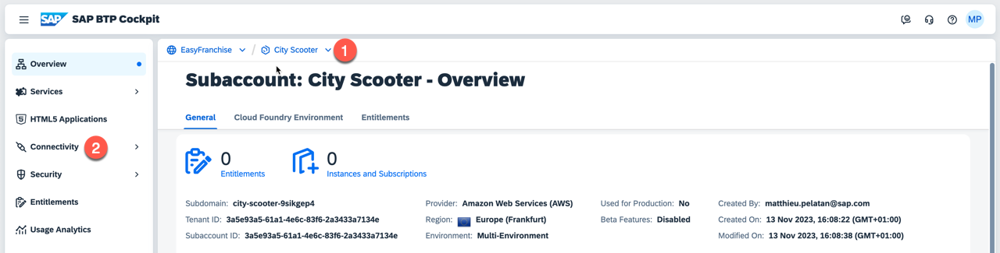
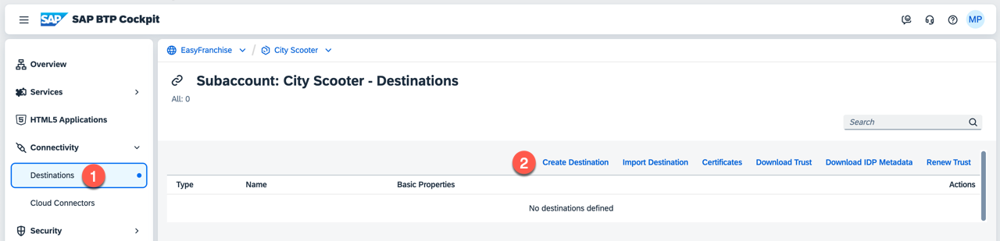
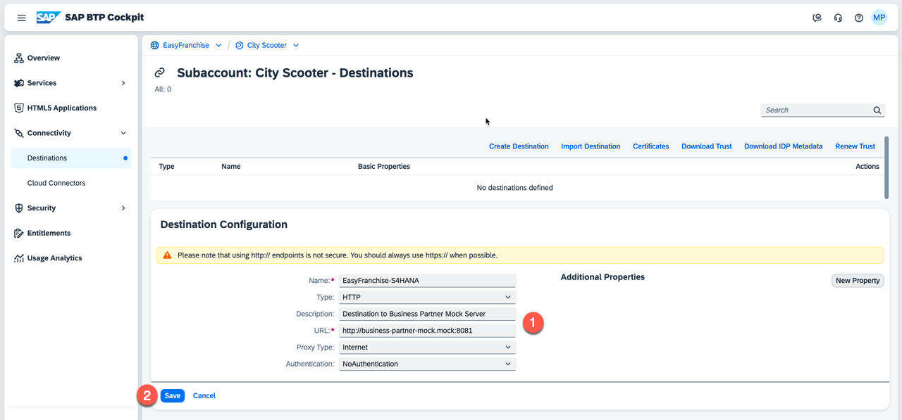

# Configure a Destination

Once the customer subaccount is created, the partner needs to establish the connection to the customer SAP S/4HANA Cloud system by configuring a destination.

1. Verify first that you are in the correct customer subaccount (here *City Scooter*) and choose **Connectivity** on the left sidebar.

   

2. Choose **Destinations** under Connectivity and create a new destination by choosing **Create Destination**.

   

3. Enter the following details to configure the destination pointing to the SAP S/4HANA system and then choose **Save**. Those details need of course to be adapted based on your system.

    In case you want to use the SAP S/4HANA system, you need a **Communication Arrangement User** with the right permission for  `https://<your S/4 hostname>-api.s4hana.ondemand.com/sap/opu/odata/sap/API_BUSINESS_PARTNER`. See section [Enable the Business Partner OData V2 Rest API in an SAP S/4HANA Cloud System](../../../documentation/appendix/enable-odata-of-s4hana/README.md) if you need more details.
    * Name: EasyFranchise-S4HANA (here it's important to keep this name)
    * Type: HTTP
    * Description: Destination to SAP S/4HANA system
    * URL: https://my******-api.s4hana.ondemand.com (the path `/sap/opu/odata/sap/API_BUSINESS_PARTNER` will be added automatically by the application.)
    * Proxy Type: Internet
    * Authentication: BasicAuthentication
    * User and Password: Communication Arrangement User

   If you are using the [Business Partner Mock Server](../../appendix/business-partner-mock/README.md), the settings are slightly different:
    * Name: EasyFranchise-S4HANA (here it's important to keep this name)
    * Type: HTTP
    * Description: Destination to Business Partner Mock Server
    * URL: http://business-partner-mock.mock:8081
    * Proxy Type: Internet
    * Authentication: NoAuthentication

   

4. Choose **Check Connection** and verify that the connection has been established. Then close the pop-up window. Please note if you used the mock server in your destination the check will fail. Reason for that is that the mock server is only reachable from within the Kyma Cluster, so it will work for the application despite the check fails.

   
