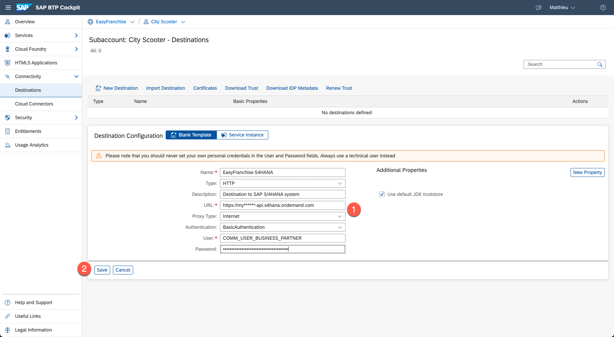

# Configure Destination

Once the consumer subaccount is created, the partner needs to establish the connection to the customer SAP S/4HANA Cloud system by configuring a destination.

1. Verify first that you are in the correct consumer subaccount (here City Scooter) and click **Connectivity** on the left sidebar.

2. Click on **Destinations** under Connectivity and create a new destination by clicking on **New Destination**.  

3. Enter the following details to configure the destination pointing to the SAP S/4HANA system and then click the button **Save**. Those details need of course to be adapted based on your system.
    * Name: EasyFranchise-S4HANA (here it's important to keep this name)
    * Type: HTTP
    * Description: Destination to SAP S/4HANA system
    * URL: https://my******-api.s4hana.ondemand.com (add the URL to your own system)
    * Proxy Type: Internet
    * Authentication: BasicAuthentication
    * User: COMM_USER_BUSINESS_PARTNER (add here the name of your SAP S/4HANA technical user)
    * Password: ********************* (add here the password of your SAP S/4HANA technical user)
    
   If you are using the Business Partner Mock Server, the settings are slightly different:
    * Name: EasyFranchise-S4HANA (here it's important to keep this name)
    * Type: HTTP
    * Description: Destination to Business Partner Mock Server
    * URL: http://business-partner-mock.mock:8081
    * Proxy Type: Internet
    * Authentication: NoAuthentication

    
4. Click now the button **Check Connection** and verify that the connection has been established. Then close the pop-up window.

    
