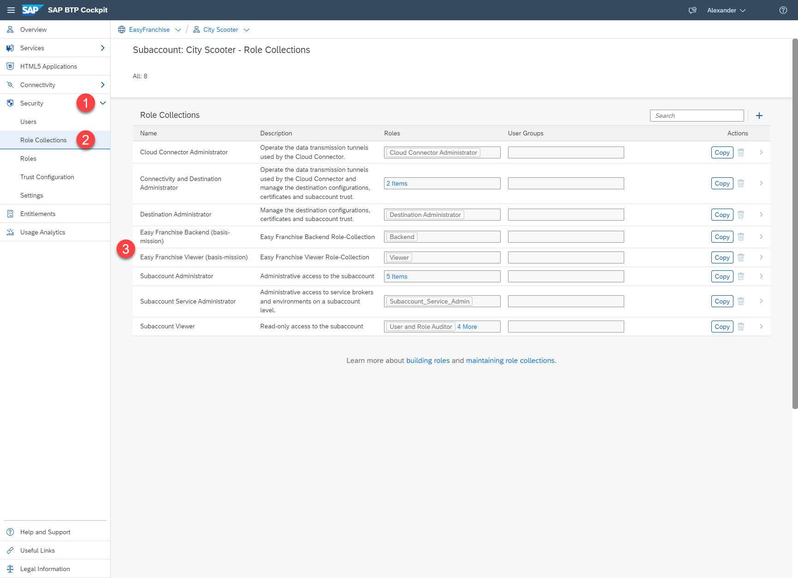
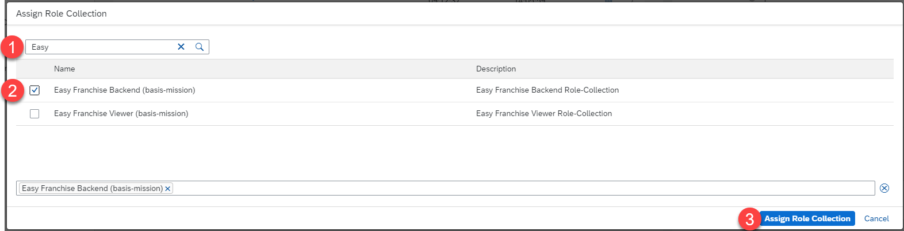
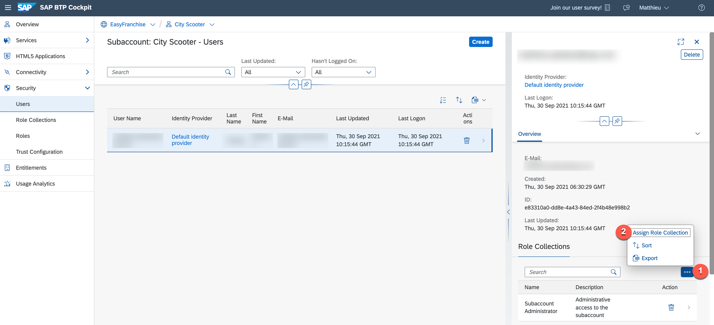
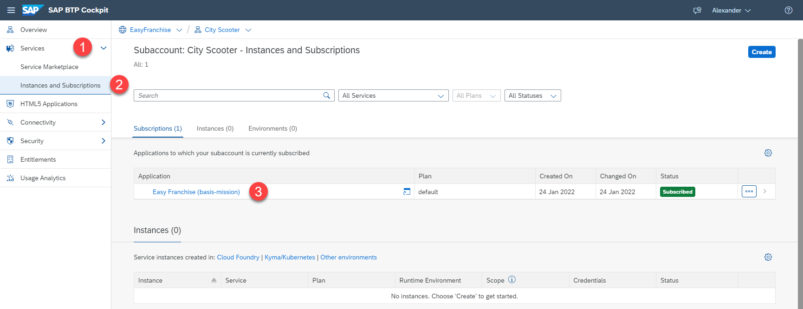

# Manage Users

In our scenario, the application will be used by the mentor coordinator to assign a mentor to new business partners (franchisees). See section [business-story](/documentation/discover/business-story/README.md#involved-personas) for more details about the personas.
That would mean that the partner would now typically add one or more mentor coordinators as users in the subaccount and give them access to the application. For ease of use, we will assume that you are also an end-user (mentor coordinator) of the application and therefore give your user the needed permissions to access the application. 

1. First verify that the role collections have been installed correctly during the subscription process. Go to **Role Collections** under **Security** in the left sidebar and search for the Easy Franchise role collections.

   
2. Navigate now to **Users** and click on your user.

   
3. Click on the 3 dots icon and select **Assign Role Collection**.

   
4. Search for **Easy Franchise**, then select **Easy Franchise (UAA) Backend Role Collection** and click **Assign Role Collection**.

   
5. The application is now configured and ready to be used by the customer. As partner you can share the link of the application with the end-user (in our case you ;)). You can find the URL of the app by clicking on **Instances and Subscriptions** under **Services**. The link is under the link **Easy Franchise (Multitenant)**. 

   
