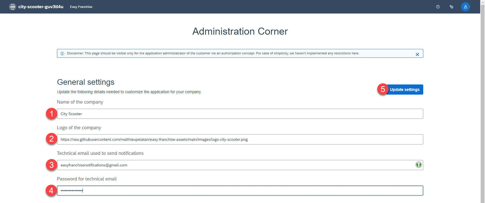
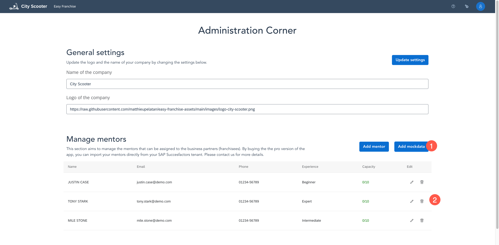
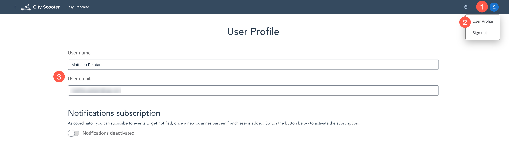
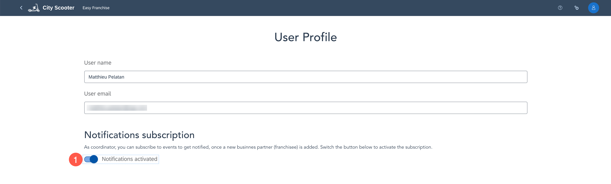
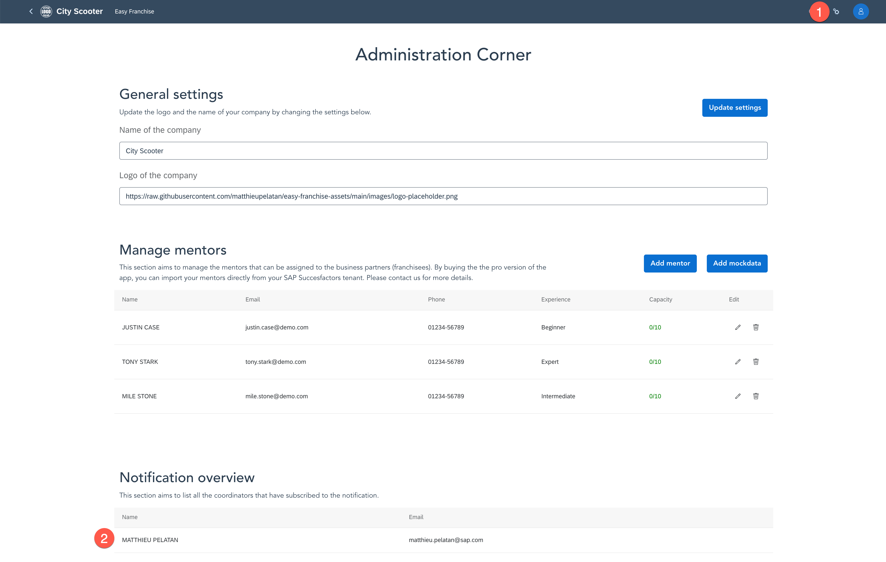
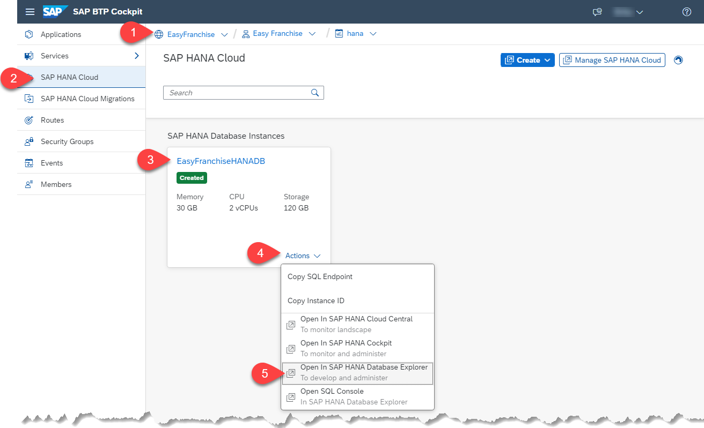
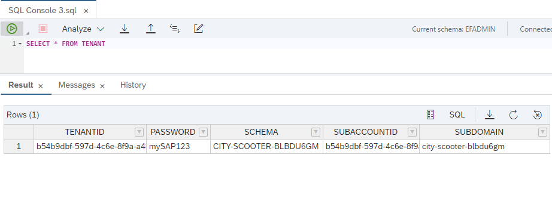
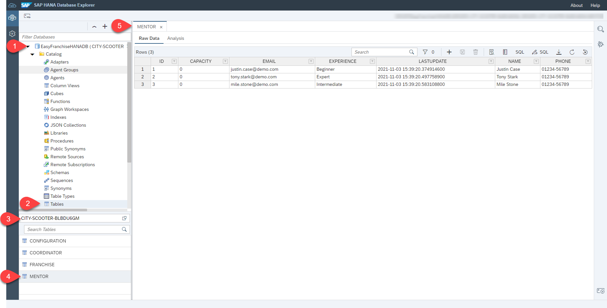

# Run the Application

As mentioned in the previous section, the application URL has been shared with the end-user and he can start using it. For ease of use, we are assuming that you are now the mentor coordinator.

1. Copy the URL sent by the partner and start the application in a browser.
    > Note: You can find your app URL by choosing **Instances and Subscriptions** under **Services**.

   

2. By running the application the first time, you will be prompted to go to the **Admin Corner** and do the initial configuration. Choose **Go to admin corner**.

   

3. Configure the general settings of the application and choose **Update settings**.
    * Name of the company: City Scooter
    * Logo of the company: https://raw.githubusercontent.com/SAP-samples/btp-kyma-multitenant-extension/main/code/easyfranchise/source/ui/src/assets/logo-city-scooter.png
    * Technical email used to send notifications: use a gmail account for sending notifications
    * Password for technical email: Use an application password for your gmail account

   

4. Add mentors by choosing **Add mockdata** and verify that the data has been generated.

   

5. Under the user icon on the top right, you can see your **User Profile**.

   

6. As mentor coordinator, you want to be informed if new business partners (franchisees) are added. Toggle the notifications now.

   

7. In the Admin Corner, you can get an overview of all mentor coordinators, who have subscribed to the notifications.

   

## Find Data in the SAP HANA

Lets have a look at the data persisted in **SAP HANA**.

1. Open the **SAP HANA Database Explorer**.
   * Open Subaccount **Easy Franchise** in a browser. Open space **hana**.
   * In the opened space **hana** select **SAP  HANA Cloud** in the left side menu.
   * Select your database. Open the **Actions** and select **Open In SAP HANA Database Explorer**.

   

2. Add your database for the DBADMIN user if not done.
3. Expand the tables and find the table **TENANT**.
4. Open the data contend of the TENANT or use an SQL window and run `SELECT * FROM TENANT` to see which rows you have now.

   You should find one ore more record. Each subscription will create a new record. A local test run might have also added a row.

    

5. In the records search for the one with the fitting subdomain. Remember the **SCHEMA** and **PASSWORD** value.
6. Open the context menu of your database and **Create a new Database with a different User**. Provide the remembered **SCHEMA** value as Database user. Use the password of the **TENANT** record.
7. Find the **Mentor** table in the just added database. Open the data view and find the mentors you have added via the application.

   

8. Browse throw the data of the other tables as well.
