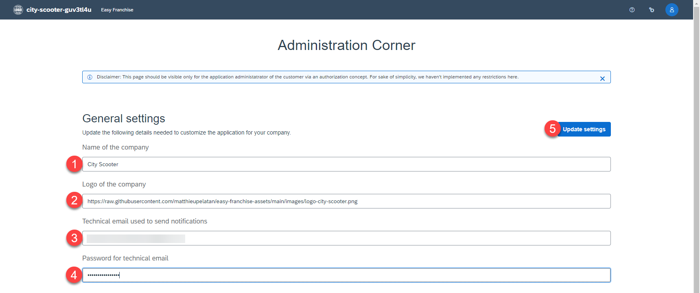

# Run the Application

As mentioned in the previous section, the application URL has been shared with the end-user and he can start using it. For ease of use, we are assuming that you are now the mentor coordinator.

1. Copy the URL sent by the partner and start the application in a browser.
    > Note: You can find your app URL by clicking on **Instances and Subscriptions** under **Services**.

   
2. By running the application the first time, you will be prompted to go to the **Admin Corner** and do the initial configuration. Click on the button **Go to admin corner**.

   

3. Configure the general settings of the application and click the button **Update settings**.
    * Name of the company: City Scooter
    * Logo of the company: https://raw.githubusercontent.com/matthieupelatan/easy-franchise-assets/main/images/logo-city-scooter.png

   

4. Add mentors by clicking on **Add mockdata** and verify that the data has been generated.

   

5. Under the user icon on the top right, you can see your **User Profile**.

   

6. As mentor coordinator, you want to be informed if new business partners (franchisees) are added. Toggle the notifications now.

   

7. In the Admin Corner, you can get an overview of all mentor coordinators, who have subscribed to the notifications.

   

