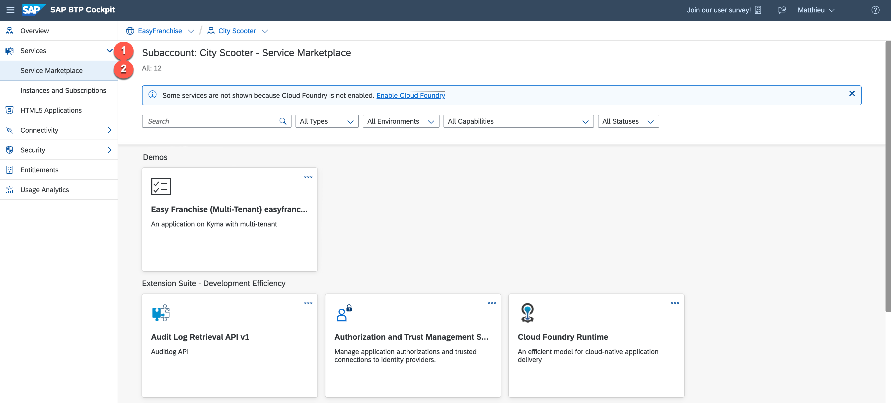
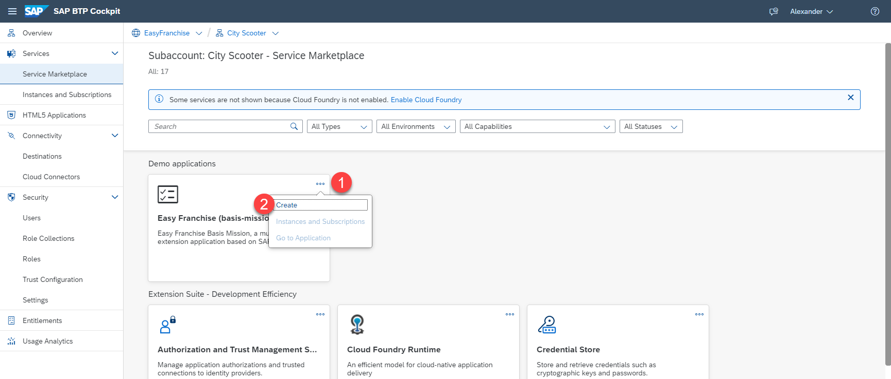
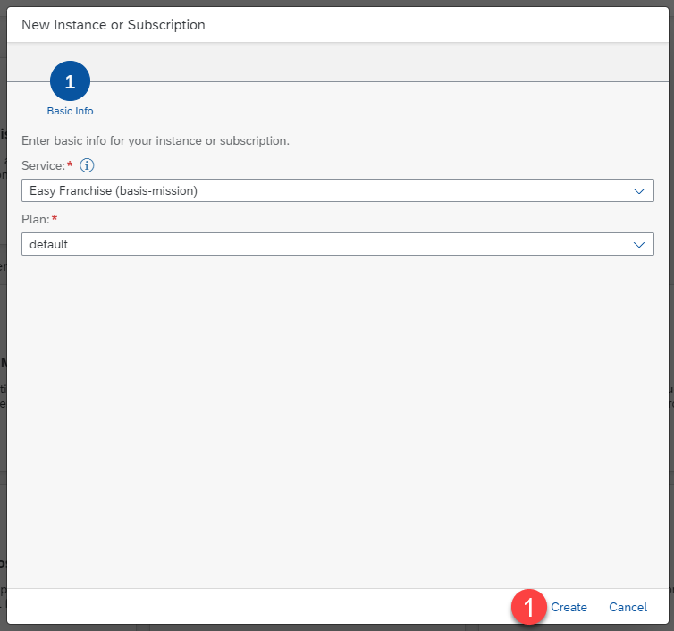
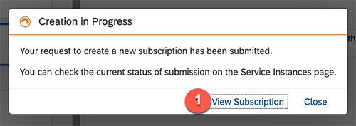
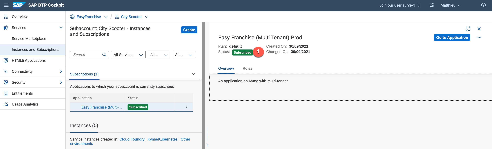

# Subscribe to the Easy Franchise Application

The next step for the partner is to subscribe the multitenant Easy Franchise application to make it available from the customer subaccount.

1. Expand the section Services in the left sidebar and choose **Service Marketplace** to show the different services available.  

2. Click on the 3 dots of the Easy Franchise application and select **Create** to start the subscription process.  

3. Keep all the default settings in the new opened pop-up window and choose**Create**.  

4. Choose **View Subscription** to be redirected to the overview page of the subscription.  

5. Verify that the subscription process was successful.  

> Hint: In case your subscription fails, check [Failing Application Subscription](../../../documentation/troubleshooting/subscription-failing/README.md) in the troubleshooting guide.
