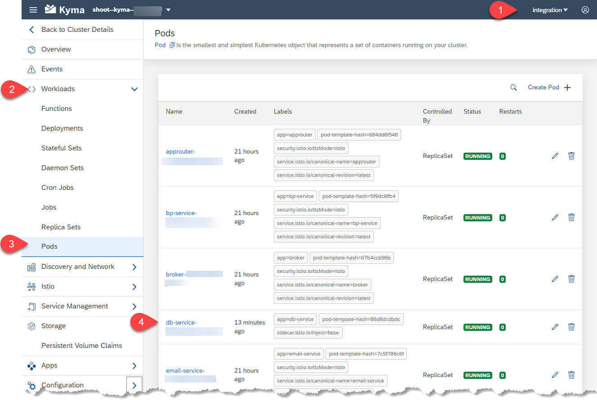

# Review Log Messages

There are two preconfigured ways to view logs:
* At each pod, you can select a log viewer. Here, only logs for the past hour will be available
* All logs are automatically transferred to Grafana and are available there for some days

## Pod Logs

1. To view the pod logs open the **Kyma dashboard** (see [this page at the bottom](../../../documentation/prepare/setup-btp-environment/README.md) for help). Then select the namespace that contains the pod you are interested in.
1. Expand the **Workloads** in the left side menu, choose **Pods** and select the pod of your interest.

   
1. In the details page of the selected pod, choose **View Logs**.

   
1. In the Log Viewer, you can filter the logs based on a timeframe and add the timestamps directly in the logs by switching the **Show Timestamps** toggle button.

   

## Grafana Log Viewer

1. To access Grafana Logs, you also start at the **Kyma dashboard**. Instead of selecting a single pod, just click the link **Logs** on the lower left side in the **Kyma dashboard**. The Grafana Explore Screen opens and **Loki** should be preselected. If not, select it now.

   

1. Initially, no logs are displayed. You have to use the button **Log labels** to select which logs to view. There are several categories to choose from. Using **app** you can select a single pod. Another interesting option is
   **namespace**, which allows you to view logs from all pods within a namespace. After selecting a **Log label**, your logs will be displayed in the main section of the log viewer window.

   

1. Select the time frame for your logs using the clock button. You can use numerous options here, like last several hours or days. Also absolute time ranges can be set here.

   

