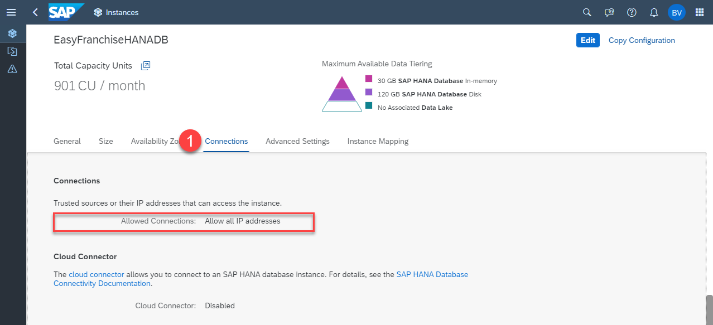

# Failing Application Subscription

Issue: The subscription as described in section [Subscribe to the Easy Franchise Application](../../../documentation/test-customer-onboarding/subscribe-easyfranchise-app/README.md) fails.

Reason: SAP HANA doesn't allow access from all IP addresses.

Symptom: The subscription fails and the error message looks like `Reason: returned value from application: 500 INTERNAL_SERVER_ERROR, with body: create database schema error`.

Check if you allowed the access from all IP addresses:
1. Open Subaccount **Easy Franchise** in browser
2. Expand **Services** and open **Instances and Subscriptions**. 
3. Select and open the Application **SAP HANA Cloud** 
   
      
4. Select your database, expand the "..." and select **Manage Configuration**

   
5. Check in the upcoming dialog for the **Connections** properties and check if **Allow all IP addresses** is selected. If not Edit the configuration of your database instance.

   
6. Try to subscribe again.
