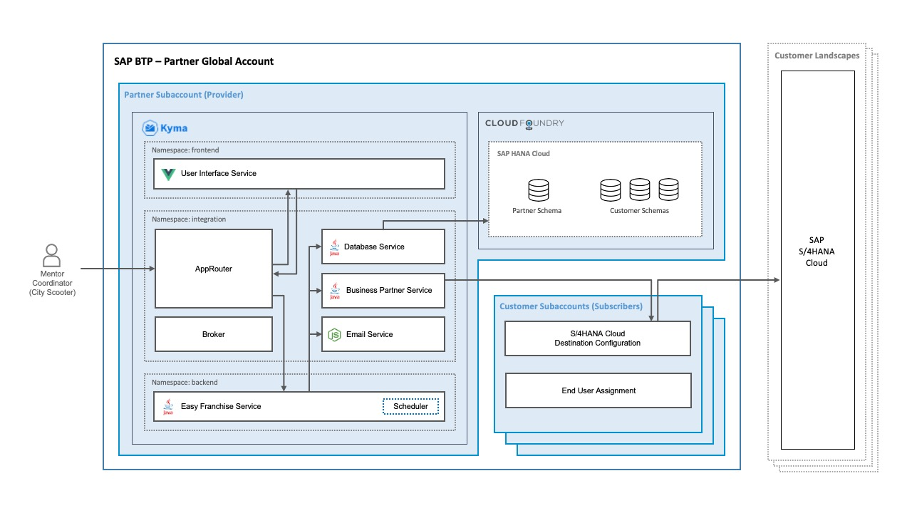

# Welcome to the Mission
In this mission you will learn how to develop a multitenant application running on the Kyma environment of the SAP Business Technology Platform (SAP BTP). 
The application called Easy Franchise is an extension of a SAP S/4 HANA Cloud and has been build based using microservices. Due to the complexity of this topic, our team has taken some compromise compared to a real application. So, this application doesn't aim to be used for productive usage. See below the solution diagram of the EasyFranchise application:

You can find the code of the application components in this Github [repository](/code).

## Who Is This Mission For?
The business scenario of this tutorial has been created with the partner as focus persona. The purpose of this project is to help SAP partners to get a quick start on developing a multitenant application and provide best practices.
This is of course not exclusively for SAP partner and can be very useful for every person looking for details on how to build a multitenant application running on Kyma. It is suitable for new or experienced developers on SAP BTP. 

## Focus Topics of the Mission
The tutorial focus on the following aspects:
* Multitenancy
* Kyma environment on SAP BTP
* Partner ecosystem
* Extension SaaS (extending an SAP LoB solution), not a standalone SaaS 
* Freedom to use non-SAP frameworks and tools without CAP neither SAPUI5 (but indeed SAP Fiori like UI)

## Known Issues
The tutorial is provided on the "as-is" basis. Currently, there are no known issues for for the tutorial project.

## How to Obtain Support?
Please check if you find an answer in the [troubleshooting](/documentation/appendix/troubleshooting/README.md) chapter.

Create an issue to get support or to report a bug [here](https://github.com/SAP-samples/btp-kyma-multitenant-extension/issues/new/choose).

## How to Provide Feedback?
Have you found the enablement material easy to understand? Are you missing something? What can we improve? Please [share](https://github.com/SAP-samples/btp-kyma-multitenant-extension/issues/new/choose) your feedback, so that we can improve the documentation and provide a better material for future stakeholders.

## What's New
Check the details of our last releases [here](/documentation/discover/whats-new/README.md).

## License
Copyright (c) 2021 SAP SE or an SAP affiliate company. All rights reserved. This project is licensed under the Apache Software License, version 2.0 except as noted otherwise in the [LICENSE](LICENSES/Apache-2.0.txt) file.
